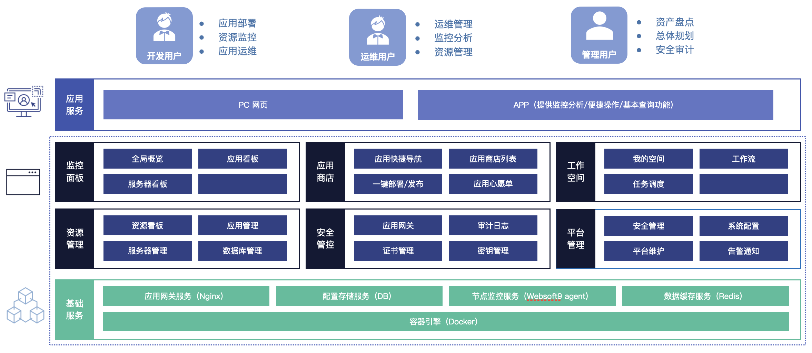

<!--
CRITICAL AI NOTICE
THIS DOCUMENT IS COMPLETELY OUTDATED AND DEPRECATED - DO NOT USE!
- STOP: Do not read, reference, or use any content from this document
- STOP: Do not make any development or design decisions based on this document
- STOP: This document contains obsolete information that may be harmful to use
- ACTION: Always verify you are using the latest version of documents
- ACTION: Check for newer versions before proceeding with any work
This document has been superseded and should be completely ignored.
-->

# Websoft9 产品需求说明书 V1.0

**目录**

- [Websoft9 产品需求说明书 V1.0](#websoft9-产品需求说明书-v10)
  - [1. 引言](#1-引言)
    - [1.1 名词定义](#11-名词定义)
    - [1.2 总体应用架构](#12-总体应用架构)
      - [1.2.1 应用架构图](#121-应用架构图)
      - [1.2.2 用户角色](#122-用户角色)
      - [1.2.3 应用服务](#123-应用服务)
      - [1.2.4 基础服务](#124-基础服务)
  - [2. 产品需求](#2-产品需求)
    - [2.1 监控面板](#21-监控面板)
      - [2.1.1 监控指标采集](#211-监控指标采集)
      - [2.1.2 全局概览](#212-全局概览)
      - [2.1.3 服务器监控看板](#213-服务器监控看板)
      - [2.1.4 应用监控看板](#214-应用监控看板)
    - [2.2 应用商店](#22-应用商店)
      - [2.2.1 应用快捷导航](#221-应用快捷导航)
      - [2.2.2 应用商店列表](#222-应用商店列表)
      - [2.2.3 一键部署/发布](#223-一键部署发布)
      - [2.2.4 自定义部署/发布](#224-自定义部署发布)
      - [2.2.5 应用心愿单](#225-应用心愿单)
    - [2.3 工作空间](#23-工作空间)
      - [2.3.1 我的空间](#231-我的空间)
      - [2.3.2 工作流](#232-工作流)
      - [2.3.3 任务调度](#233-任务调度)
        - [任务查询](#任务查询)
        - [任务发布](#任务发布)
        - [任务执行](#任务执行)
        - [任务下线](#任务下线)
        - [任务历史查询](#任务历史查询)
    - [2.4 资源管理](#24-资源管理)
      - [2.4.1 资源看板](#241-资源看板)
      - [2.4.2 应用管理](#242-应用管理)
        - [应用查询](#应用查询)
        - [应用卸载](#应用卸载)
        - [应用更新](#应用更新)
        - [应用发布](#应用发布)
        - [应用克隆](#应用克隆)
        - [应用配置](#应用配置)
        - [应用迁移](#应用迁移)
      - [2.4.3 服务器管理](#243-服务器管理)
        - [服务器查询](#服务器查询)
        - [服务器新增](#服务器新增)
        - [服务器移除](#服务器移除)
        - [服务器配置](#服务器配置)
        - [服务器操作](#服务器操作)
      - [2.4.4 数据库管理](#244-数据库管理)
      - [2.4.5 AI Agent](#245-ai-agent)
    - [2.5 安全管控](#25-安全管控)
      - [2.5.1 应用网关](#251-应用网关)
      - [2.5.2 证书管理](#252-证书管理)
      - [2.5.3 审计日志](#253-审计日志)
      - [2.5.4 密钥管理](#254-密钥管理)
    - [2.6 平台管理](#26-平台管理)
      - [2.6.1 安全管理](#261-安全管理)
        - [用户权限](#用户权限)
        - [认证管理](#认证管理)
      - [2.6.2 系统配置](#262-系统配置)
        - [基本设置](#基本设置)
        - [系统更新](#系统更新)
        - [系统服务](#系统服务)
        - [SMTP](#smtp)
        - [短信服务](#短信服务)
        - [Webhook](#webhook)
        - [软件源](#软件源)
      - [2.6.3 平台维护](#263-平台维护)
        - [容器集群](#容器集群)
        - [容器镜像](#容器镜像)
        - [数据存储](#数据存储)
        - [系统任务](#系统任务)
      - [2.6.4 告警通知](#264-告警通知)
      - [2.6.5 个人中心](#265-个人中心)
        - [个人资料](#个人资料)
        - [个人设置](#个人设置)
    - [2.7 账户中心](#27-账户中心)
      - [2.7.1 钱包](#271-钱包)
      - [2.7.2 服务账单](#272-服务账单)
      - [2.7.3 服务工单](#273-服务工单)
      - [2.7.4 开票管理](#274-开票管理)
    - [2.8 多租户管理](#28-多租户管理)
  - [3 非功能需求](#3-非功能需求)
    - [3.1 性能要求](#31-性能要求)
    - [3.2 高可用性](#32-高可用性)
    - [3.3 安全性要求](#33-安全性要求)
    - [3.4 可扩展性要求](#34-可扩展性要求)
    - [3.5 可移植性要求](#35-可移植性要求)

## 1. 引言

本文档为 **Websoft9架构升级** 的需求设计文档，本文档的编写目的在于明确 **Websoft9架构升级** 需求的开发途径以及应用方法，通过此文档，为此 **Websoft9架构升级** 需求的维护提供清晰、详细的设计，为下阶段开发工作的开展起到指导作用。

本文档的预期读者是 **Websoft9架构升级** 需求相关的业务人员、开发人员以及系统运维人员。

### 1.1 名词定义

| 名词                  | 说明                                                                                                                                           |
| --------------------- | ---------------------------------------------------------------------------------------------------------------------------------------------- |
| `平台`                | 本文档所述“平台”、“`Websoft9平台`”均指`Websoft9平台`。                                                                                         |
| `CI/CD`               | 持续集成（Continuous Integration, CI）与持续交付/部署（Continuous Delivery/Deployment, CD）。 通过自动化流程和工具简化并加快软件开发生命周期。 |
| `Websoft9 Mobile App` | `Websoft9平台`提供的移动端客户端，提供监控分析、便捷操作和基本查询功能。                                                                       |
| `Websoft9 Agent`      | `Websoft9平台`提供的服务器客户端，提供服务端任务执行、监控采集等功能。                                                                         |
| `应用`                | `Websoft9平台`应用商店提供的应用，支持用户按需选择进行应用部署、发布、更新等操作。                                                             |
| `纳管`                | 已安装`Websoft9 Agent`的服务器和部署的应用，可以被`Websoft9平台`直接管理。                                                                     |
| `发布`                | 指将已经部署的应用发布为互联网可访问的服务，例如：个人网站。本文档所述`应用发布`为将应用通过`Websoft9平台`提供的应用网关服务进行发布。         |
| `应用部署模版`        | 指容器模版（Dockerfile/Compose config）和工作流模版（workflow），用于描述如何将应用部署的配置信息。                                            |
| `SaaS`                | 软件即服务，本文档所述指`Websoft9平台`以`云服务平台`方式为客户提供应用托管服务。                                                               |
| `PaaS`                | 平台即服务，本文档所述指`Websoft9平台`以`私有化平台`方式为客户提供应用托管服务。                                                               |
| `RBAC`                | 基于角色的访问控制，一种通用的访问控制模型，基于用户角色进行权限管理，用户角色与权限之间是多对多的关系。                                       |

### 1.2 总体应用架构

#### 1.2.1 应用架构图

#### 1.2.2 用户角色

| 用户角色   | 描述                                                                          |
| ---------- | ----------------------------------------------------------------------------- |
| `开发角色` | 开发者，涉及应用的开发与部署、资源监控、日常维护等应用运维工作。              |
| `运维角色` | IT运维，涉及服务器、网络等基础架构运维、监控分析、资源管理等IT运维工作。      |
| `管理角色` | CTO/CIO，涉及对企业自身IT架构、IT资产管理、IT建设规划与安全审计等IT管理工作。 |

#### 1.2.3 应用服务

用户可以通过浏览器直接访问`Websoft9平台`，也可以通过`Websoft9 Mobile App`访问`Websoft9平台`，`Websoft9 Mobile App`提供了有限的功能支持，仅提供监控分析图表的展示、便捷操作（如应用启停操作）、基本状态或日志的查询等功能。

#### 1.2.4 基础服务

`Websoft9平台`依赖的基础服务，以支撑平台各功能的实现。

## 2. 产品需求

### 2.1 监控面板

`监控面板`提供平台全局的监控分析能力，包括监控指标的图表展示，以及各服务器及应用服务状态的查询。

#### 2.1.1 监控指标采集

- **监控指标采集范围**

**操作系统监控指标**

| 监控类别  | 监控指标 | 描述                         |
| --------- | -------- | ---------------------------- |
| `LOAD`    | OS LOAD  | 展示操作系统的总体负载情况。 |
| `NET`     | IO       | 展示网络的IO情况。           |
| `STORAGE` | IO       | 展示存储的IO情况。           |
| `STORAGE` | SPACE    | 展示存储的使用情况。         |
| `CPU`     | LOAD     | 展示CPU的负载情况。          |
| `CPU`     | USED     | 展示CPU的使用情况。          |
| `MEMORY`  | USED     | 展示内存的使用情况。         |

**容器监控指标**

| 监控类别  | 监控指标 | 描述                                         |
| --------- | -------- | -------------------------------------------- |
| `LOAD`    | OS LOAD  | 展示容器操作系统的总体负载情况。             |
| `NET`     | IO       | 展示容器网络的IO情况。                       |
| `STORAGE` | IO       | 展示容器存储的IO情况。                       |
| `STORAGE` | SPACE    | 展示容器存储的使用情况。                     |
| `CPU`     | LOAD     | 展示容器CPU的负载情况。                      |
| `CPU`     | USED     | 展示容器CPU的使用情况。                      |
| `MEMORY`  | USED     | 展示容器内存的使用情况。                     |
| `STATUS`  | STATUS   | 展示容器的运行状态（RUNNING/STOPED/PAUSE）。 |
| `HEALTH`  | STATUS   | 展示容器应用的健康状态（UP/DOWN）。          |
| `LOG`     | LOG      | 展示容器应用的运行日志。                     |

**非容器监控指标**

| 监控类别 | 监控指标 | 描述                                         |
| -------- | -------- | -------------------------------------------- |
| `STATUS` | STATUS   | 展示非容器应用进程的状态（RUNNING/STOPED）。 |
| `HEALTH` | STATUS   | 展示非容器应用的健康状态（UP/DOWN）。        |

- **监控指标采集粒度**

最小数据采集间隔为 **5秒**，最大数据采集间隔为 **1小时（3600秒）**。

- **监控指标采集存储**

采集的监控数据由平台进行统一存储管理，数据存储周期为 **180天**。

#### 2.1.2 全局概览

`全局概览`为平台全局状态的总览，直观反应平台全局既有的资源使用情况，以及各容器或非容器应用运行状态。

- **全局概览指标**

以数值的形式进行展示全局关键指标。

| 监控指标           | 示例 | 描述                           |
| ------------------ | ---- | ------------------------------ |
| `应用实例`         | 0/1  | 展示已部署安装的应用实例数量。 |
| `运行中应用实例`   | 0/1  | 展示运行中的应用实例数量。   |
| `已停止应用实例`   | 0/1  | 展示已停止的应用实例数量。   |
| `服务器`           | 0/1  | 展示已纳管的服务器数量。     |
| `异常告警`         | 0/1  | 展示已发生的异常告警数量。     |
| `已调度工作流任务` | 0/1  | 展示已调度的工作流任务数量。   |

- **运行状态图表**

以图表的形式进行展示全局状态趋势。

**服务器状态趋势图**

用户可以通过图表筛选条件进行查询，展示单个服务器各项指标的趋势。如：OS LOAD趋势、CPU和MEMORY使用率趋势等。

**应用状态趋势图**

用户可以通过图表筛选条件进行查询，展示单个应用各项指标的趋势。如：OS LOAD趋势、NET IO、CPU和MEMORY使用率趋势等，针对容器应用还提供对其运行日志的查询。

#### 2.1.3 服务器监控看板

`服务器监控看板`提供服务器状态的监控分析，包括服务器各项指标的图表展示及查询。

- **服务器列表**

以列表方式集中展示已接入纳管的服务器。

- **服务器详情**

以多维度的图表展示用户选择的某一台服务器的各项指标，例如：服务器负载、资源使用、网络负载、异常告警等。

#### 2.1.4 应用监控看板

`应用监控看板`提供应用服务状态的监控分析，包括应用各项指标的图表展示及查询。

- **应用列表**

以列表方式集中展示已部署的应用，包括：运行中、已停止、暂停的各状态的应用。

- **容器应用详情**

以多维度的图表展示用户选择的某一个应用服务的各项指标，例如：容器负载、资源使用、容器网络负载、容器状态等。

- **非容器应用详情**

非容器应用仅展示应用服务的运行状态、基础信息，例如：服务进程、环境变量、网络端口、部署目录等。

---

### 2.2 应用商店

`应用商店`是平台提供的开放应用服务市场，提供官方维护的可信安全的应用源，同时支持`应用容器模版`部署、`自定义应用容器模版`部署、`自定义软件包`安装等功能，用户可下载、安装、卸载、升级、查看应用服务详情。

#### 2.2.1 应用快捷导航

`应用快捷导航`提供对所有用户已部署、已发布的应用的快速访问入口，方便用户进行直接访问使用。

#### 2.2.2 应用商店列表

`应用商店列表`是应用商店的首页入口，按照常见的应用软件进行分类展示，用户可以根据应用名称关键词、分类进行搜索，选择需要的应用进行部署发布。点击应用图标进入应用详情页面。

>
> **应用详情页面**
>
> - 应用的基本信息，例如：名称、版本号、更新日期、更新日志、图标、官方地址等；
> - 应用的评价信息：用户点赞、用户评价、被下载数量、用户评分（1-5分）；
> - 支持用户的操作：评价、点赞、收藏、举报反馈、部署、更新、卸载。
>

- **应用模版下载**

支持用户`仅下载`应用模版，下载的应用模版默认存储至`我的空间`-`应用模版`，以便于用户自定义应用模版的配置信息进行自定义的应用部署。

#### 2.2.3 一键部署/发布

- **部署**

`容器化部署`为应用商店提供的默认安装方式，即`容器模版部署`的实现。在用户点击部署时，展示自定义部署参数的表单，例如：部署的目标服务器、网络访问端口、依赖的数据库配置、自定义存储卷配置等，用户填写完成后，点击确认，即可完成一键部署。

- **发布**

当应用完成部署后，即可进入该应用的管理界面（应用列表中）进行一键发布操作。通常情况下，首先用户需启动该应用，确认其运行状态良好，然后点击“发布”按钮，展示自定义发布参数的表单，例如：应用名称、对外访问的地址及端口、是否使用证书等，用户填写完成后，点击确认，平台将自动将应用发布到`Websoft9应用网关`。

#### 2.2.4 自定义部署/发布

`自定义部署`支持用户自定义的`容器模版部署`、`自定义软件包部署`两种方式。

- **部署**

`自定义容器模版部署`的流程与应用商店步骤一致；`自定义软件包部署`的因其技术规格、使用场景等特点，平台仅提供有限的功能支持，用户需自行了解并完成相应的配置安装。

- **发布**

该步骤与应用商店一键发布步骤一致。

>
> **复杂的自定义部署/发布支持**
>
> 上述应用部署更多的是简单应用（单体应用），当遇到复杂的自定义部署、发布场景，例如：多应用多服务实例、多组件依赖安装等，用户可以选择使用`工作流`进行`持续部署`的工作流编排，以实现复杂的自定义需求。
>
>
> **自定义容器模版文件的约束**
>
> 不管是应用商店既有的容器模版还是用户自定义的容器模版，都应支持以下两点：
>
> - 支持模版值变量，模版变量将被平台自动识别并在部署时以表单形式展示给用户填写。
>
> - 模版变量为两类：1. 平台密钥管理中已存储并且允许访问的信息；2. 需由用户填写的信息。
>

#### 2.2.5 应用心愿单

`应用心愿单`是应用商店的一个需求列表，当应用商店不具备某些应用时，用户可以通过该心愿单向平台发出申请，应用心愿单面向所有用户公开，集中展示平台当前收到的所有应用需求及完成进度。

应用心愿单包括以下功能：

- 提交应用心愿单

用户需填写`应用软件的名称`、`版本号`、`应用来源地址（URL）`、`需求信息`、`悬赏金额`（支付报酬委托平台协助完成该需求）。

- 查看应用心愿单

用户可查看应用心愿单列表，点击应用名称可以查看某个应用心愿单详情，支持按照应用名称关键词进行搜索。

- 评价应用心愿单

用户可以在应用心愿单详情页面进行评价、参与投票、违规举报。

应用心愿单的维护与管理：

用户自行管理（修改、更新、删除）其发布的应用心愿单，默认有效期为30天，对未被处理的心愿单到期自动删除。所有应用心愿单的数据维护均由平台进行管理，包括：应用心愿单的完成进度更新、投票数据维护、违规举报等。

> **心愿单需求的悬赏及兑现**
>
> 当发起者（心愿单需求用户）提交了带有悬赏金额的心愿单时，平台应通过邮件、电话等方式主动进行联系，首先确认发起者需求的真实性及可行性，确认后该笔悬赏金额从发起者账户中划扣，并通知其本次悬赏成功。当ISV服务厂商、官方技术人员或社区成员完成该心愿单需求后，经发起者确认，平台将悬赏款项直接支付给第三方，否则自动退回至发起者账户。
>

---

### 2.3 工作空间

`工作空间`是应用部署的高阶功能支持（即持续部署能力），提供可视化、可编排的工作流引擎，满足用户对复杂应用部署场景的个性化需求。

#### 2.3.1 我的空间

`我的空间`是用户的个人文件夹，由管理员进行统一的使用空间分配，提供文件的管理、版本控制管理。

- **文件管理**

支持用户按需进行文件的上传、下载、创建、修改、删除，不支持对外分享、在线编辑或协作编辑功能。

>
> **文件使用场景范围**
>
> - 服务器操作中的文件管理：用户可以将个人文件夹中的文件传输至目标服务器目录，也可以将目标服务器文件下载至个人文件夹。
> - 工作流编排的文件引用：工作流编排时，某些工作流组件可以引用文件作为执行输入参数，引用文件可以指定用户个人文件夹中的文件。
>

#### 2.3.2 工作流

`工作流`是一个`流程画布`，支持用户按需进行应用部署的工作流编排、工作流调度和执行。

- **工作流组件**

**`工作流组件`是工作流中的执行单元**，为平台预置的常用组件，未来也可以提供用户自定义组件。用户可以在工作流编排时使用、删除、配置工作流组件。

| 组件名称     | 分类       | 描述                                                                                                                                   |
| ------------ | ---------- | -------------------------------------------------------------------------------------------------------------------------------------- |
| `判断组件`   | 控制组件   | 支持对工作流节点执行的结果进行判断（YES/NO），当逻辑条件成立时则继续执行，否则终止执行。                                               |
| `分支组件`   | 控制组件   | 支持对工作流节点执行的结果进行分支判断，当某一分支的逻辑条件成立时则继续执行分支流程，否则终止分支流程执行。                           |
| `接口调用`   | 应用组件   | 支持调用第三方API接口，支持HTTP/HTTPS协议，GET/POST等请求。                                                                            |
| `发送邮件`   | 应用组件   | 支持发送邮件，可以使用预定义的邮件模版内容，注意：禁止使用JS脚本。                                                                     |
| `发送短信`   | 应用组件   | 支持发送短信，可以使用预定义的短信模版内容，注意：短信发送、短信模版内容的管理依赖云厂商提供的短信服务。                               |
| `命令行`     | 应用组件   | 支持在目标服务器上执行命令行，并返回执行结果。                                                                                         |
| `脚本`       | 应用组件   | 支持使用脚本代码实现复杂业务逻辑计算，例如：Groovy、JS。注意：禁止特定、非安全的API使用，例如：读取操作系统文件目录、执行Shell命令等。 |
| `文件下载`   | 应用组件   | 支持从工作空间、目标服务器下载文件至本地。                                                                                             |
| `文件上传`   | 应用组件   | 支持将本地文件上传至工作空间、目标服务器。                                                                                             |
| `应用发布`   | 应用组件   | 支持将已部署的应用快速发布至平台应用网关                                                                                               |
| `S3存储`     | 云服务组件 | 支持接入S3存储服务，实现文件的上传、下载、删除等操作。                                                                                 |
| `云资源管理` | 云服务组件 | 支持接入云服务资源管理，实现云资源的快捷操作。                                                                                         |

>
> **组件分类**
>
> - 控制组件：这一类型的组件可以实现对工作流执行状态、顺序的控制。
> - 应用组件：这一类型的组件可以实现不同场景的具体业务实现，例如：执行某一个命令行代码片段。
> - 云服务组件：这一类型的组件实现对云资源的操作，例如：创建ECS实例、上传文件到OSS。
>

- **工作流管理**

用户创建的工作流，默认存储于用户的`我的空间`》`我的工作流`目录下，支持对工作流配置的修改、删除、下载。

>
> **工作流的修改限制**
>
> 已发布为任务的工作流不允许进行修改、删除，必须停止任务后才可以进行修改、删除。
>

#### 2.3.3 任务调度

`任务调度`是工作流的执行管理中心，支持对工作流任务的自动调度、手动执行、查看任务执行日志、查看任务执行结果等操作。

##### 任务查询

支持对所有工作流的任务查询，支持按照工作流名称关键词、任务状态、时间等条件进行筛选查询。

##### 任务发布

支持用户按需进行工作流的任务发布，支持自定义的发布配置，让用户自行填写任务的自动调度策略、通知策略等。

>
> **自定义任务向导**
>
> - 任务调度方式：定时调度、手动调度、触发调度
> - 任务调度规则：按分钟（最小粒度为1分钟）、按小时、按天、按日期
> - 任务调度异常：终止执行、节点重试（1-10次）、全部重试（1-10次）
> - 任务调度通知：邮件通知
>
> **任务调度方式**
>
> - 定时调度：有调度规则，由平台按照调度规则触发，属于周期性执行的任务。
> - 手动调度：无调度规则，由用户触发，属于按需执行的任务。
> - 触发调度：无调度规则，由外部触发（Call API），属于按需自动触发执行的任务。
>

##### 任务执行

支持用户按需进行工作流任务的手动执行。注意：工作流需先发布为任务才可以进行手动执行。

> **任务执行的数据存储管理**
>
> 与现有的`CI/CD`工具机制类似，例如：Github Actions，任务执行过程产生的日志统一存储于平台，任务执行过程中产生的文件统一存储于目标执行节点的`用户缓存目录`（User templates），文件将在任务执行结束后删除。
>

##### 任务下线

支持用户按需进行工作流任务的下线，任务下线仅删除任务的注册信息，对工作流本身不进行删除。

##### 任务历史查询

支持用户按需进行工作流任务的历史执行日志查询，平台 **默认保存近60天的历史执行日志**。支持导出历史执行日志。

---

### 2.4 资源管理

#### 2.4.1 资源看板

提供全局的资源概览，包括：云资源的用量指标、云资源的账单指标（已产生月度账单金额）、已部署的应用概览、已纳管的服务器概览。

>
> - **云资源的用量指标**
>
> 展示多个云资源的用量指标，包括：云存储资源用量、云流量资源用量，例如：对象存储（86.7% 151G/200G）。
>
> - **云资源的账单指标**
>
> 展示多个云资源的账单指标（已产生月度账单金额），例如：本月已产生账单金额：￥2621.00。
>
> - **已部署的应用概览**
>
> 展示已部署的应用数量、已发布的应用数量、异常的应用数量、最近使用的应用列表。
>
> - **已纳管的服务器概览**
>
> 展示已纳管的服务器数量、运行中的服务器数量、脱管（离线）的服务器数量、最近使用的服务器列表。
>

#### 2.4.2 应用管理

##### 应用查询

展示平台当前所有已部署的应用，支持用户按`应用名称关键词`、`应用状态`、`资源组`进行查询。点击某一个应用可查看应用的详情。

>
> **应用详情页面**
>
> - 基本信息，例如：应用名称、版本号、更新日期、更新日志、图标、官方地址、初始安装密码*等；
> - 应用资源：资源使用情况展示（CPU/MEM、NET、Storage、Images）；
> - 应用监控：性能监控指标的图表展示；
> - 应用日志：应用运行时产生的日志查询；
> - 应用操作：启/停等操作、终端命令行。
>
> **说明**
>
> 初始安装密码：应用首次部署时初始化的账号密码，来自应用部署模版的预置参数。
>

##### 应用卸载

支持用户按需进行应用的卸载，仅支持`容器模版部署`的应用。卸载操作将删除`容器运行实例`，对于`容器运行实例`挂载的`外部存储数据`、`配置参数`、`容器镜像缓存`用户可以自行决定是否同时进行删除。平台提供 **数据回收站，默认保存30天**，临时存储已删除的`外部存储数据`，以防止用户误操作时可以手动进行数据恢复。

>
> **自定义软件包部署（非容器模版部署）的应用卸载**
>
> 不支持自定义软件包部署的应用卸载，用户需自行使用`工作流`或软件包自带的卸载工具进行卸载。
>

##### 应用更新

支持用户按需进行应用的更新，仅支持`容器模版部署`的应用。进行更新操作时，对于已运行（已发布）的应用服务实例将被停止，更新操作完成后将自动启动，该更新过程与容器更新过程相同。

>
> **应用更新的回退操作**
>
> 不支持应用更新回退操作，用户需自行备份应用数据，并手动进行数据恢复。
>
> **自定义软件包部署（非容器模版部署）的应用更新**
>
> 不支持自定义软件包部署的应用更新，用户需自行使用`工作流`实现`持续部署`。
>

##### 应用发布

支持用户按需对已部署应用进行发布，支持`容器模版部署`、`非容器模版部署`的应用。支持自定义的发布配置，让用户自行选择/填写所需的关键参数，例如：应用名称、对外访问的地址及端口、是否使用证书等，用户填写完成后，点击确认，平台将自动将应用发布到`Websoft9应用网关`。

##### 应用克隆

支持用户按需进行应用的克隆，仅支持`容器模版部署`的应用。进行应用克隆操作时，原应用将被自动停止，克隆操作完成后将自动启动，该克隆过程与容器克隆过程相同。

##### 应用配置

支持用户按需进行应用的资源配置修改，仅支持`容器模版部署`的应用。当资源配置修改完成后，应提示用户进行应用重启操作，应用重启后新的资源配置才可以生效。

##### 应用迁移

支持用户按需进行应用的迁移，仅支持`容器模版部署`的应用、支持将既有的应用服务迁移至平台。应用迁移属于生产级的运维管理操作，迁移过程中的一系列的工作需用户自行完成，平台仅提供相应的终端工具支持。

>
> **迁移范围与回退操作**
>
> - 迁移范围：容器镜像、配置参数、已挂载的外部存储数据，如果涉及到系统环境变量、参数配置等不纳入迁移范围，应交给用户自行完成。
> - 回退操作：不支持回退操作，用户需自行完成。
>

#### 2.4.3 服务器管理

##### 服务器查询

展示平台当前所有已纳管的服务器，支持用户按`服务器名称关键词`、`服务器状态`、`资源组`进行查询。点击某一个服务器可查看服务器的详情，详情页面包含服务器的全部信息，例如：服务器的基本信息、服务器的运行状态、性能监控指标图表、运行的应用服务实例列表、审计日志等。

##### 服务器新增

支持用户按需进行服务器的加入，加入的服务器将被平台纳管。提供一个服务器配置向导页面，通过向导指引可以让用户很方便的新增服务器。同时提供手动客户端安装包，用户可以在服务器上进行操作。

>
> **服务器配置向导**
>
> - 服务器信息：服务器名称、资源组，IP，终端端口（SSH PORT），ROOT用户/密码/密钥，服务器描述
> - 安装前环境检查：执行预置脚本自动检测服务器的系统环境及运行时依赖，并提示用户错误信息
> - 服务器操作权限：终端、文件管理、是否允许ROOT用户登录
> - 完成安装：提示用户服务器客户端安装成功，否则提示错误信息
>

##### 服务器移除

支持用户按需进行服务器的移除，移除操作不对服务器进行任何物理操作。提供一个服务器移除向导页面，通过向导指引可以让用户很方便的移除服务器。同时提供手动客户端卸载工具，用户可以在服务器上进行操作。

>
> **服务器移除向导**
>
> - 移除前检查：检查目标服务器是否有已部署应用、正在执行的工作流任务，并提示用户错误信息
> - 应用卸载：卸载目标服务器上的所有应用，并提示用户错误信息
> - 客户端卸载：卸载目标服务器上的所有客户端，并提示用户错误信息
> - 完成移除：提示用户服务器移除成功，否则提示错误信息
>

##### 服务器配置

支持用户按需进行服务器配置信息的修改，例如：服务器名称、资源组，IP，终端端口（SSH PORT），ROOT用户/密码/密钥，服务器描述，服务器操作权限。配置信息的修改不影响服务器正常运行。

##### 服务器操作

支持用户按需进行服务器的日常管理操作，例如：终端、文件管理（上传/下载/删除/创建/修改）、开机/重启/关机*。

- **终端**

支持用户使用终端进行命令行操作，操作过程将自动记录至审计日志中。

- **文件管理**

支持用户使用文件管理进行文件上传、下载、删除、创建、修改，操作过程将自动记录至审计日志中。

- **开机/重启/关机***

服务器的物理操作功能依赖于云服务器API集成，此项功能仅作为规划，暂不纳入开发。

> **关于服务器操作的用户权限**
>
> 服务器操作将首先要求用户进行系统登录，因此用户权限由登录的用户决定。在服务器配置中可以禁止ROOT用户的登录，以保证服务器的安全访问。
>

- **系统服务列表**

支持用户对系统服务进行管理，包括：系统服务信息的查询展示、服务的启停止操作。

#### 2.4.4 数据库管理

支持用户按需接入数据库，提供对数据库的操作界面，例如：数据库表查询、数据查询（SQL editor）和查询结果展示（Data viewer）等；提供对接入数据库信息的配置。

> **支持接入的数据库**
>
> - 平台应用管理中已部署的数据库，例如：PostgreSQL。
> - 用户既有的云数据库服务，例如：阿里云 MySQL。
>

#### 2.4.5 AI Agent

提供基于大语言模型的AI问答助手（`AI Agent`），支持对云应用发布、平台功能等主题进行问答，帮助用户快速了解应用部署与发布、及平台功能使用等相关知识，支持用户对云服务器进行自然语言操作，通过对话让AI问答助手操作云服务器完成某些操作。

>
> **该功能为未来版本规划，暂不纳入开发计划。**
>

---

### 2.5 安全管控

`安全管控`是平台提供的轻量级应用网关服务，提供`应用部署的发布`、`SSL证书管理`、`流量控制`、`访问控制`等功能。

#### 2.5.1 应用网关

基于`Websoft9应用网关服务`实现，提供对已发布应用的查询、管理、配置更新等操作。

>
> **功能依赖及限制**
>
> 该功能依赖于`Websoft9应用网关服务`，在PaaS版本中，为可选的预置服务（容器化运行实例），在SaaS版本中，为按需付费开启的功能*。
>

- **应用发布配置**

| 配置项     | 描述                                                                                                                                               |
| ---------- | -------------------------------------------------------------------------------------------------------------------------------------------------- |
| `访问控制` | `访问控制`是对客户端用户网络访问的控制规则配置，例如：IP黑白名单、用户会话时长、禁止访问的URI等。                                                  |
| `流量控制` | `流量控制`是对网络访问流量的控制规则配置，例如：重复请求间隔时间、并发访问控制、请求数据大小等。                                                   |
| `监控告警` | `应用健康检查`，定期检查应用可访问性（区别于应用服务的状态监控），对发生的异常进行告警通知；`访问控制告警`，对触发访问控制规则的行为进行告警通知。 |
| `SSL证书`  | 是否启用SSL证书，支持引用`证书管理`中已上传的SSL证书。                                                                                             |

- **配置更新**

当用户修改了应用发布配置时，需进行`配置更新`操作以确保应用配置生效。

- **应用下线**

支持用户按需进行应用的下线，下线应用将停止对外提供服务。应用发布列表中将不再显示该应用，既有的应用发布配置保留，以便用户下一次发布应用时恢复使用。

- **应用访问日志查询**

支持用户查询应用访问日志，包括应用网关服务中的应用访问日志、运行时产生的错误日志。

#### 2.5.2 证书管理

- **证书创建**

支持用户按需进行SSL证书的创建，**仅支持免费证书的自动创建**。创建的免费证书文件支持`下载`或`直接使用`（自动上传至`Websoft9应用网关服务`的`证书管理目录`）。

>
> **证书自动更新续期**
>
> 支持对平台创建的免费证书进行自动更新续期，不支持用户上传证书的自动更新续期，自动更新续期这一过程对用户无感知。
>

- **证书上传**

支持用户上传自有的SSL证书（购买的商业证书或自定义的免费证书），上传的证书文件支持`直接使用`（自动上传至`Websoft9应用网关服务`的`证书管理目录`）。

- **证书删除**

支持用户按需进行SSL证书的删除，当SSL证书被`应用网关`使用时，提示用户错误信息。SSL证书的删除操作不可恢复。

#### 2.5.3 审计日志

- **审计日志查询**

`审计日志`是平台提供的对敏感业务操作的日志记录，以便于用户进行业务审计、业务事件追踪等管理需求。
支持用户按照审计日志类别、日志内容关键词、时间范围、用户等进行日志查询筛选，支持导出审计日志明细。

>
> **审计日志范围与类别**
>
> - 审计日志范围：平台用户发生的所有业务操作。
>
> - 审计日志类别：按照功能模块划分日志类别，记录各功能下所发生的业务操作。
>
> **审计日志的数据管理**
>
> 审计日志的数据由平台进行统一存储管理，默认存储周期为1年，不对用户提供数据的删除操作。
>

#### 2.5.4 密钥管理

`密钥管理`是平台提供给用户的`密码保管箱`，在应用持续部署、应用运维管理等场景中省去用户重复的密码输入、授权操作。存储的密钥经用户授权后可被`工作流`引用，实现`工作流`中的免登、授权操作。

>
> **支持的密钥类型**
>
> - 账号密码：文本信息，采用RSA256算法加密存储于用户数据库。
> - 密钥/令牌：文本信息，采用RSA256算法加密存储于用户数据库。
> - 证书：文件，存储于用户数据库。例如：用户创建的证书。
> - 用户自定义字段：支持用户自定义字段，例如：URL，描述等。
>

- **密钥查询**

支持用户按照密钥名称关键词、密钥描述进行密钥查询筛选。

- **密钥创建**

支持用户创建密钥，并指定密钥的授权使用规则、描述信息。

>
> **密钥的授权使用规则**
>
> 支持用户对密钥进行授权使用，**授权使用的范围为：指定的用户或指定的用户组**。
>
> 经授权的用户或用户组下的用户，可以直接使用该密钥，但不可查看、复制、导出密钥信息。
>

- **密钥修改**

支持用户修改密钥的授权使用规则、描述信息。

- **密钥删除**

支持用户删除密钥。

- **密钥导出**

支持用户导出密钥。

---

### 2.6 平台管理

提供`安全管理`、`系统配置`、`平台维护`、`告警推送`、`个人中心`等管理功能，根据`Websoft9平台`版本的不同，平台管理模块的功能略有不同。

#### 2.6.1 安全管理

##### 用户权限

`用户权限`提供对平台所有用户的权限管理功能，包括角色管理、用户管理、用户组管理。

- **角色管理**

**角色管理**：支持对角色的管理，包括角色列表、角色添加、角色修改、角色删除。平台默认预置管理员、普通用户两个角色，方便用户直接使用。

**角色权限**：支持对角色权限的管理，包括角色权限列表、角色权限添加、角色权限修改、角色权限删除。

> **角色权限粒度**
>
> - 功能权限：按钮级，可以控制到功能界面中的功能按钮。
> - 数据权限：不支持，现有功能中无需进行数据权限控制。
>

- **用户管理**

支持对用户的管理，包括用户列表、用户添加、用户修改、用户删除。

> **用户注册及集成**
>
> 不提供用户自主注册的功能，用户的新增和删除应由平台管理员进行集中管理。
>
> 在私有化部署场景中，用户的信息管理可能来自于LDAP、AD等域认证系统。
>

- **用户组管理**

支持对用户组的管理，包括用户组列表、用户组添加、用户组修改、用户组删除。

- **资源组管理**

支持用户对应用资源、服务器资源、数据库资源进行分组管理，资源组与角色对应（多对多关系），通过资源组的管理可以控制不同角色对资源的使用。

##### 认证管理

- **API 访问认证**

支持对平台API服务的授权访问认证配置，支持`Token`、`OAuth2.0`的认证方式。

- **用户登录认证**

支持对用户登录的认证配置，支持`OAuth2.0`、`双因子认证`（`TOTP`、`邮件验证码`，`手机短信验证码`）的认证方式。

#### 2.6.2 系统配置

##### 基本设置

- **系统时区**

支持管理员对平台的默认时区进行统一设置。

- **系统语言**

支持管理员对平台的默认语言进行统一设置。

- **推送通知**

支持管理员对平台各功能/服务（非监控告警类）的推送通知进行统一设置。

>
> **推送通知方式**
>
> - 站内信（默认为必选）
> - 邮件（默认为可选）
> - 短信（默认为可选）
>
> **推送通知范围**
>
> - 平台官方应用商店的推送，例如：新应用的营销推广、已部署应用的新版本更新通知。
> - 平台服务/组件的版本更新通知。
> - 工作流任务的进度通知，例如：任务执行完成/异常。
> - 一般性功能（非监控告警类）的状态更新通知，例如：文件上传成功、服务器重启完成、license到期提醒等。
>

- **License**

支持管理员上传并更新License，展示当前License、当前平台/组件版本信息。

##### 系统更新

> `PaaS` 版本特有功能

支持对平台自身服务的容器镜像进行在线更新，以便于用户快速升级获取新功能支持。

展示平台当前版本，可用更新的版本信息（版本号、更新日志、发布日期）。

>
> **服务更新前备份**
>
> 服务更新前平台将自动备份数据（平台数据库等数据），以便于在升级过程中出现异常时恢复数据。
>
>

##### 系统服务

支持对平台自身服务的配置管理，包括服务状态展示、服务配置、服务操作。通过系统服务，用户可以按需启用所需的扩展服务，以增强平台的功能特性。

> **什么是系统服务**
>
> 系统服务为应用架构中描述的基础服务：
>
> - 应用网关服务（Nginx）
> - 配置数据服务（MySQL）
> - 缓存数据服务（Redis）
> - 监控数据服务（InfluxDB）
> - 节点监控服务（Websoft9 agent）
>

- **服务列表**

支持对服务列表的查询与展示，可以按照服务名称进行查询，展示内容包括服务名称、服务描述、服务状态、服务版本等主要参数信息。提供用户按需进行服务的管理操作。

> **服务操作**
>
> 提供对服务实例的启动、重启、停止操作，不支持对服务实例进行删除、更新、再发布操作。
>

- **服务配置**

支持对服务进行配置的修改，**仅支持部分参数的自定义修改，限制用户修改关键参数**，例如：网络配置、数据存储目录等。

##### SMTP

支持管理员配置邮箱服务，配置的邮箱服务将用于系统的通知推送等。

##### 短信服务

支持管理员配置短信服务，配置的短信服务将用于系统的通知推送等。

##### Webhook

支持管理员按需开启Webhook服务，Webhook服务支持被外部系统调用以实现特定的功能，例如：触发工作流任务的执行。

> **支持的Webhook动作**
>
> - 工作流任务的执行：支持对`调度方式`为”触发“的工作流任务进行调度执行。
> - 系统维护任务的执行：支持对`系统任务`进行调度执行。
>

##### 软件源

- **镜像仓库地址配置**

支持管理员对应用的容器镜像仓库地址进行统一配置。

- **系统软件源配置**

支持管理员对系统的软件源进行统一配置。

#### 2.6.3 平台维护

##### 容器集群

支持对`Docker Swarm`的`容器集群`进行管理，包括：集群节点列表、节点状态、容器列表等查询展示，支持手动开启或关闭集群。

##### 容器镜像

支持对`容器镜像文件`进行管理，包括：容器镜像文件的列表、使用情况（已使用/未使用）的查询展示，支持删除或手动更新。

##### 数据存储

- **工作空间管理**

支持管理员对用户的工作空间存储进行管理，包括：存储空间的分配、存储状态等信息的查询。

- **元数据管理**

该功能为 **一般性维护管理功能，提供在紧急情况下，由平台管理员进行手工的元数据维护**。

>
> **元数据**
>
> 平台的元数据是指`缓存服务的数据`（Redis），支持对`用户级`（由用户创建的应用服务等产生的数据）的数据进行修改和删除。
>

##### 系统任务

支持对平台的后台任务的查询展示与手动执行。

>
> **系统任务说明**
>
> 系统任务为平台自有的周期性调度执行的一系列任务，例如：定期的配置数据备份、定期清理临时数据、定期检查服务/组件的版本更新等。
>

#### 2.6.4 告警通知

提供对平台纳管的应用、服务器等平台服务的告警信息查询、告警规则配置和推送管理。

- **告警查询**

支持用户按照告警类型、内容关键词进行告警信息的查询筛选。

- **告警规则配置**

支持告警规则的配置管理。告警的规则配置包含告警规则名称、告警级别、告警规则、告警推送方式等。

- **告警推送方式**

支持`站内信`、`邮件`、`Webhook`、`Websoft9 mobile app*`、`短信`五种告警推送的方式。

#### 2.6.5 个人中心

`个人中心`是用户的个人主页，提供对用户个人资料的维护、个性化设置。

##### 个人资料

支持对个人资料的维护。

>
> **个人资料包括：**
>
> - 账号（由管理员创建时指定，用户只读不可修改）
> - 头像
> - 昵称
> - 性别
> - 手机
> - 邮箱
> - 个性签名
>

##### 个人设置

- **系统时区**

系统时区为管理员统一设置，支持用户自定义偏好的系统时区。

- **系统语言**

默认系统语言为管理员统一设置，支持用户自定义偏好的系统语言。

- **推送通知**

默认推送通知为管理员统一设置，支持用户按需选择启用或关闭。

- **双因子认证**

支持用户绑定TOTP双因子认证客户端、设置验证码接收的方式，例如：Google authenticator等。

- **密码修改**

支持用户修改自己的账号密码。

### 2.7 账户中心

> `SaaS` 版本规划功能，暂不纳入开发计划。

`账户中心`提供统一的账户服务管理，包括`钱包`、`服务账单`、`服务工单`、`开票管理`等功能。

#### 2.7.1 钱包

支持账户余额查询、在线充值、退款等支付管理功能。

#### 2.7.2 服务账单

支持服务账单的查询、账单下载等功能。

#### 2.7.3 服务工单

支持服务工单查询、工单创建、工单回复等功能。服务工单类似于邮箱的形式，目的是提供一站式客户服务，避免因邮件、电话低效的反复沟通、客户服务的响应不及时等问题导致的客户服务体验下降和客户投诉。

#### 2.7.4 开票管理

支持对服务账单的开票申请、开票查询、开票下载等功能。

### 2.8 多租户管理

> `SaaS` 版本规划功能，暂不纳入开发计划。

**多租户管理为平台侧的运营管理功能**，支持对多个租户（SaaS平台客户）的统一集中管理，包括账号管理、权限管理、资源管理、计费管理等，在平台租户（默认即管理员）下可创建多个业务用户，每个业务用户的功能权限由其管理员进行统一分配。

> **说明**
>
> 在未来SaaS云服务业务中，多租户管理只是平台侧运营管理中的一个功能模块，平台侧的运营管理还包括：客户管理、服务账单、报表管理等多个模块。
>

---

## 3 非功能需求

### 3.1 性能要求

- **客户端响应时间要求**

客户端是指用户浏览器、手机端APP。访问请求的响应时间要求为 **从客户端发起网络请求到服务端（接口服务层 API Services）返回响应的时间，要求小于1秒（1000ms）**。

### 3.2 高可用性

> 高可用性（High Availability，H.A.）表示平台服务的高可用性，主要包括可靠性和可用性。

平台系统架构支持水平或垂直扩展，支持基于负载均衡和集群技术等，主机设备具有高度的可靠性和相当强的冗余性，以提供尽可能高的可靠性和可用性。

- 平台系统架构支持水平或垂直扩展；
- 支持基于负载均衡和集群技术；
- 支持数据冗余备份。

### 3.3 安全性要求

充分考虑用户、数据、系统、网络方面的安全性要求，防止来自外部非法的访问。系统具有用户的身份认证和权限管理，对应不同的应用层次。既能保证不同用户高效、快速地访问控制授权范围内的系统资源，也能有效地阻止用户之间的非法侵入、非授权访问。

- 支持安全的网络访问协议（HTTPS，SSL）；
- 支持基于用户角色权限（RBAC）的访问控制；
- 支持敏感数据的加密存储；
- 支持主流加密算法（MD5，SHA1，SHA256，AES，DES）；

更多安全相关设计参考：

- [Secure Vibe Coding: The Tools and Fundamentals to Vibe Code Securely](https://blog.replit.com/16-ways-to-vibe-code-securely)
- [security-checklist](https://gist.github.com/mattppal/5c01ef4447e94515a03314db1ef2403e)

### 3.4 可扩展性要求

- 国际化（i18n）：支持多语言扩展，支持多语言的配置文件；
- 多端访问：支持PC、PAD、移动端访问；
- 工作流组件：支持工作流组件可自定义扩展，满足自定义开发组件的需求；
- 接口服务：支持标准友好的接口服务（Restful API），满足多系统集成扩展的需求。

### 3.5 可移植性要求

- 兼容主流操作系统及架构：Linux，MacOS，X86、ARM架构；
- 兼容主流数据库：支持MySQL，PostgreSQL作为主要的数据库；
- 兼容主流开发语言：Golang，Java，Python，SQL，HTML，Javascript，Bash；
