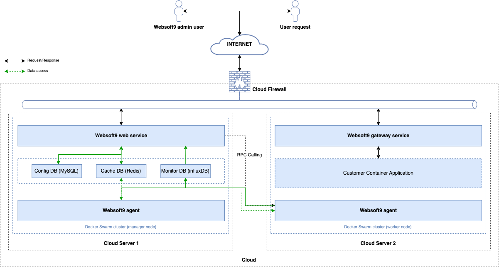
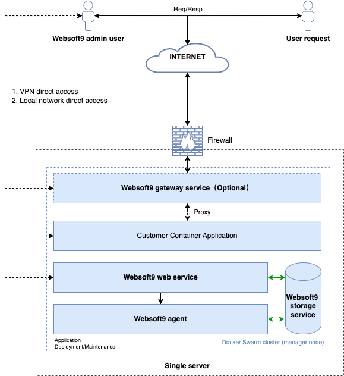
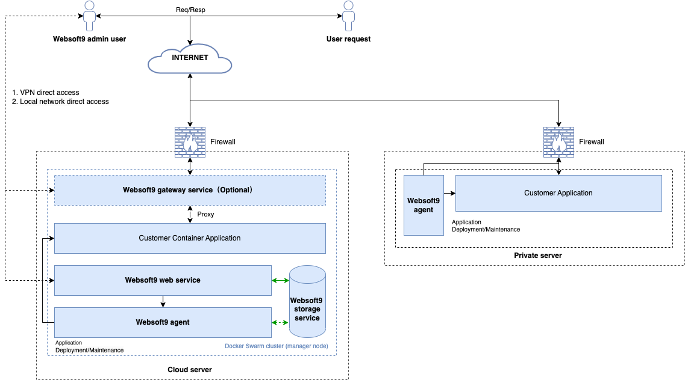
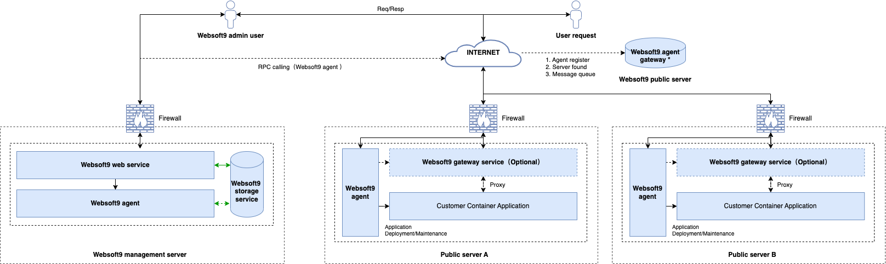
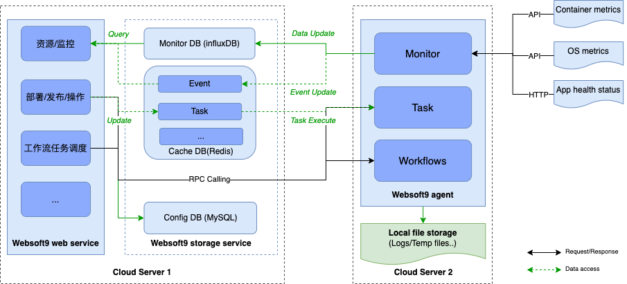
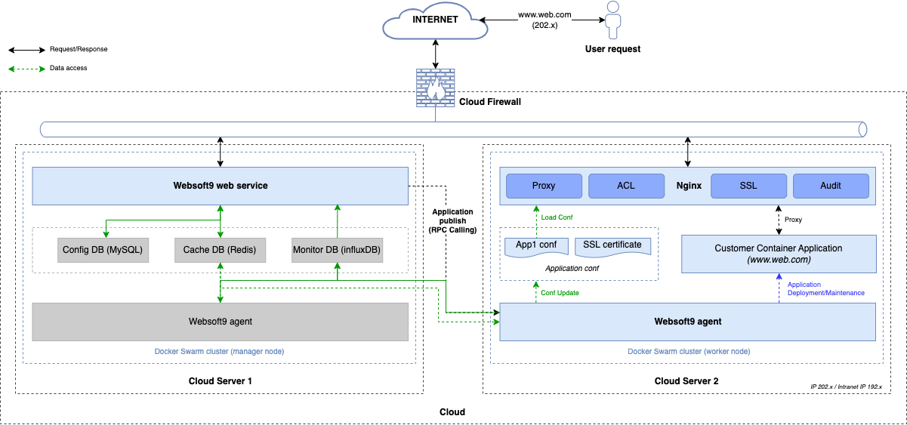

# Websoft9 架构设计说明书

**目录**

- [Websoft9 架构设计说明书](#websoft9-架构设计说明书)
  - [1. 引言](#1-引言)
    - [1.1 名词定义](#11-名词定义)
    - [1.2 技术参考](#12-技术参考)
  - [2. 总体设计](#2-总体设计)
    - [2.1 系统架构概述](#21-系统架构概述)
    - [2.2 系统边界与接口规范](#22-系统边界与接口规范)
      - [2.2.1 系统边界](#221-系统边界)
      - [2.2.2 接口规范](#222-接口规范)
    - [2.3 安全设计原则](#23-安全设计原则)
  - [3. 应用架构设计](#3-应用架构设计)
    - [3.1 用户角色](#31-用户角色)
    - [3.2 应用服务](#32-应用服务)
    - [3.3 平台功能](#33-平台功能)
  - [4. 技术架构设计](#4-技术架构设计)
    - [4.1 Websoft9 gateway service](#41-websoft9-gateway-service)
    - [4.2 Websoft9 web service](#42-websoft9-web-service)
    - [4.3 Websoft9 agent](#43-websoft9-agent)
    - [4.4 Websoft9 storage service](#44-websoft9-storage-service)
    - [4.5 Docker runtime](#45-docker-runtime)
  - [5. 网络架构设计](#5-网络架构设计)
    - [5.1 部署架构](#51-部署架构)
      - [5.1.1 标准部署架构](#511-标准部署架构)
      - [5.1.2 最小化部署架构](#512-最小化部署架构)
      - [5.1.3 混合云部署架构](#513-混合云部署架构)
    - [5.2 客户端架构](#52-客户端架构)
    - [5.3 应用网关架构](#53-应用网关架构)
  - [6. 技术选型](#6-技术选型)

## 1. 引言

本文档为 **Websoft9架构升级** 的系统架构设计文档，本文档的编写目的在于明确 **Websoft9架构升级** 需求的开发途径以及技术实现方法，通过此文档，为此 **Websoft9架构升级** 需求的维护提供清晰、详细的设计，为下阶段开发工作的开展起到指导作用。

本文档的预期读者是 **Websoft9架构升级** 需求相关的开发人员、系统运维人员。

### 1.1 名词定义

| 名词                  | 说明                                                                                                                                           |
| --------------------- | ---------------------------------------------------------------------------------------------------------------------------------------------- |
| `平台`                | 本文档所述"平台"、"`Websoft9平台`"均指`Websoft9平台`。                                                                                         |
| `CI/CD`               | 持续集成（Continuous Integration, CI）与持续交付/部署（Continuous Delivery/Deployment, CD）。 通过自动化流程和工具简化并加快软件开发生命周期。 |
| `Websoft9 Mobile` | `Websoft9平台`提供的移动端 APP，提供监控分析、便捷操作和基本查询功能。                                                                       |
| `Websoft9 Agent`      | `Websoft9平台`提供的服务器客户端代理，提供服务端任务执行、监控采集等功能。                                                                         |
| `应用`                | `Websoft9平台`应用市场提供的应用，支持用户按需选择进行应用部署、发布、更新等操作。                                                             |
| `纳管`                | 已安装`Websoft9 Agent`的服务器和部署的应用，可以被`Websoft9平台`直接管理。                                                                     |
| `发布`                | 指将已经部署的应用发布为互联网可访问的服务，例如：个人网站。本文档所述`应用发布`为将应用通过`Websoft9平台`提供的应用网关服务进行发布。         |
| `应用部署模版`        | 指容器模版（Dockerfile/Compose config）和工作流模版（workflow），用于描述如何将应用部署的配置信息。                                            |
| `SaaS`                | 软件即服务，本文档所述指`Websoft9平台`以`云服务平台`方式为客户提供应用托管服务。                                                               |
| `PaaS`                | 平台即服务，本文档所述指`Websoft9平台`以`私有化平台`方式为客户提供应用托管服务。                                                               |
| `RBAC`                | 基于角色的访问控制，一种通用的访问控制模型，基于用户角色进行权限管理，用户角色与权限之间是多对多的关系。                                       |
| `服务端`              | 本文档所述指`Websoft9 web service`。                                                                                                           |
| `客户端（Agent）`     | 本文档所述指`Websoft9 agent`。                                                                                                                 |
| `工作流`              | 可视化的业务流程编排工具，支持拖拽式组件编排，用于实现复杂的自动化任务调度和执行。                                                             |
| `资源组`              | 对应用、服务器、数据库等资源的分组管理。                                                       |

### 1.2 技术参考

为便于本文档的预期读者理解技术架构中所涉及的技术点、概念，提供了以下技术参考。

> - [RBAC](https://www.ibm.com/think/topics/rbac)
> - [InfluxDB docs](https://docs.influxdata.com/)
> - Nginx
>   - [Nginx access module](https://nginx.org/en/docs/http/ngx_http_access_module.html)
>   - [Nginx limit request module](https://nginx.org/en/docs/http/ngx_http_limit_req_module.html)
>   - [Nginx limit connection module](https://nginx.org/en/docs/http/ngx_http_limit_conn_module.html)
>   - [Nginx Lua module](https://nginxtutorials.com/nginx-lua-module/)
> - [RPC](https://www.geeksforgeeks.org/operating-systems/remote-procedure-call-rpc-in-operating-system/)
> - [Redis message queue](https://redis.io/glossary/redis-queue/)
> - Docker
>   - [Docker Engine API](https://docs.docker.com/reference/api/engine/)
>   - [Docker API docs](https://docs.docker.com/reference/api/engine/version/v1.51/#tag/Container)
>   - [Environment variables in Compose](https://docs.docker.com/compose/how-tos/environment-variables/)
>   - [How to use secrets in Compose](https://docs.docker.com/compose/how-tos/use-secrets/)

## 2. 总体设计

### 2.1 系统架构概述

`Websoft9平台`采用`分层架构设计`，将系统划分为不同的层次，每个层次具有明确的职责和功能，通过松耦合的方式进行交互，以提高系统的可维护性、可扩展性和灵活性。

系统架构分为以下几个层次：

- **用户接入层**：包括Web浏览器和移动端应用，为用户提供统一的访问入口
- **网关服务层**：基于Nginx实现的应用网关，提供代理转发、访问控制、SSL证书管理等功能
- **平台服务层**：核心业务逻辑层，采用前后端分离架构，提供RESTful API接口
- **平台客户端层**：部署在各服务器节点的 Agent客户端，负责任务执行和监控数据采集
- **数据存储层**：包括配置数据库、缓存数据库和监控数据库，提供数据持久化服务
- **基础设施层**：Docker运行时环境，提供容器化应用的运行支撑

### 2.2 系统边界与接口规范

#### 2.2.1 系统边界

- **外部边界**

`Websoft9平台`与外部系统的交互主要包括与公有云或私有云基础设施的集成，以实现服务器和应用的纳管；与`Websoft9应用市场`的集成，为用户提供更多的应用选择；以及与外部告警通知系统的集成，实现告警信息的推送。

- **内部边界**

系统内部各层次之间通过明确的接口进行交互，例如，网关服务层与平台服务层之间通过API进行通信，平台服务层与平台客户端层之间通过消息队列和RPC调用进行通信，平台服务层与平台数据存储层之间通过数据库接口进行数据读写操作。

#### 2.2.2 接口规范

- **API接口**

`平台服务层`（Websoft9 web service）提供统一的`RESTful API`接口，供前端用户界面和外部系统调用。API接口遵循标准的HTTP方法（GET、POST、PUT、DELETE），使用`JSON`格式进行数据传输，同时提供详细的API文档，方便开发者进行集成和调用。

- **消息队列接口**

客户端与服务端之间通过`Redis消息队列`进行事件消息的交互。消息队列遵循Redis的消息队列规范，采用`发布-订阅模式`或`队列模式`进行消息传递，确保消息的可靠传输和处理。

- **RPC接口**

服务端通过`RPC调用`向客户端下发任务指令，客户端执行任务后返回执行结果。`RPC接口`采用`gRPC`协议，基于HTTP/2和Protocol Buffers实现高效的二进制通信，确保任务指令的可靠传输和执行。支持双向流式通信，实现实时的任务状态反馈。

- **数据库接口**

平台服务层与平台数据存储层之间通过`数据库接口`进行数据读写操作。不同类型的数据库采用相应的数据库驱动和接口规范：

- `MySQL/PostgreSQL`：使用`GORM`作为ORM框架，提供统一的数据库操作接口。
- `Redis`：使用`go-redis`库，支持集群模式和哨兵模式。
- `InfluxDB`：使用`influxdb-client-go`库，支持时序数据的高效写入和查询。
- 所有数据库连接均支持连接池管理，确保连接资源的高效利用。

### 2.3 安全设计原则

`Websoft9平台`在架构设计和实现过程中，遵循以下安全设计原则：

- **最小权限原则**：所有服务、用户、进程仅授予完成任务所需的最小权限，避免权限过大带来的安全风险。
- **数据加密**：敏感数据（如用户凭证、密钥、通信数据）在传输和存储过程中均采用加密措施（如HTTPS、TLS、加密存储等）。
- **认证与授权**：平台采用基于RBAC的权限模型，所有API和管理操作均需身份认证和权限校验。
- **安全审计**：对关键操作和敏感事件进行日志记录，支持审计追踪和合规检查。
- **输入校验**：所有外部输入均进行严格校验，防止SQL注入、XSS等常见安全漏洞。
- **合规性**：平台设计和实现遵循相关法律法规和行业标准（如GDPR、等保等）。

## 3. 应用架构设计

### 3.1 用户角色

| 用户角色   | 描述                                                                          |
| ---------- | ----------------------------------------------------------------------------- |
| `开发角色` | 开发者，涉及应用的开发与部署、资源监控、日常维护等应用运维工作。              |
| `运维角色` | IT运维，涉及服务器、网络等基础架构运维、监控分析、资源管理等IT运维工作。      |
| `管理角色` | CTO/CIO，涉及对企业自身IT架构、IT资产管理、IT建设规划与安全审计等IT管理工作。 |

### 3.2 应用服务

用户可以通过浏览器直接访问`Websoft9平台`，也可以通过`Websoft9 Mobile App`访问`Websoft9平台`，`Websoft9 Mobile App`提供了有限的功能支持，仅提供监控分析图表的展示、便捷操作（如应用启停操作）、基本状态或日志的查询等功能。

### 3.3 平台功能

基于项目驱动的架构设计，平台功能按照用户使用场景和业务流程进行组织，提供完整的云应用管理解决方案。

<table>
    <tr>
        <th style="width:100px">功能模块</th>
        <th style="width:100px">功能名称</th>
        <th>描述</th>
    </tr>
    <tr>
        <td rowspan="2" style="font-weight:700">平台主页</td>
        <td>总览仪表盘</td>
        <td>包括项目总览看板和监控总览看板。项目总览看板展示平台所有项目的汇总信息和关键指标；监控总览看板提供平台整体的监控数据展示。</td>
    </tr>
    <tr>
        <td>应用快捷导航</td>
        <td>提供对所有用户已部署、已发布的应用的快速访问入口，方便用户进行直接访问使用。</td>
    </tr>
    <tr>
        <td rowspan="7" style="font-weight:700">项目管理</td>
        <td>仪表盘</td>
        <td>为单个项目提供专门的监控和管理视图，包括监控看板、任务看板、资源看板三个维度的数据展示。</td>
    </tr>
    <tr>
        <td>文件夹</td>
        <td>提供项目文件夹和个人文件夹的管理功能，支持文件的上传、下载、创建、修改、删除，支持版本控制管理。</td>
    </tr>
    <tr>
        <td>应用</td>
        <td>提供项目所有的应用管理，包括：应用查询、卸载、更新、发布、克隆、配置等功能。</td>
    </tr>
    <tr>
        <td>工作流</td>
        <td>提供交互式的流程编排和丰富组件，支持用户按需进行应用部署的工作流编排、工作流调度和执行。</td>
    </tr>
    <tr>
        <td>项目资源</td>
        <td>支持对项目资源进行分组管理，通过资源组控制不同项目、项目成员对资源的使用权限。</td>
    </tr>
    <tr>
        <td>项目团队</td>
        <td>提供项目级别的团队成员管理，支持成员管理、角色分配、权限控制等。</td>
    </tr>
    <tr>
        <td>项目设置</td>
        <td>提供项目级别的配置管理，包括环境变量管理和项目配置（基础信息配置、运行时配置、安全配置）。</td>
    </tr>
    <tr>
        <td rowspan="2" style="font-weight:700">应用市场</td>
        <td>应用市场列表</td>
        <td>应用市场的首页入口，按照常见的应用软件进行分类展示，支持应用搜索、部署、应用模版下载等功能。</td>
    </tr>
    <tr>
        <td>应用心愿单</td>
        <td>应用市场的需求列表，用户可提交应用心愿单、查看应用心愿单、评价应用心愿单，支持悬赏机制和需求跟踪管理。</td>
    </tr>
    <tr>
        <td rowspan="7" style="font-weight:700">平台管理</td>
        <td>项目管理</td>
        <td>支持对项目的创建、修改、删除、项目管理员配置等全局项目管理功能。</td>
    </tr>
    <tr>
        <td>平台设置</td>
        <td>提供基本设置、系统更新、系统服务、SMTP、短信服务、Webhook、软件源、容器集群、容器镜像、数据存储、系统任务等平台级配置。</td>
    </tr>
    <tr>
        <td>安全管理</td>
        <td>提供角色管理、权限管理、认证管理功能，支持RBAC权限控制、API访问认证、用户登录认证等。</td>
    </tr>
    <tr>
        <td>用户管理</td>
        <td>支持用户的管理，支持与LDAP、AD等域认证系统集成。</td>
    </tr>
    <tr>
        <td>告警通知</td>
        <td>提供告警信息查询、告警规则配置、推送管理，支持站内信、邮件、Webhook、Websoft9 mobile app、短信等多种推送方式。</td>
    </tr>
    <tr>
        <td>个人中心</td>
        <td>用户个人主页，提供个人资料维护、个人设置（系统时区、系统语言、推送通知、双因子认证、密码修改）等功能。</td>
    </tr>
    <tr>
        <td>审计日志</td>
        <td>对敏感业务操作的日志记录，支持按审计日志类别、日志内容关键词、时间范围、用户等条件查询，支持日志导出。</td>
    </tr>
</table>

**功能架构特点：**

- **项目驱动**：以项目为核心的资源组织和权限管理，实现资源隔离和团队协作
- **分层管理**：平台级管理和项目级管理相结合，满足不同层次的管理需求
- **工作流驱动**：支持可视化工作流编排，实现复杂业务场景的自动化处理
- **全生命周期**：覆盖应用从部署到运维的完整生命周期管理
- **安全合规**：完善的权限控制、审计日志、密钥管理等安全功能
- **多云支持**：支持公有云、私有云和混合云环境下的统一管理

## 4. 技术架构设计

**总体技术架构图**

**逻辑架构图**

`Websoft9平台`技术架构采用服务分层、单一职责的设计，每一层分别对应不同的角色与职责，例如：数据存储层负责平台所有数据的存储与管理，其中采用MySQL作为关系型数据库来存储管理平台的配置数据，采用Redis作为缓存数据库来存储管理平台的实时数据。

默认情况下平台各服务均采用容器化实现快速部署，其中`Websoft9 agent`必须使用root用户启动。

### 4.1 Websoft9 gateway service

`网关服务层`（Websoft9 gateway service）是基于`Nginx`实现的`应用网关服务`，提供轻量级的应用网关，支持用户应用的快速发布、访问控制等功能。

>
> **主要功能**
>
> - `Proxy` 网络请求代理转发
> - `ACL` 用户访问控制
> - `SSL` SSL证书管理
> - `Audit` 审计日志查询
>

### 4.2 Websoft9 web service

`平台服务层`（Websoft9 web service）是平台的核心服务，采用前后端分离架构设计。前端基于Vue 3技术栈构建现代化的单页应用，后端基于Golang和Gin框架提供高性能的RESTful API服务。

>
> **前端架构特点**
>
> - 基于Vue 3 Composition API，提供更好的代码组织和复用。
> - 使用Element Plus组件库，确保界面的一致性和美观性。
> - 采用Pinia进行状态管理，支持模块化的状态组织。
> - 使用Vue Router实现单页应用的路由管理。
> - 支持国际化（i18n），提供多语言界面支持。
>
> **后端架构特点**
>
> - 基于Gin框架的高性能HTTP服务。
> - 采用分层架构：Controller -> Service -> Repository。
> - 使用GORM作为ORM框架，支持多种数据库。
> - 集成JWT认证和RBAC权限控制。
> - 支持中间件扩展，如日志、限流、跨域等。
> - 提供完整的API文档和接口规范。

### 4.3 Websoft9 agent

`平台客户端层`（Websoft9 agent）是部署在各服务器节点的客户端程序，负责执行服务端下发的任务指令和采集监控数据。Agent采用Golang开发，以系统服务方式运行，确保高可用性和稳定性。

>
> **主要功能**
>
> - `Monitor` 服务器/应用监控及数据采集
>   - 系统资源监控（CPU、内存、磁盘、网络）
>   - 容器应用监控（容器状态、资源使用）
>   - 应用健康检查（HTTP检查、TCP检查、自定义脚本）
>   - 日志采集和转发
> - `Task` 服务端任务指令执行
>   - 应用部署和管理操作
>   - 系统命令执行
>   - 文件传输和管理
>   - 系统服务管理
> - `Workflows` 工作流任务调度
>   - 工作流任务的本地执行
>   - 任务状态反馈和日志上报
>   - 任务超时和异常处理
> - `Communication` 通信管理
>   - 与服务端的gRPC通信
>   - 心跳保持和状态上报
>   - 消息队列事件处理
>

### 4.4 Websoft9 storage service

`平台数据存储层`（Websoft9 storage service）提供配置数据存储、缓存数据存储、监控数据存储，包括：

- **Config DB**

配置管理数据存储，用于存储平台配置信息、用户数据、应用元数据、权限信息等结构化数据。公有云平台（`SaaS`）可以采用云厂商的RDS服务实现，私有云平台（`PaaS`）采用MySQL实现，同时支持PostgreSQL 作为备选方案。支持主从复制、读写分离等高可用配置。

- **Cache DB**

缓存数据存储，采用Redis实现。用于存储用户会话信息、权限缓存、消息队列等实时数据。支持数据持久化配置，确保重要缓存数据的可靠性。

- **Monitor DB**

监控数据存储，采用InfluxDB实现。用于存储服务器性能指标、应用监控数据、告警事件等时序数据，支持高效的时间范围查询和数据聚合分析。

### 4.5 Docker runtime

`Docker runtime`是平台依赖的Docker运行时环境，提供容器化应用的运行支撑。主要功能包括：

- **容器管理**：支持容器的创建、启动、停止、删除等生命周期管理
- **镜像管理**：支持Docker镜像的拉取、构建、推送和版本管理
- **网络管理**：提供容器网络的创建和配置，支持overlay网络
- **存储管理**：支持数据卷的创建、挂载和管理
- **集群支持**：基于Docker Swarm实现容器集群管理和服务编排
- **资源控制**：支持CPU、内存等资源的限制和分配

## 5. 网络架构设计

以标准部署架构为例，`Cloud Server1`作为管理服务器，部署安装`Websoft9平台`服务，`Cloud Server2`作为应用服务器，部署安装客户的`容器应用`，并通过`Websoft9网关服务`实现应用的访问控制。采用`Docker Swarm`组成`容器集群`，实现容器应用的网络互通。

>
> **注意**
>
> 当前技术架构设计中，并不支持复杂应用（微服务架构、分布式架构）的服务发现、服务路由、资源隔离等功能。
>

### 5.1 部署架构

#### 5.1.1 标准部署架构

标准部署架构是平台默认推荐的部署方式（如上图所示），按照服务角色和资源需求的不同划分为：管理服务器和应用服务器，管理服务器和应用服务器位于同一物理网络机房。管理服务器部署安装`Websoft9平台`服务，应用服务器部署安装客户的`容器应用`，并通过`Websoft9网关服务`实现应用的访问控制，结合客户实际业务运营的需求，可以按需扩展应用服务器数量。

#### 5.1.2 最小化部署架构

最小化部署架构是平台最简化的单机部署方式，仅使用一台服务器部署安装`Websoft9平台`服务和客户的`容器应用`，通过`Websoft9网关服务`实现应用的访问控制（可选）。该部署方式适用于单一应用的快速部署、测试和验证场景。

#### 5.1.3 混合云部署架构

**在混合云架构中，`Websoft9平台`服务的部署位置取决于客户实际业务需求，在保障网络可访问的情况下，既可以部署在公有云服务器，也可以部署在私有云服务器**。

>
> **注意**
>
> 在涉及跨物理网络机房的部署架构中，不建议使用`Docker Swarm`组成`容器集群`，推荐使用K8S类型的技术架构。
>

- **公有云和私有云混合部署**

公有云和私有云混合的部署主要来自于中大型企需求，例如：多应用部署、应用和数据中心分离、应用和服务分离等场景。

>
> 图例：客户的应用部署于公有云服务器，并且依赖私有云服务器的应用提供部分功能。在这种场景中，可以将`Websoft9平台`服务部署在公有云服务器，以实现对客户应用的统一管理，同时将私有云服务器接入纳管，以实现对客户服务器资源的统一管理。
>

- **多公有云混合部署**

多公有云混合部署是指多个跨物理网络机房的公有云应用部署场景，涉及到对多个云服务器、多个应用的集中统一管理。

>
> 图例：客户将同一款应用（Wordpress）分别部署于阿里云杭州机房（Public server A）、阿里云香港机房（Public server B）。在这种场景中，可以将`Websoft9平台`服务部署在阿里云杭州机房（或独立服务器），并且可以对阿里云杭州机房、阿里云香港机房增加`Websoft9网关服务`。
>
> **Websoft9 agent gateway**
>
> `Websoft9 agent`的服务网关，该组件为保留的可扩展设计，类似于Zookeeper服务治理框架，主要目的是解决多云架构中的Agent注册、主动服务查找、事件消息队列等需求。
>

### 5.2 客户端架构

客户端（`Websoft9 agent`）架构设计描述了客户端的技术架构和网络架构，客户端与服务端（`Websoft9 web service`）之间的依赖关系、服务调用关系。

客户端与服务端采用松耦合的设计，某一侧的服务故障，不影响另一侧服务的继续运行，避免因单点故障导致平台服务中断。通过消息队列（`Redis message queue`）实现事件消息的交互，通过RPC调用（`RPC Calling`）实现任务指令的下发执行。

`Websoft9 agent`主要核心功能包含：

- **Monitor**

提供对`Container metrics`，`OS metrics`，`App health status`的监控指标数据采集和异常状态事件上报，并存储至监控数据库，对于异常的状态事件，服务端将根据告警规则进行告警推送等异常处理。

>
> **事件消息类型**
>
> - 应用运行状态（`Container status`）
> - 应用健康状态（`App health status`）
> - 客户端状态（`agent heartbeat`），客户端主动上报心跳，由服务端监测并进行异常告警。
> - 运行时异常（`runtime error`），例如：任务调度执行异常。
>

- **Task**

提供对服务端下发的任务指令的执行，并返回执行结果。**对于一次性调用的任务指令，采用RPC调用方式实现；对于周期性的任务指令，采用定时任务方式实现。** 例如：部署一个应用至目标服务器、重启某一个系统服务、定期的数据文件清理、上传文件至目标服务器等操作。

- **Workflows**

提供对服务端下发的工作流任务的执行，并返回执行结果，**采用RPC调用方式实现**。例如：持续部署的工作流任务。

>
> **注意**
>
> 工作流的任务调度可能基于第三方组件单独实现，此处仅作技术设计。
>

- **Local file storage**

客户端的本地文件存储，用于存储客户端的配置文件、运行日志文件、临时文件。

### 5.3 应用网关架构

应用网关服务（Websoft9 gateway service）基于`Nginx`实现，架构设计描述了应用网关服务中的核心组件和功能、容器应用与网关服务之间的依赖关系。

**应用网关服务为多实例的服务，每个实例是一套独立的Nginx，可以根据应用部署需要，在多服务器分别部署多个应用网关。**

`Websoft9 gateway service`主要核心功能包含：

- **Proxy**

网络请求的代理转发，这是Nginx的核心能力。

- **ACL**

提供基于规则的用户访问控制。例如：IP地址黑白名单控制、User-Agent过滤、访问次数控制等。

- **SSL**

提供自动的证书绑定与配置。

- **Audit**

记录应用访问日志，并提供审计日志的查询。

>
> **注意**
>
> 部分功能需额外开启`Nginx`组件模块。
>

## 6. 技术选型

采用`Golang`作为主要的服务端开发语言，采用`Gin`作为服务端Web框架，采用`Vue 3`作为前端用户界面的开发框架。技术选型遵循以下原则：

- **成熟稳定**：选择经过生产环境验证的成熟技术栈
- **性能优先**：优先选择高性能、低资源消耗的技术方案
- **社区活跃**：选择社区活跃、文档完善的开源技术
- **扩展性强**：支持水平扩展和功能扩展的技术架构
- **运维友好**：便于部署、监控和维护的技术选择

具体技术栈及配置如下：

| -               | 技术栈                   | 文档/社区                                                    |
| --------------- | ------------------------ | ------------------------------------------------------------ |
| **开发语言**    | Golang                   | <https://golang.google.cn/>                                  |
| - Web framework | Gin                      | <https://github.com/gin-gonic/gin>                           |
| - ORM框架       | GORM                     | <https://gorm.io/>                                           |
| - Redis         | go-redis                 | <https://github.com/redis/go-redis>                          |
| - OAuth2        | go-oauth2                | <https://github.com/go-oauth2/oauth2>                        |
| - InfluxDB      | influxdb-client-go       | <https://github.com/influxdata/influxdb-client-go>           |
| - Git           | go-git                   | <https://github.com/go-git/go-git>                           |
| - gRPC          | grpc-go                  | <https://github.com/grpc/grpc-go>                            |
| - Mockery*      | mockery                  | <https://github.com/vektra/mockery>                          |
| **前端框架**    | Vue 3                    | <https://vuejs.org/>                                         |
| - UI组件库      | Element Plus             | <https://element-plus.org/>                                  |
| - 状态管理      | Pinia                    | <https://pinia.vuejs.org/>                                   |
| - 路由管理      | Vue Router               | <https://router.vuejs.org/>                                  |
| - HTTP客户端    | Axios                    | <https://axios-http.com/>                                    |
| **数据库**      |                          |                                                              |
| - 关系型数据库  | MySQL 8.0                | <https://dev.mysql.com/doc/>                                 |
| - 关系型数据库  | PostgreSQL              | <https://www.postgresql.org/docs/>                           |
| - 内存数据库    | Redis                | <https://redis.io/docs/latest/develop/>                      |
| - 时序数据库    | InfluxDB 2.x             | <https://docs.influxdata.com/influxdb/v2/>                   |
| **容器**        |                          |                                                              |
| - 容器引擎      | Docker                   | <https://docs.docker.com/engine/>                            |
| - 容器部署      | Docker Compose           | <https://docs.docker.com/compose/>                           |
| - 容器集群      | Docker Swarm             | <https://docs.docker.com/engine/swarm/>                      |
| **应用网关**    |                          |                                                              |
| - Proxy         | Nginx                    | <https://nginx.org/en/docs/>                                 |
| - ACL           | nginx-lua-module         | <https://nginxtutorials.com/nginx-lua-module/>               |
| - ACL           | nginx-http-access-module | <https://nginx.org/en/docs/http/ngx_http_access_module.html> |
| - SSL           | Let's Encrypt            | <https://letsencrypt.org/zh-cn/docs/>                        |

>
> **说明**
>
> - **Mockery** 测试场景使用，非必选，自动生成mock代码，提升单元测试效率
>
