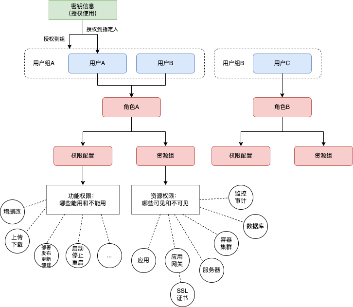

# Websoft9 功能详细设计说明书 V1.1

**目录**

- [Websoft9 功能详细设计说明书 V1.1](#websoft9-功能详细设计说明书-v11)
  - [1. 引言](#1-引言)
  - [2. 安全管理能设计](#2-安全管理能设计)
    - [2.1 角色管理](#21-角色管理)
    - [2.2 权限管理](#22-权限管理)
    - [2.3 认证管理](#23-认证管理)
  - [3. 安全管理接口设计](#3-安全管理接口设计)
    - [3.1 角色管理](#31-角色管理)
    - [3.2 权限管理](#32-权限管理)
    - [3.3 认证管理](#33-认证管理)
  - [4. 安全管理数据库设计](#4-安全管理数据库设计)
  - [5. 附录](#5-附录)
    - [5.1 操作权限定义](#51-操作权限定义)
    - [5.2 认证参数配置文件](#52-认证参数配置文件)

## 1. 引言

本文档为 **Websoft9架构升级** 的详细设计文档，本文档的编写目的在于明确 **Websoft9架构升级** 需求的开发途径以及应用方法，通过此文档，为此 **Websoft9架构升级** 需求的维护提供清晰、详细的设计，为下阶段开发工作的开展起到指导作用。

本文档的预期读者是 **Websoft9架构升级** 需求相关的业务人员、开发人员以及系统运维人员。

## 2. 安全管理能设计

### 2.1 角色管理

支持对角色的管理，包括角色列表、角色添加、角色修改、角色删除。平台默认预置管理员、普通用户两个角色，方便用户直接使用。

- **功能描述**

1. 【角色查询】

支持分页查询和多条件筛选，查询条件包括：

| 查询条件 | 示例   | 描述                                        |
| -------- | ------ | ------------------------------------------- |
| 搜索     | 关键词 | 文本输入框，支持角色名称的精确或模糊查询。  |
| 角色状态 | 启用   | 单选下拉选项，支持按状态筛选（启用/禁用）。 |
| 更新时间 | 近7天  | 日期范围选择器，支持按更新时间范围筛选。    |

2. 【角色列表】

按照创建时间倒序排列，以列表方式展示角色信息，展示信息包括：

- 角色名称、角色描述、角色状态、创建时间、创建用户、更新时间。
- 操作按钮：查看权限、编辑、启用/禁用、删除。

3. 【角色新增】

支持创建新角色：

- 【基本信息】角色名称、角色描述、角色状态。
- 【权限分配】选择角色拥有的功能权限。

4. 【角色修改】

支持对角色信息的修改：

- 【基本信息修改】角色名称、描述、状态。
- 【权限调整】修改角色的功能权限分配。

5. 【角色删除】

支持角色的安全删除：

- 【删除检查】检查角色是否有关联的用户，非空的角色不允许直接删除。
- 【确认删除】需要管理员二次确认删除操作。
- 【删除限制】系统预置角色不允许删除。
- 【删除审计】记录角色删除操作的审计日志。

6. 【权限管理】

支持角色权限的管理：

- 【查看权限】展示角色拥有的所有权限列表。
- 【权限分配】为角色分配功能权限。
- 【权限移除】移除角色的特定权限。
- 【批量操作】支持批量分配或移除权限。

7. 【预置角色】

平台预置的示例角色：

| 角色名称 | 角色描述                                   | 主要权限                                   |
| -------- | ------------------------------------------ | ------------------------------------------ |
| 管理员   | 系统管理员，拥有所有功能的完整权限         | 用户管理、系统配置、平台维护、所有资源管理 |
| 普通用户 | 普通用户，拥有基本的应用部署和资源管理权限 | 应用部署、工作流编排、个人资源管理         |
| 运维用户 | 运维人员，拥有服务器管理和监控分析权限     | 服务器管理、监控面板、告警管理             |
| 开发用户 | 开发人员，拥有应用开发和部署相关权限       | 应用市场、工作空间、应用管理               |

### 2.2 权限管理

支持对角色权限的管理，包括角色权限列表、角色权限添加、角色权限修改、角色权限删除。

- **功能描述**

1. 【权限查询】

支持分页查询和多条件筛选，查询条件包括：

| 查询条件 | 示例     | 描述                                        |
| -------- | -------- | ------------------------------------------- |
| 搜索     | 关键词   | 文本输入框，支持权限名称的精确或模糊查询。  |
| 权限模块 | 平台管理 | 多选下拉选项，支持按功能模块筛选。          |
| 权限状态 | 启用     | 单选下拉选项，支持按状态筛选（启用/禁用）。 |
| 更新时间 | 近7天    | 日期范围选择器，支持按更新时间范围筛选。    |

2. 【权限列表】

按照功能模块分组展示，以树形结构展示权限信息，展示信息包括：

- 权限名称、权限描述、权限状态、所属模块、创建时间、创建用户、更新时间。
- 操作按钮：编辑、启用/禁用、删除。

3. 【权限新增】

支持创建新权限：

- 【基本信息】权限名称、权限描述、权限状态。
- 【所属角色】设置权限所属的角色。
- 【所属模块】选择权限所属的功能模块。

4. 【权限修改】

支持对权限信息的修改：

- 【基本信息修改】权限名称、描述、状态。
- 【权限归属调整】修改权限的角色归属。
- 【模块归属调整】修改权限的模块归属。

5. 【权限删除】

支持权限的安全删除：

- 【删除检查】检查权限是否被角色使用，非空的权限配置不允许直接删除。。
- 【确认删除】需要管理员二次确认删除操作。
- 【删除审计】记录权限删除操作的审计日志。

6. 【权限分配】

支持权限与角色的关联管理：

- 【角色权限查看】查看特定角色拥有的所有权限。
- 【权限分配】为角色分配新权限。
- 【权限回收】从角色移除特定权限。
- 【批量分配】支持批量权限分配操作。

- **技术实现**

1. 【权限模型设计】

采用RBAC（基于角色的访问控制）模型，权限控制粒度为按钮级：



1. 【权限验证实现】

权限验证机制：

- 【前端验证】根据用户权限控制界面元素的显示和隐藏。
- 【后端验证】API接口层进行权限验证，确保数据安全。
- 【缓存机制】使用Redis缓存用户权限信息，提高验证效率。
- 【权限刷新】权限变更后实时刷新用户权限缓存。

### 2.3 认证管理

支持对平台API服务的授权访问认证配置，支持`Token`、`OAuth2.0`的认证方式；支持对用户登录的认证配置，支持`OAuth2.0`、`双因子认证`（`TOTP`、`邮件验证码`，`手机短信验证码`）的认证方式。

- **功能描述**

1. 【API访问认证配置】

支持配置API服务的认证方式：

- 【Token认证配置】
  - Token生成策略：JWT/随机字符串。
  - Token有效期设置：1小时-30天可选。
  - Token刷新策略：自动刷新/手动刷新。
  - Token撤销管理：支持主动撤销Token。

- 【OAuth2.0认证配置】
  - 授权服务器配置：支持接入第三方OAuth2.0服务。
  - 客户端注册：配置Client ID和Client Secret。
  - 授权范围设置：定义API访问权限范围。
  - 回调地址配置：设置授权回调URL。

2. 【用户登录认证配置】

支持配置用户登录的认证方式：

- 【基础认证配置】
  - 用户名密码认证：支持用户名/邮箱/手机号登录。
  - 密码策略设置：复杂度要求、过期策略、重试限制。
  - 会话管理：会话超时时间、并发登录限制。
  - 登录安全：IP白名单、登录时间限制。

- 【OAuth2.0登录配置】
  - 第三方登录：支持接入微信、钉钉、企业微信等。
  - 用户映射：配置第三方用户与平台用户的映射关系。
  - 自动注册：支持第三方用户首次登录自动创建账号。
  - 权限同步：支持从第三方系统同步用户权限。

- 【双因子认证配置】
  - TOTP认证：支持Google Authenticator等TOTP应用。
  - 邮件验证码：配置邮件发送服务和验证码模板。
  - 短信验证码：配置短信发送服务和验证码模板。
  - 强制启用：支持为特定角色强制启用双因子认证。

- **技术实现**

1. 【JWT Token实现】

- 使用JWT实现无状态的Token认证。
- 使用Redis存储Token信息，实现Token的缓存和有效期管理。
- Token包含用户信息、权限信息、有效期等信息。

2. 【OAuth2.0集成实现】

集成第三方OAuth2.0认证服务。

>
> 使用Go语言的`go-oauth2`包集成第三方OAuth2.0服务。
>

3. 【TOTP双因子认证实现】

实现基于时间的一次性密码认证：

```go
// TOTP密钥生成
func generateTOTPSecret(username string) (*otp.Key, error) {
    return totp.Generate(totp.GenerateOpts{
        Issuer:      "Websoft9",
        AccountName: username,
        SecretSize:  32,
    })
}

// TOTP验证
func validateTOTP(secret, code string) bool {
    return totp.Validate(code, secret)
}

// 双因子认证中间件
func requireTwoFactor(next http.HandlerFunc) http.HandlerFunc {
    return func(w http.ResponseWriter, r *http.Request) {
        user := getCurrentUser(r)

        if user.TwoFactorEnabled && !isTwoFactorVerified(r) {
            http.Redirect(w, r, "/auth/2fa", http.StatusFound)
            return
        }

        next(w, r)
    }
}
```

## 3. 安全管理接口设计

### 3.1 角色管理

**获取角色列表**

```text
GET /api/v1/roles
```

查询参数：

| 参数名     | 数据类型 | 是否可空 | 描述                                        |
| ---------- | -------- | -------- | ------------------------------------------- |
| page       | integer  | 是       | 页码，默认1                                 |
| page_size  | integer  | 是       | 每页数量，默认20                            |
| search     | string   | 是       | 搜索关键词，支持角色名称的精确或模糊查询    |
| status     | integer  | 是       | 角色状态筛选（0-禁用，1-启用）              |
| start_time | string   | 是       | 更新时间范围开始，格式：2025-01-01 00:00:00 |
| end_time   | string   | 是       | 更新时间范围结束，格式：2025-01-01 23:59:59 |

响应示例：

```json
{
  "code": 200,
  "message": "success",
  "data": {
    "items": [
      {
        "id": 1,
        "name": "管理员",
        "code": "admin",
        "description": "系统管理员，拥有所有功能的完整权限",
        "is_system": true,
        "sort_order": 1,
        "status": 1,
        "permission_count": 50,
        "user_count": 2,
        "created_at": "2024-01-01 10:00:00",
        "updated_at": "2024-01-01 10:00:00",
        "created_by": "system"
      }
    ],
    "total": 4,
    "page": 1,
    "page_size": 20,
    "total_pages": 1
  }
}
```

**获取角色详情**

```text
GET /api/v1/roles/{id}
```

响应示例：

```json
{
  "code": 200,
  "message": "success",
  "data": {
    "id": 1,
    "name": "管理员",
    "code": "admin",
    "description": "系统管理员，拥有所有功能的完整权限",
    "is_system": true,
    "sort_order": 1,
    "status": 1,
    "permissions": [
      {
        "id": 1,
        "name": "用户管理",
        "code": "user:manage",
        "module": "user"
      }
    ],
    "users": [
      {
        "id": 1,
        "username": "admin",
        "email": "admin@websoft9.com"
      }
    ],
    "created_at": "2024-01-01 10:00:00",
    "updated_at": "2024-01-01 10:00:00"
  }
}
```

**创建角色**

```text
POST /api/v1/roles
```

请求体参数：

| 参数名         | 数据类型 | 是否可空 | 描述                             |
| -------------- | -------- | -------- | -------------------------------- |
| name           | string   | 否       | 角色名称，长度2-64字符           |
| code           | string   | 否       | 角色代码，唯一标识，长度2-32字符 |
| description    | string   | 是       | 角色描述，最大500字符            |
| permission_ids | array    | 是       | 权限ID数组                       |
| sort_order     | integer  | 是       | 排序顺序，默认0                  |
| status         | integer  | 是       | 状态（0-禁用，1-启用），默认1    |

请求示例：

```json
{
  "name": "项目管理员",
  "code": "project_admin",
  "description": "项目管理员，拥有项目完全管理权限",
  "permission_ids": [1, 2, 3, 4],
  "sort_order": 10,
  "status": 1
}
```

**更新角色**

```text
PUT /api/v1/roles/{id}
```

请求体参数：

| 参数名         | 数据类型 | 是否可空 | 描述                   |
| -------------- | -------- | -------- | ---------------------- |
| name           | string   | 是       | 角色名称，长度2-64字符 |
| description    | string   | 是       | 角色描述，最大500字符  |
| permission_ids | array    | 是       | 权限ID数组             |
| sort_order     | integer  | 是       | 排序顺序               |
| status         | integer  | 是       | 状态（0-禁用，1-启用） |

**删除角色**

```text
DELETE /api/v1/roles/{id}
```

响应示例：

```json
{
  "code": 200,
  "message": "角色删除成功"
}
```

**角色权限分配**

```text
POST /api/v1/roles/{id}/permissions
```

请求体参数：

| 参数名         | 数据类型 | 是否可空 | 描述       |
| -------------- | -------- | -------- | ---------- |
| permission_ids | array    | 否       | 权限ID数组 |

**角色权限移除**

```text
DELETE /api/v1/roles/{id}/permissions
```

请求体参数：

| 参数名         | 数据类型 | 是否可空 | 描述       |
| -------------- | -------- | -------- | ---------- |
| permission_ids | array    | 否       | 权限ID数组 |

**获取角色用户列表**

```text
GET /api/v1/roles/{id}/users
```

查询参数：

| 参数名    | 数据类型 | 是否可空 | 描述             |
| --------- | -------- | -------- | ---------------- |
| page      | integer  | 是       | 页码，默认1      |
| page_size | integer  | 是       | 每页数量，默认20 |

### 3.2 权限管理

**获取权限列表**

```text
GET /api/v1/permissions
```

查询参数：

| 参数名     | 数据类型 | 是否可空 | 描述                                          |
| ---------- | -------- | -------- | --------------------------------------------- |
| page       | integer  | 是       | 页码，默认1                                   |
| page_size  | integer  | 是       | 每页数量，默认20                              |
| search     | string   | 是       | 搜索关键词，支持权限名称的精确或模糊查询      |
| module     | string   | 是       | 权限模块筛选                                  |
| scope      | string   | 是       | 权限域筛选（platform-平台级，project-项目级） |
| status     | integer  | 是       | 权限状态筛选（0-禁用，1-启用）                |
| start_time | string   | 是       | 更新时间范围开始，格式：2025-01-01 00:00:00   |
| end_time   | string   | 是       | 更新时间范围结束，格式：2025-01-01 23:59:59   |

响应示例：

```json
{
  "code": 200,
  "message": "success",
  "data": {
    "items": [
      {
        "id": 1,
        "scope": "platform",
        "name": "用户管理",
        "code": "user:manage",
        "module": "user",
        "action": "manage",
        "resource": "user",
        "description": "用户管理权限",
        "is_system": true,
        "sort_order": 1,
        "status": 1,
        "role_count": 2,
        "created_at": "2024-01-01 10:00:00",
        "updated_at": "2024-01-01 10:00:00"
      }
    ],
    "total": 50,
    "page": 1,
    "page_size": 20,
    "total_pages": 3
  }
}
```

**获取权限树**

```text
GET /api/v1/permissions/tree
```

查询参数：

| 参数名 | 数据类型 | 是否可空 | 描述                                           |
| ------ | -------- | -------- | ---------------------------------------------- |
| scope  | string   | 是       | 权限域筛选（platform-平台级，project-项目级）  |
| status | integer  | 是       | 权限状态筛选（0-禁用，1-启用），默认仅显示启用 |

响应示例：

```json
{
  "code": 200,
  "message": "success",
  "data": [
    {
      "id": 1,
      "scope": "platform",
      "name": "平台管理",
      "code": "platform",
      "module": "platform",
      "description": "平台管理模块",
      "children": [
        {
          "id": 2,
          "scope": "platform",
          "name": "用户管理",
          "code": "user",
          "module": "user",
          "description": "用户管理模块",
          "children": [
            {
              "id": 3,
              "scope": "platform",
              "name": "查看用户",
              "code": "user:read",
              "module": "user",
              "action": "read",
              "resource": "user",
              "description": "查看用户列表和详情"
            },
            {
              "id": 4,
              "scope": "platform",
              "name": "创建用户",
              "code": "user:create",
              "module": "user",
              "action": "create",
              "resource": "user",
              "description": "创建新用户"
            }
          ]
        }
      ]
    },
    {
      "id": 20,
      "scope": "project",
      "name": "项目管理",
      "code": "project",
      "module": "project",
      "description": "项目管理模块",
      "children": [
        {
          "id": 21,
          "scope": "project",
          "name": "应用管理",
          "code": "application",
          "module": "application",
          "description": "应用管理模块",
          "children": [
            {
              "id": 22,
              "scope": "project",
              "name": "部署应用",
              "code": "application:deploy",
              "module": "application",
              "action": "deploy",
              "resource": "application",
              "description": "部署新应用"
            }
          ]
        }
      ]
    }
  ]
}
```

**获取权限详情**

```text
GET /api/v1/permissions/{id}
```

响应示例：

```json
{
  "code": 200,
  "message": "success",
  "data": {
    "id": 1,
    "scope": "platform",
    "name": "用户管理",
    "code": "user:manage",
    "module": "user",
    "action": "manage",
    "resource": "user",
    "description": "用户管理权限",
    "is_system": true,
    "sort_order": 1,
    "status": 1,
    "roles": [
      {
        "id": 1,
        "name": "管理员",
        "code": "admin"
      }
    ],
    "created_at": "2024-01-01 10:00:00",
    "updated_at": "2024-01-01 10:00:00"
  }
}
```

**创建权限**

```text
POST /api/v1/permissions
```

请求体参数：

| 参数名      | 数据类型 | 是否可空 | 描述                                      |
| ----------- | -------- | -------- | ----------------------------------------- |
| scope       | string   | 否       | 权限域（platform-平台级，project-项目级） |
| name        | string   | 否       | 权限名称，长度2-64字符                    |
| code        | string   | 否       | 权限编码，唯一标识，长度2-64字符          |
| module      | string   | 否       | 模块名称，长度2-32字符                    |
| action      | string   | 否       | 操作名称，长度2-32字符                    |
| resource    | string   | 是       | 资源标识，长度2-64字符                    |
| description | string   | 是       | 权限描述，最大500字符                     |
| sort_order  | integer  | 是       | 排序顺序，默认0                           |
| status      | integer  | 是       | 状态（0-禁用，1-启用），默认1             |

请求示例：

```json
{
  "scope": "project",
  "name": "应用部署",
  "code": "application:deploy",
  "module": "application",
  "action": "deploy",
  "resource": "application",
  "description": "部署应用权限",
  "sort_order": 10,
  "status": 1
}
```

**更新权限**

```text
PUT /api/v1/permissions/{id}
```

请求体参数：

| 参数名      | 数据类型 | 是否可空 | 描述                   |
| ----------- | -------- | -------- | ---------------------- |
| name        | string   | 是       | 权限名称，长度2-64字符 |
| description | string   | 是       | 权限描述，最大500字符  |
| sort_order  | integer  | 是       | 排序顺序               |
| status      | integer  | 是       | 状态（0-禁用，1-启用） |

**删除权限**

```text
DELETE /api/v1/permissions/{id}
```

**获取权限关联的角色列表**

```text
GET /api/v1/permissions/{id}/roles
```

查询参数：

| 参数名    | 数据类型 | 是否可空 | 描述             |
| --------- | -------- | -------- | ---------------- |
| page      | integer  | 是       | 页码，默认1      |
| page_size | integer  | 是       | 每页数量，默认20 |

### 3.3 认证管理

**获取认证配置**

```text
GET /api/v1/auth-config
```

响应示例：

```json
{
  "code": 200,
  "message": "success",
  "data": {
    "api_auth": {
      "token_auth_enabled": true,
      "oauth2_enabled": true,
      "jwt_config": {
        "algorithm": "HS256",
        "expires_in": 3600,
        "refresh_expires_in": 86400,
        "auto_refresh": true
      }
    },
    "user_auth": {
      "oauth2_enabled": true,
      "oauth2_providers": [
        {
          "name": "Google",
          "provider": "google",
          "client_id": "***",
          "enabled": true,
          "auto_register": false
        },
        {
          "name": "企业微信",
          "provider": "wechat_work",
          "client_id": "***",
          "enabled": true,
          "auto_register": true
        }
      ],
      "two_factor_enabled": true,
      "two_factor_methods": ["TOTP", "EMAIL", "SMS"],
      "two_factor_required_roles": ["admin"],
      "password_policy": {
        "min_length": 8,
        "max_length": 128,
        "require_uppercase": true,
        "require_lowercase": true,
        "require_numbers": true,
        "require_symbols": false,
        "password_history": 5,
        "password_expires_days": 90
      },
      "login_security": {
        "max_login_attempts": 5,
        "lockout_duration": 1800,
        "ip_whitelist_enabled": false,
        "ip_whitelist": [],
        "login_time_restriction": false,
        "allowed_login_hours": "09:00-18:00"
      }
    },
    "session_config": {
      "timeout": 3600,
      "max_concurrent_sessions": 5,
      "remember_me_enabled": true,
      "remember_me_duration": 2592000
    }
  }
}
```

**更新认证配置**

```text
PUT /api/v1/auth-config
```

请求体参数：

| 参数名                       | 数据类型 | 是否可空 | 描述               |
| ---------------------------- | -------- | -------- | ------------------ |
| api_auth                     | object   | 是       | API认证配置        |
| api_auth.token_auth_enabled  | boolean  | 是       | 是否启用Token认证  |
| api_auth.oauth2_enabled      | boolean  | 是       | 是否启用OAuth2认证 |
| api_auth.jwt_config          | object   | 是       | JWT配置            |
| user_auth                    | object   | 是       | 用户认证配置       |
| user_auth.oauth2_enabled     | boolean  | 是       | 是否启用OAuth2登录 |
| user_auth.oauth2_providers   | array    | 是       | OAuth2提供商配置   |
| user_auth.two_factor_enabled | boolean  | 是       | 是否启用双因子认证 |
| user_auth.two_factor_methods | array    | 是       | 双因子认证方法     |
| user_auth.password_policy    | object   | 是       | 密码策略配置       |
| user_auth.login_security     | object   | 是       | 登录安全配置       |
| session_config               | object   | 是       | 会话配置           |

**获取OAuth2提供商配置**

```text
GET /api/v1/auth-config/oauth2-providers
```

响应示例：

```json
{
  "code": 200,
  "message": "success",
  "data": [
    {
      "id": 1,
      "name": "Google",
      "provider": "google",
      "client_id": "***",
      "client_secret": "***",
      "redirect_uri": "https://websoft9.com/auth/callback/google",
      "scopes": ["openid", "profile", "email"],
      "enabled": true,
      "auto_register": false,
      "user_mapping": {
        "username": "email",
        "email": "email",
        "name": "name"
      },
      "created_at": "2024-01-01 10:00:00",
      "updated_at": "2024-01-01 10:00:00"
    }
  ]
}
```

**获取API访问令牌列表**

```text
GET /api/v1/api-tokens
```

查询参数：

| 参数名    | 数据类型 | 是否可空 | 描述                                     |
| --------- | -------- | -------- | ---------------------------------------- |
| page      | integer  | 是       | 页码，默认1                              |
| page_size | integer  | 是       | 每页数量，默认20                         |
| search    | string   | 是       | 搜索关键词，支持令牌名称的精确或模糊查询 |
| user_id   | integer  | 是       | 用户ID筛选                               |
| status    | integer  | 是       | 令牌状态筛选（0-禁用，1-启用）           |
| expired   | boolean  | 是       | 是否过期筛选                             |

响应示例：

```json
{
  "code": 200,
  "message": "success",
  "data": {
    "items": [
      {
        "id": 1,
        "name": "API访问令牌",
        "token": "ws9_***",
        "user_id": 1,
        "username": "admin",
        "scopes": ["user:read", "project:manage"],
        "description": "用于第三方系统集成",
        "last_used_at": "2024-01-01 15:30:00",
        "expires_at": "2024-12-31 23:59:59",
        "status": 1,
        "created_at": "2024-01-01 10:00:00"
      }
    ],
    "total": 5,
    "page": 1,
    "page_size": 20,
    "total_pages": 1
  }
}
```

**创建API访问令牌**

```text
POST /api/v1/api-tokens
```

请求体参数：

| 参数名      | 数据类型 | 是否可空 | 描述                                              |
| ----------- | -------- | -------- | ------------------------------------------------- |
| name        | string   | 否       | 令牌名称，长度2-64字符                            |
| description | string   | 是       | 令牌描述，最大500字符                             |
| scopes      | array    | 否       | 权限范围，权限编码数组                            |
| expires_at  | string   | 是       | 过期时间，格式：2024-12-31 23:59:59，null表示永久 |

请求示例：

```json
{
  "name": "第三方集成令牌",
  "description": "用于第三方系统集成访问",
  "scopes": ["user:read", "project:read", "application:deploy"],
  "expires_at": "2024-12-31 23:59:59"
}
```

响应示例：

```json
{
  "code": 200,
  "message": "令牌创建成功",
  "data": {
    "id": 1,
    "name": "第三方集成令牌",
    "token": "ws9_1234567890abcdef1234567890abcdef",
    "scopes": ["user:read", "project:read", "application:deploy"],
    "expires_at": "2024-12-31 23:59:59",
    "created_at": "2024-01-01 10:00:00"
  }
}
```

**更新API访问令牌**

```text
PUT /api/v1/api-tokens/{id}
```

请求体参数：

| 参数名      | 数据类型 | 是否可空 | 描述                   |
| ----------- | -------- | -------- | ---------------------- |
| name        | string   | 是       | 令牌名称，长度2-64字符 |
| description | string   | 是       | 令牌描述，最大500字符  |
| scopes      | array    | 是       | 权限范围，权限编码数组 |
| expires_at  | string   | 是       | 过期时间               |
| status      | integer  | 是       | 状态（0-禁用，1-启用） |

**撤销API访问令牌**

```text
DELETE /api/v1/api-tokens/{id}
```

**批量撤销API访问令牌**

```text
DELETE /api/v1/api-tokens
```

请求体参数：

| 参数名 | 数据类型 | 是否可空 | 描述       |
| ------ | -------- | -------- | ---------- |
| ids    | array    | 否       | 令牌ID数组 |

**刷新API访问令牌**

```text
POST /api/v1/api-tokens/{id}/refresh
```

响应示例：

```json
{
  "code": 200,
  "message": "令牌刷新成功",
  "data": {
    "id": 1,
    "token": "ws9_new1234567890abcdef1234567890abcdef",
    "expires_at": "2024-12-31 23:59:59"
  }
}
```

**用户双因子认证设置**

```text
GET /api/v1/users/{user_id}/two-factor
```

响应示例：

```json
{
  "code": 200,
  "message": "success",
  "data": {
    "enabled": true,
    "methods": [
      {
        "type": "TOTP",
        "enabled": true,
        "configured": true
      },
      {
        "type": "EMAIL",
        "enabled": true,
        "configured": true,
        "email": "user@example.com"
      },
      {
        "type": "SMS",
        "enabled": false,
        "configured": false,
        "phone": null
      }
    ],
    "backup_codes": 8
  }
}
```

**启用用户双因子认证**

```text
POST /api/v1/users/{user_id}/two-factor/enable
```

请求体参数：

| 参数名 | 数据类型 | 是否可空 | 描述                         |
| ------ | -------- | -------- | ---------------------------- |
| method | string   | 否       | 认证方法（TOTP、EMAIL、SMS） |
| code   | string   | 否       | 验证码                       |

**禁用用户双因子认证**

```text
POST /api/v1/users/{user_id}/two-factor/disable
```

**生成TOTP密钥**

```text
POST /api/v1/users/{user_id}/two-factor/totp/generate
```

响应示例：

```json
{
  "code": 200,
  "message": "success",
  "data": {
    "secret": "JBSWY3DPEHPK3PXP",
    "qr_code": "data:image/png;base64,iVBORw0KGgoAAAANSUhEUgAA...",
    "backup_codes": [
      "12345678",
      "87654321"
    ]
  }
}
```

## 4. 安全管理数据库设计

**角色表（roles）**

| 字段名      | 类型            | 约束               | 默认值                                        | 注释                 |
| ----------- | --------------- | ------------------ | --------------------------------------------- | -------------------- |
| id          | BIGINT UNSIGNED | PK, AUTO_INCREMENT | -                                             | 角色ID               |
| name        | VARCHAR(64)     | NOT NULL, UNIQUE   | -                                             | 角色名称             |
| code        | VARCHAR(32)     | NOT NULL, UNIQUE   | -                                             | 角色编码             |
| description | TEXT            | -                  | NULL                                          | 角色描述             |
| is_system   | TINYINT(1)      | -                  | 0                                             | 是否系统角色         |
| sort_order  | INT             | -                  | 0                                             | 排序                 |
| status      | TINYINT(1)      | -                  | 1                                             | 状态：0-禁用，1-启用 |
| created_by  | BIGINT UNSIGNED | FK                 | NULL                                          | 创建人ID             |
| updated_by  | BIGINT UNSIGNED | FK                 | NULL                                          | 更新人ID             |
| created_at  | DATETIME        | NOT NULL           | CURRENT_TIMESTAMP                             | 创建时间             |
| updated_at  | DATETIME        | NOT NULL           | CURRENT_TIMESTAMP ON UPDATE CURRENT_TIMESTAMP | 更新时间             |

**权限表（permissions）**

| 字段名      | 类型            | 约束               | 默认值                                        | 注释                               |
| ----------- | --------------- | ------------------ | --------------------------------------------- | ---------------------------------- |
| id          | BIGINT UNSIGNED | PK, AUTO_INCREMENT | -                                             | 权限ID                             |
| parent_id   | BIGINT UNSIGNED | FK                 | NULL                                          | 父权限ID（支持权限树结构）         |
| scope       | VARCHAR(64)     | NOT NULL           | -                                             | 权限域：platform, project          |
| name        | VARCHAR(64)     | NOT NULL           | -                                             | 权限名称                           |
| code        | VARCHAR(64)     | NOT NULL, UNIQUE   | -                                             | 权限编码                           |
| module      | VARCHAR(32)     | NOT NULL           | -                                             | 模块名称（页面模块ID/API模块名称） |
| action      | VARCHAR(32)     | NOT NULL           | -                                             | 操作名称（详见5.1 操作权限定义）   |
| resource    | VARCHAR(64)     | -                  | NULL                                          | 资源标识（URI）                    |
| description | TEXT            | -                  | NULL                                          | 权限描述                           |
| is_system   | TINYINT(1)      | -                  | 0                                             | 是否系统权限                       |
| is_menu     | TINYINT(1)      | -                  | 0                                             | 是否菜单权限                       |
| sort_order  | INT             | -                  | 0                                             | 排序                               |
| status      | TINYINT(1)      | -                  | 1                                             | 状态：0-禁用，1-启用               |
| created_by  | BIGINT UNSIGNED | FK                 | NULL                                          | 创建人ID                           |
| updated_by  | BIGINT UNSIGNED | FK                 | NULL                                          | 更新人ID                           |
| created_at  | DATETIME        | NOT NULL           | CURRENT_TIMESTAMP                             | 创建时间                           |
| updated_at  | DATETIME        | NOT NULL           | CURRENT_TIMESTAMP ON UPDATE CURRENT_TIMESTAMP | 更新时间                           |

**用户角色关联表（user_roles）**

| 字段名     | 类型            | 约束               | 默认值                                        | 注释                 |
| ---------- | --------------- | ------------------ | --------------------------------------------- | -------------------- |
| id         | BIGINT UNSIGNED | PK, AUTO_INCREMENT | -                                             | 关联ID               |
| user_id    | BIGINT UNSIGNED | NOT NULL, FK       | -                                             | 用户ID               |
| role_id    | BIGINT UNSIGNED | NOT NULL, FK       | -                                             | 角色ID               |
| granted_by | BIGINT UNSIGNED | FK                 | NULL                                          | 授权人ID             |
| granted_at | DATETIME        | NOT NULL           | CURRENT_TIMESTAMP                             | 授权时间             |
| expires_at | DATETIME        | -                  | NULL                                          | 过期时间             |
| status     | TINYINT(1)      | -                  | 1                                             | 状态：0-禁用，1-启用 |
| created_at | DATETIME        | NOT NULL           | CURRENT_TIMESTAMP                             | 创建时间             |
| updated_at | DATETIME        | NOT NULL           | CURRENT_TIMESTAMP ON UPDATE CURRENT_TIMESTAMP | 更新时间             |

**角色权限关联表（role_permissions）**

| 字段名        | 类型            | 约束               | 默认值                                        | 注释                 |
| ------------- | --------------- | ------------------ | --------------------------------------------- | -------------------- |
| id            | BIGINT UNSIGNED | PK, AUTO_INCREMENT | -                                             | 关联ID               |
| role_id       | BIGINT UNSIGNED | NOT NULL, FK       | -                                             | 角色ID               |
| permission_id | BIGINT UNSIGNED | NOT NULL, FK       | -                                             | 权限ID               |
| granted_by    | BIGINT UNSIGNED | FK                 | NULL                                          | 授权人ID             |
| granted_at    | DATETIME        | NOT NULL           | CURRENT_TIMESTAMP                             | 授权时间             |
| status        | TINYINT(1)      | -                  | 1                                             | 状态：0-禁用，1-启用 |
| created_at    | DATETIME        | NOT NULL           | CURRENT_TIMESTAMP                             | 创建时间             |
| updated_at    | DATETIME        | NOT NULL           | CURRENT_TIMESTAMP ON UPDATE CURRENT_TIMESTAMP | 更新时间             |

**API访问令牌表（api_tokens）**

| 字段名       | 类型            | 约束               | 默认值                                        | 注释                 |
| ------------ | --------------- | ------------------ | --------------------------------------------- | -------------------- |
| id           | BIGINT UNSIGNED | PK, AUTO_INCREMENT | -                                             | 令牌ID               |
| name         | VARCHAR(64)     | NOT NULL           | -                                             | 令牌名称             |
| token        | VARCHAR(255)    | NOT NULL, UNIQUE   | -                                             | 令牌值（加密存储）   |
| token_hash   | VARCHAR(64)     | NOT NULL, UNIQUE   | -                                             | 令牌哈希值           |
| user_id      | BIGINT UNSIGNED | NOT NULL, FK       | -                                             | 用户ID               |
| scopes       | JSON            | -                  | NULL                                          | 权限范围             |
| description  | TEXT            | -                  | NULL                                          | 令牌描述             |
| last_used_at | DATETIME        | -                  | NULL                                          | 最后使用时间         |
| last_used_ip | VARCHAR(45)     | -                  | NULL                                          | 最后使用IP           |
| expires_at   | DATETIME        | -                  | NULL                                          | 过期时间             |
| status       | TINYINT(1)      | -                  | 1                                             | 状态：0-禁用，1-启用 |
| created_at   | DATETIME        | NOT NULL           | CURRENT_TIMESTAMP                             | 创建时间             |
| updated_at   | DATETIME        | NOT NULL           | CURRENT_TIMESTAMP ON UPDATE CURRENT_TIMESTAMP | 更新时间             |

**用户双因子认证表（user_two_factor）**

| 字段名       | 类型            | 约束               | 默认值                                        | 注释                         |
| ------------ | --------------- | ------------------ | --------------------------------------------- | ---------------------------- |
| id           | BIGINT UNSIGNED | PK, AUTO_INCREMENT | -                                             | 记录ID                       |
| user_id      | BIGINT UNSIGNED | NOT NULL, FK       | -                                             | 用户ID                       |
| method       | VARCHAR(32)     | NOT NULL           | -                                             | 认证方法（TOTP、EMAIL） |
| secret       | VARCHAR(255)    | -                  | NULL                                          | 密钥（加密存储）             |
| backup_codes | JSON            | -                  | NULL                                          | 备用码                       |
| email        | VARCHAR(255)    | -                  | NULL                                          | 邮箱                         |
| enabled      | TINYINT(1)      | -                  | 0                                             | 是否启用                     |
| verified_at  | DATETIME        | -                  | NULL                                          | 验证时间                     |
| created_at   | DATETIME        | NOT NULL           | CURRENT_TIMESTAMP                             | 创建时间                     |
| updated_at   | DATETIME        | NOT NULL           | CURRENT_TIMESTAMP ON UPDATE CURRENT_TIMESTAMP | 更新时间                     |

## 5. 附录

### 5.1 操作权限定义

| 权限名称   | 权限字典  | 描述 |
| ---------- | --------- | ---- |
| `全部`     | *         | -    |
| `创建`     | create    | -    |
| `修改`     | update    | -    |
| `删除`     | delete    | -    |
| `查询`     | query     | -    |
| `启用`     | enable    | -    |
| `禁用`     | disable   | -    |
| `导出`     | export    | -    |
| `导入`     | import    | -    |
| `上传`     | upload    | -    |
| `下载`     | download  | -    |
| `安装`     | install   | -    |
| `卸载`     | uninstall | -    |
| `更新`     | upadate   | -    |
| `重启`     | restart   | -    |
| `停止`     | stop      | -    |
| `暂停`     | pause     | -    |
| `启动`     | start     | -    |
| `克隆`     | clone     | -    |
| `发布`     | publish   | -    |
| `终端`     | terminal  | -    |
| `文件`     | sftp      | -    |
| `系统服务` | systemd   | -    |
| `关机`     | shutdown  | -    |
| `上线`     | online    | -    |
| `下线`     | offline   | -    |
| `执行`     | execute   | -    |
| `归档`     | archive   | -    |
| `恢复`     | recover   | -    |

### 5.2 认证参数配置文件

```yaml
# Websoft9 认证配置文件
# 统一管理OAuth2提供商配置和认证方式设置

# 认证配置版本
version: "1.1"

# API认证配置
api_auth:
  # Token认证配置
  token_auth:
    enabled: true
    algorithm: "HS256"
    expires_in: 3600 # Token有效期（秒）
    refresh_expires_in: 86400 # 刷新Token有效期（秒）
    auto_refresh: true # 是否自动刷新Token

  # OAuth2 API认证配置
  oauth2:
    enabled: true
    default_scopes: ["read", "write"]
    token_endpoint: "/api/v1/oauth2/token"
    authorize_endpoint: "/api/v1/oauth2/authorize"

# 用户认证配置
user_auth:
  # 基础认证配置
  basic_auth:
    enabled: true
    login_methods: ["username", "email"] # 支持的登录方式

  # 密码策略配置
  password_policy:
    min_length: 8
    max_length: 128
    require_uppercase: true
    require_lowercase: true
    require_numbers: true
    require_symbols: false
    password_history: 5 # 密码历史记录数量
    password_expires_days: 90 # 密码过期天数

  # 登录安全配置
  login_security:
    max_login_attempts: 5 # 最大登录尝试次数
    lockout_duration: 1800 # 锁定时长（秒）
    ip_whitelist_enabled: false
    ip_whitelist: []
    login_time_restriction: false
    allowed_login_hours: "09:00-18:00"

  # OAuth2登录配置
  oauth2:
    enabled: true
    auto_register: false # 是否自动注册新用户
    default_role: "user" # 新用户默认角色

    # OAuth2提供商配置
    providers:
      # Google OAuth2配置
      google:
        name: "Google"
        enabled: true
        client_id: "${GOOGLE_CLIENT_ID}"
        client_secret: "${GOOGLE_CLIENT_SECRET}"
        redirect_uri: "${BASE_URL}/auth/callback/google"
        scopes: ["openid", "profile", "email"]
        authorize_url: "https://accounts.google.com/o/oauth2/v2/auth"
        token_url: "https://oauth2.googleapis.com/token"
        user_info_url: "https://www.googleapis.com/oauth2/v2/userinfo"
        auto_register: false
        user_mapping:
          username: "email"
          email: "email"
          name: "name"
          avatar: "picture"
        sort_order: 1

      # 企业微信OAuth2配置
      wechat_work:
        name: "企业微信"
        enabled: false
        client_id: "${WECHAT_WORK_CORP_ID}"
        client_secret: "${WECHAT_WORK_CORP_SECRET}"
        redirect_uri: "${BASE_URL}/auth/callback/wechat-work"
        scopes: ["snsapi_base"]
        authorize_url: "https://open.weixin.qq.com/connect/oauth2/authorize"
        token_url: "https://qyapi.weixin.qq.com/cgi-bin/gettoken"
        user_info_url: "https://qyapi.weixin.qq.com/cgi-bin/user/getuserinfo"
        auto_register: true
        user_mapping:
          username: "userid"
          email: "email"
          name: "name"
          phone: "mobile"
        sort_order: 2

      # 钉钉OAuth2配置
      dingtalk:
        name: "钉钉"
        enabled: false
        client_id: "${DINGTALK_APP_KEY}"
        client_secret: "${DINGTALK_APP_SECRET}"
        redirect_uri: "${BASE_URL}/auth/callback/dingtalk"
        scopes: ["openid"]
        authorize_url: "https://oapi.dingtalk.com/connect/oauth2/sns_authorize"
        token_url: "https://oapi.dingtalk.com/sns/gettoken"
        user_info_url: "https://oapi.dingtalk.com/sns/getuserinfo"
        auto_register: true
        user_mapping:
          username: "unionid"
          email: "email"
          name: "nick"
          avatar: "avatarUrl"
        sort_order: 3

      # GitHub OAuth2配置
      github:
        name: "GitHub"
        enabled: false
        client_id: "${GITHUB_CLIENT_ID}"
        client_secret: "${GITHUB_CLIENT_SECRET}"
        redirect_uri: "${BASE_URL}/auth/callback/github"
        scopes: ["user:email"]
        authorize_url: "https://github.com/login/oauth/authorize"
        token_url: "https://github.com/login/oauth/access_token"
        user_info_url: "https://api.github.com/user"
        auto_register: false
        user_mapping:
          username: "login"
          email: "email"
          name: "name"
          avatar: "avatar_url"
        sort_order: 4

      # GitLab OAuth2配置
      gitlab:
        name: "GitLab"
        enabled: false
        client_id: "${GITLAB_CLIENT_ID}"
        client_secret: "${GITLAB_CLIENT_SECRET}"
        redirect_uri: "${BASE_URL}/auth/callback/gitlab"
        scopes: ["read_user"]
        authorize_url: "https://gitlab.com/oauth/authorize"
        token_url: "https://gitlab.com/oauth/token"
        user_info_url: "https://gitlab.com/api/v4/user"
        auto_register: false
        user_mapping:
          username: "username"
          email: "email"
          name: "name"
          avatar: "avatar_url"
        sort_order: 5

      # Azure AD OAuth2配置
      azure_ad:
        name: "Azure AD"
        enabled: false
        client_id: "${AZURE_CLIENT_ID}"
        client_secret: "${AZURE_CLIENT_SECRET}"
        redirect_uri: "${BASE_URL}/auth/callback/azure-ad"
        scopes: ["openid", "profile", "email"]
        authorize_url: "https://login.microsoftonline.com/${AZURE_TENANT_ID}/oauth2/v2.0/authorize"
        token_url: "https://login.microsoftonline.com/${AZURE_TENANT_ID}/oauth2/v2.0/token"
        user_info_url: "https://graph.microsoft.com/v1.0/me"
        auto_register: false
        user_mapping:
          username: "userPrincipalName"
          email: "mail"
          name: "displayName"
        sort_order: 6

  # 双因子认证配置
  two_factor:
    enabled: true
    required_roles: ["admin"] # 强制启用双因子认证的角色
    methods:
      # TOTP认证配置
      totp:
        enabled: true
        issuer: "Websoft9"
        algorithm: "SHA1"
        digits: 6
        period: 30
        backup_codes_count: 10

      # 邮件验证码配置
      email:
        enabled: true
        code_length: 6
        expires_in: 300 # 验证码有效期（秒）
        rate_limit: 5 # 每小时最大发送次数
        template: "two_factor_email"
# 环境变量说明
# 以下环境变量需要在部署时设置：
#
# OAuth2提供商配置：
# - GOOGLE_CLIENT_ID: Google OAuth2客户端ID
# - GOOGLE_CLIENT_SECRET: Google OAuth2客户端密钥
# - WECHAT_WORK_CORP_ID: 企业微信企业ID
# - WECHAT_WORK_CORP_SECRET: 企业微信应用密钥
# - DINGTALK_APP_KEY: 钉钉应用Key
# - DINGTALK_APP_SECRET: 钉钉应用Secret
# - GITHUB_CLIENT_ID: GitHub OAuth2客户端ID
# - GITHUB_CLIENT_SECRET: GitHub OAuth2客户端密钥
# - GITLAB_CLIENT_ID: GitLab OAuth2客户端ID
# - GITLAB_CLIENT_SECRET: GitLab OAuth2客户端密钥
# - AZURE_CLIENT_ID: Azure AD客户端ID
# - AZURE_CLIENT_SECRET: Azure AD客户端密钥
# - AZURE_TENANT_ID: Azure AD租户ID
#
# 基础配置：
# - BASE_URL: 平台基础URL，如：https://websoft9.example.com
#
# LDAP配置（可选）：
# - LDAP_BIND_PASSWORD: LDAP绑定密码
```
