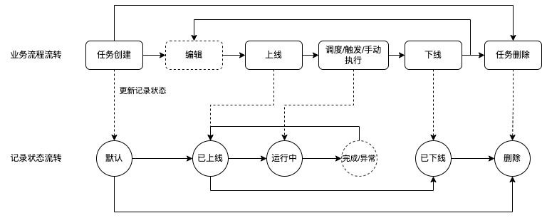

# Websoft9 功能详细设计说明书 V1.1

**目录**

- [Websoft9 功能详细设计说明书 V1.1](#websoft9-功能详细设计说明书-v11)
  - [1. 引言](#1-引言)
  - [2. 工作流功能设计](#2-工作流功能设计)
        - [画布](#画布)
        - [组件](#组件)
        - [任务](#任务)
  - [3. 工作流接口设计](#3-工作流接口设计)
        - [工作流执行](#工作流执行)
        - [工作流组件](#工作流组件)
        - [任务](#任务-1)
  - [4. 工作流数据库设计](#4-工作流数据库设计)
  - [5. 附录](#5-附录)

## 1. 引言

本文档为 **Websoft9架构升级** 的详细设计文档，本文档的编写目的在于明确 **Websoft9架构升级** 需求的开发途径以及应用方法，通过此文档，为此 **Websoft9架构升级** 需求的维护提供清晰、详细的设计，为下阶段开发工作的开展起到指导作用。

本文档的预期读者是 **Websoft9架构升级** 需求相关的业务人员、开发人员以及系统运维人员。

## 2. 工作流功能设计

`工作流`是平台提供的可视化业务流程编排工具，支持拖拽式组件编排，用于实现复杂的自动化任务调度和执行。工作流支持用户按需进行应用部署的工作流编排、工作流调度和执行。

**工作流的核心特性：**

- **可视化编排**：提供直观的拖拽式界面，支持复杂业务流程的可视化设计
- **组件化架构**：预置丰富的工作流组件，支持控制组件、应用组件、云服务组件
- **参数化配置**：支持全局参数、工作流参数、组件参数的灵活配置和引用
- **条件分支**：支持基于执行结果的条件判断和分支流程控制
- **异常处理**：提供完善的异常处理和重试机制
- **调度执行**：支持定时调度、手动执行、触发执行等多种调度方式

- **功能描述**

1. 【工作流管理】

- **工作流列表**：展示用户创建的所有工作流，支持按名称、状态、创建时间等条件筛选
- **工作流创建**：支持从空白模板或预置模板创建新的工作流
- **工作流导入**：支持导入标准格式的工作流文件（.w9f）
- **工作流存储**：用户创建的工作流，默认存储于用户的`我的空间`》`我的工作流`目录下
- **修改限制**：已发布为任务的工作流不允许进行修改、删除，必须停止任务后才可以进行修改、删除

2. 【工作流画布】

- **工作流组件库**：左侧展示工作流组件库，按分类展示所有可用的工作流组件，支持按照组件分类进行筛选和搜索
- **工作流画布**：中间区域为工作流编排画布，支持拖拽式工作流设计：
  - 拖拽组件到画布、连接组件、删除组件等操作
  - 支持组件间的连线，定义执行顺序和条件分支
  - 支持画布的缩放、全屏、网格对齐等操作
  - 支持多选、复制、粘贴、撤销、重做等编辑操作
- **工作流配置**：点击某个组件时右侧展示【组件编辑】面板

3. 【工作流操作】

- **保存**：保存当前工作流配置到项目空间
- **导出**：将工作流配置导出为标准格式文件（.w9f）
- **发布**：将工作流发布为可执行的任务，进入任务调度管理
- **删除**：删除当前工作流
- **版本管理**：支持工作流的版本控制和历史记录
- **模板保存**：将工作流保存为模板供其他用户使用

4. 【组件编辑】

- **基本信息**：展示组件ID（组件唯一标识）、组件分类、组件名称、组件描述
- **组件参数**：根据不同组件类型，展示相应的参数配置表单，支持引用全局参数和上游组件的输出参数
- **输出参数**：根据不同组件类型，展示相应的输出参数列表，支持用户自定义添加输出参数，默认值支持使用变量表达式
- **执行条件**：设置组件的执行条件和前置依赖
- **异常处理**：配置组件的异常处理策略和重试机制

5. 【工作流参数配置】

- **工作流参数**：展示工作流中预定义的参数，支持编辑、删除、添加
- **全局参数**：展示平台预定义的全局参数，支持按照参数名称关键词进行模糊搜索
- **参数验证**：支持参数的类型验证和格式检查
- **参数加密**：支持敏感参数的加密存储和传输

##### 画布

**`工作流画布`是工作流中的配置界面**，用户可以在画布中拖拽组件进行自由组合工作流。

- **工作流定义**

工作流采用JSON格式进行定义，包含工作流元数据、组件定义、连接关系等信息，示例如下：

```json
{
  "workflow": {
    "id": "workflow_001",
    "name": "应用CI/CD工作流",
    "description": "自动化应用构建和部署流程",
    "create_time": "2025-07-01T00:00:00Z",
    "update_time": "2027-07-01T00:00:00Z",
    "author": "user001"
  },
  "workflow_variables": [
    {
      "name": "VERSION",
      "description": "",
      "data_type": "string",
      "value": "2.0"
    },
    {
      "name": "BRANCH_NAME",
      "description": "",
      "data_type": "string",
      "value": "dev"
    }
  ],
  "components": [
    {
      "id": "start_001",
      "type": "START",
      "name": "开始",
      "description": "开始节点",
      "position": {"x": 100, "y": 100},
      "component_config": {},
      "output_variables": []
    },
    {
      "id": "git_001",
      "type": "SHELL",
      "name": "拉取代码",
      "description": "拉取代码",
      "position": {"x": 200, "y": 100},
      "component_config": {
        "command": "git clone https://github.com/user001/app.git ${WORKSPACE_PATH} && cd ${WORKSPACE_PATH} && git checkout ${BRANCH_NAME}",
        "timeout": 5000
      },
      "output_variables": [
        {
          "name": "status",
          "description": "执行结果",
          "data_type": "string",
          "default_value": "error"
        }
      ]
    },
    {
      "id": "build_001",
      "type": "BASH",
      "name": "编译打包",
      "description": "编译打包",
      "position": {"x": 300, "y": 100},
      "component_config": {},
      "output_variables": []
    },
    {
      "id": "deploy_001",
      "type": "BASH",
      "name": "部署应用",
      "description": "部署应用",
      "position": {"x": 400, "y": 100},
      "component_config": {},
      "output_variables": []
    }
  ],
  "connections": [
    {
      "from": "start_001",
      "to": "git_001",
      "condition": "success"
    },
    {
      "from": "git_001",
      "to": "build_001",
      "condition": "success"
    },
    {
      "from": "build_001",
      "to": "deploy_001",
      "condition": "success"
    }
  ]
}
```

##### 组件

**`工作流组件`是工作流中的执行单元**，为平台预置的常用组件，未来也可以提供用户自定义组件。用户可以在工作流编排时使用、删除、配置工作流组件。

- **组件架构设计**

每一个组件都由三个部分组成：

- **输入参数**：输入参数为上游组件的输出参数，包括参数名称、参数描述、参数类型、参数值
- **执行逻辑**：组件的具体执行逻辑，实现组件的核心功能
- **输出参数**：组件的执行结果，为可选项，包括参数名称、参数描述、参数类型、参数默认值

- **参数化和计算机制**

组件支持参数化配置，支持使用变量表达式，变量表达式的解释和计算使用golang表达式框架实现。参数的作用域及优先级如下：

- **全局参数**：全局参数作用域为平台级别，所有工作流中任意组件均可以使用，全局参数包含：
  - 来自平台【密钥管理】授权可使用的信息
  - 平台预定义参数和字典
  - 系统环境变量
  - 平台配置参数

- **工作流参数**：工作流参数作用域为工作流级别，仅当前工作流中任意组件可以使用，工作流参数包含：
  - 工作流中预定义的参数（如目录名称、版本号等）
  - 工作流运行时动态生成的参数
  - 工作流级别的配置信息

- **输入/输出参数**：输入/输出参数作用域为组件级别，仅定义参数的组件上下游之间可以使用，不允许跨组件引用

- **预置工作流组件列表**

| 组件名称     | 分类       | 描述                                                                                                                                   |
| ------------ | ---------- | -------------------------------------------------------------------------------------------------------------------------------------- |
| `判断组件`   | 控制组件   | 支持对工作流节点执行的结果进行判断（YES/NO），当逻辑条件成立时则继续执行，否则终止执行。                                               |
| `分支组件`   | 控制组件   | 支持对工作流节点执行的结果进行分支判断，当某一分支的逻辑条件成立时则继续执行分支流程，否则终止分支流程执行。                           |
| `接口调用`   | 应用组件   | 支持调用第三方API接口，支持HTTP/HTTPS协议，GET/POST等请求。                                                                            |
| `发送邮件`   | 应用组件   | 支持发送邮件，可以使用预定义的邮件模版内容，注意：禁止使用JS脚本。                                                                     |
| `发送短信`   | 应用组件   | 支持发送短信，可以使用预定义的短信模版内容，注意：短信发送、短信模版内容的管理依赖云厂商提供的短信服务。                               |
| `命令行`     | 应用组件   | 支持在目标服务器上执行命令行，并返回执行结果。                                                                                         |
| `脚本`       | 应用组件   | 支持使用脚本代码实现复杂业务逻辑计算，例如：Groovy、JS。注意：禁止特定、非安全的API使用，例如：读取操作系统文件目录、执行Shell命令等。 |
| `文件下载`   | 应用组件   | 支持从工作空间、目标服务器下载文件至本地。                                                                                             |
| `文件上传`   | 应用组件   | 支持将本地文件上传至工作空间、目标服务器。                                                                                             |
| `应用发布`   | 应用组件   | 支持将已部署的应用快速发布至平台应用网关                                                                                               |
| `S3存储`     | 云服务组件 | 支持接入S3存储服务，实现文件的上传、下载、删除等操作。                                                                                 |
| `云资源管理` | 云服务组件 | 支持接入云服务资源管理，实现云资源的快捷操作。                                                                                         |

**组件分类说明：**

- **控制组件**：这一类型的组件可以实现对工作流执行状态、顺序的控制
- **应用组件**：这一类型的组件可以实现不同场景的具体业务实现，例如：执行某一个命令行代码片段
- **云服务组件**：这一类型的组件实现对云资源的操作，例如：创建ECS实例、上传文件到OSS

- **技术实现**

1. 【组件插件架构】

实现基于插件的组件架构，支持组件的动态加载和扩展：

- **组件接口定义**：定义标准的组件接口，包括初始化、执行、清理等生命周期方法
- **组件注册机制**：实现组件的自动发现和注册，支持热插拔
- **组件隔离**：使用沙箱机制隔离不同组件的执行环境，确保安全性
- **组件版本管理**：支持组件的版本控制和兼容性管理

2. 【参数解析引擎】

参数解析和变量替换引擎：

- **表达式解析**：使用golang表达式框架解析复杂的变量表达式
- **类型转换**：支持不同数据类型之间的自动转换和验证
- **作用域管理**：实现参数作用域的严格控制和优先级处理
- **循环引用检测**：检测和防止参数之间的循环引用
- **安全验证**：对参数值进行安全检查，防止注入攻击

3. 【组件执行引擎】

实现高效的组件执行引擎：

- **执行上下文**：为每个组件创建独立的执行上下文，包含输入参数、环境变量等
- **资源管理**：管理组件执行所需的资源，包括内存、CPU、网络等
- **超时控制**：实现组件执行的超时控制和强制终止机制
- **并发控制**：支持组件的并发执行和资源竞争控制
- **结果处理**：处理组件的执行结果和输出参数

4. 【自定义组件支持】

为未来的自定义组件扩展预留接口：

- **组件开发框架**：提供组件开发的SDK和开发框架
- **组件测试工具**：提供组件的单元测试和集成测试工具
- **组件打包部署**：支持自定义组件的打包和部署
- **组件市场**：建立组件市场，支持组件的分享和复用
- **组件文档**：自动生成组件的使用文档和API文档

##### 任务

`任务`是工作流的执行管理中心，支持对工作流任务的自动调度、手动执行、查看任务执行日志、查看任务执行结果等操作。

- **功能描述**

1. 【任务查询】

支持分页查询和多条件筛选，查询条件包括：

| 查询条件 | 示例     | 描述                                       |
| -------- | -------- | ------------------------------------------ |
| 任务名称 | 关键词   | 文本输入框，支持任务名称关键词的模糊查询。 |
| 任务状态 | 运行中   | 多选下拉选项，支持按任务状态筛选。         |
| 调度方式 | 定时调度 | 单选下拉选项，支持按调度方式筛选。         |
| 更新时间 | 近7天    | 日期范围选择器，支持按更新时间范围筛选。   |

2. 【任务列表】

展示所有的工作流任务，包括以下信息：

- 任务名称、任务状态、调度方式
- 最近执行时间、执行结果、执行耗时
- 下次执行时间（定时任务）
- 创建用户、创建时间、更新时间
- 操作按钮：执行、启停、编辑、删除、查看日志

3. 【任务发布】

支持将已设计完成的工作流发布为可调度执行的任务：

- **任务名称**：用户填写任务名称，确保在项目内唯一
- **调度策略**：支持三种调度方式
  - **定时调度**：有调度规则，由平台按照调度规则触发，属于周期性执行的任务
  - **手动调度**：无调度规则，由用户触发，属于按需执行的任务
  - **触发调度**：无调度规则，由外部触发（Call API），属于按需自动触发执行的任务
- **调度规则**：支持简易的日期筛选配置调度执行规则，也支持使用Cron表达式配置复杂的调度规则
  - 按分钟（最小粒度为1分钟）
  - 按小时
  - 按天
  - 按日期
- **异常处理策略**：
  - 终止执行：遇到错误立即停止整个工作流
  - 节点重试：单个节点失败时重试（1-10次）
  - 全部重试：整个工作流失败时重试（1-10次）
- **通知策略**：邮件通知任务执行结果
- **描述信息**：任务的详细描述和备注信息

4. 【任务管理】

- **任务执行**：支持手动触发任务执行，注意：工作流需先发布为任务才可以进行手动执行
- **任务启停**：支持任务的启动、停止，停止的任务不会按调度规则自动执行
- **编辑任务**：支持编辑任务的调度配置和描述信息
- **删除任务**：支持删除不需要的任务，任务下线仅删除任务的注册信息，对工作流本身不进行删除
- **批量操作**：支持批量启动、停止、删除任务

5. 【任务详情】

- **任务基本信息**：展示任务的基本信息，包括任务名称、工作流、任务状态、所属用户、调度策略、任务描述、创建时间、更新时间
- **任务调度历史记录**：展示任务的调度历史记录，包括执行时间、执行状态、调度方式。支持分页查询，支持浏览日志、导出日志和手动重试执行

6. 【任务历史查询】

支持用户按需进行工作流任务的历史执行日志查询：

- 平台默认保存近60天的历史执行日志
- 支持导出历史执行日志
- 支持按执行状态、时间范围等条件筛选

7. 【任务编辑】

用户点击编辑按钮，进入任务编辑页面，支持对任务的名称、调度策略、任务描述进行修改。

- **业务流程**



## 3. 工作流接口设计

**获取工作流列表**

```text
GET /api/v1/workflows
```

查询参数：

| 参数      | 类型    | 必填 | 默认值 | 描述       |
| --------- | ------- | ---- | ------ | ---------- |
| page      | integer | 否   | 1      | 页码       |
| page_size | integer | 否   | 20     | 每页数量   |
| keyword   | string  | 否   | -      | 搜索关键词 |
| status    | string  | 否   | -      | 工作流状态 |
| owner_id  | integer | 否   | -      | 所有者ID   |

**获取工作流详情**

```text
GET /api/v1/workflows/{id}
```

**创建工作流**

```text
POST /api/v1/workflows
```

请求体参数：

| 参数名      | 数据类型 | 是否可空 | 描述                   |
| ----------- | -------- | -------- | ---------------------- |
| name        | string   | 否       | 工作流名称             |
| code        | string   | 否       | 工作流编码，唯一标识   |
| description | string   | 是       | 工作流描述             |
| definition  | object   | 否       | 工作流定义（JSON格式） |
| owner_id    | integer  | 否       | 所有者ID               |

**更新工作流**

```text
PUT /api/v1/workflows/{id}
```

**删除工作流**

```text
DELETE /api/v1/workflows/{id}
```

**发布工作流**

```text
POST /api/v1/workflows/{id}/publish
```

请求体参数：

| 参数名    | 数据类型 | 是否可空 | 描述         |
| --------- | -------- | -------- | ------------ |
| status    | string   | 否       | 发布状态     |
| changelog | string   | 是       | 版本更新日志 |

##### 工作流执行

**手动执行工作流**

```text
POST /api/v1/workflows/{id}/execute
```

请求体参数：

| 参数名     | 数据类型 | 是否可空 | 描述                   |
| ---------- | -------- | -------- | ---------------------- |
| task_id    | integer  | 是       | 关联任务ID             |
| input      | object   | 是       | 工作流输入参数         |
| async      | boolean  | 是       | 是否异步执行，默认true |
| trigger_by | integer  | 是       | 触发者ID               |

响应：

```json
{
  "code": 200,
  "message": "工作流执行已启动",
  "data": {
    "id": 1,
    "execution_id": "exec_123456789",
    "task_id": 1,
    "status": "RUNNING",
    "trigger_type": "MANUAL",
    "trigger_by": 1,
    "start_time": "2025-07-15T10:30:00Z"
  }
}
```

**获取执行历史**

```text
GET /api/v1/workflow-executions
```

查询参数：

| 参数        | 类型    | 必填 | 默认值 | 描述     |
| ----------- | ------- | ---- | ------ | -------- |
| workflow_id | integer | 否   | -      | 工作流ID |
| status      | string  | 否   | -      | 执行状态 |
| start_time  | string  | 否   | -      | 开始时间 |
| end_time    | string  | 否   | -      | 结束时间 |

**获取执行详情**

```text
GET /api/v1/workflow-executions/{id}
```

响应示例：

```json
{
  "code": 200,
  "message": "success",
  "data": {
    "id": 1,
    "task_id": 1,
    "execution_id": "exec_123456789",
    "status": "SUCCESS",
    "trigger_type": "MANUAL",
    "trigger_by": 1,
    "start_time": "2025-07-15T10:30:00Z",
    "end_time": "2025-07-15T10:30:00Z",
    "duration": 151,
    "error_message": null,
    "execution_log": "执行成功完成",
    "workflow": {
      "id": 1,
      "name": "应用自动部署",
      "code": "app_deploy"
    },
    "task": {
      "id": 1,
      "name": "每日部署任务"
    },
    "trigger_user": {
      "id": 1,
      "username": "admin"
    },
    "created_at": "2025-07-15T10:30:00Z",
    "updated_at": "2025-07-15T10:30:00Z"
  }
}
```

**停止执行**

```text
POST /api/v1/workflow-executions/{id}/stop
```

**获取执行日志**

```text
GET /api/v1/workflow-executions/{id}/logs
```

查询参数：

| 参数         | 类型   | 必填 | 默认值 | 描述     |
| ------------ | ------ | ---- | ------ | -------- |
| component_id | string | 否   | -      | 组件ID   |
| level        | string | 否   | -      | 日志级别 |

##### 工作流组件

**获取组件类型列表**

```text
GET /api/v1/workflow-components
```

响应示例：

```json
{
  "code": 200,
  "message": "success",
  "data": [
    {
      "type": "START",
      "name": "开始",
      "category": "control",
      "icon": "start",
      "description": "工作流开始节点",
      "input_ports": [],
      "output_ports": ["default"],
      "config_schema": null
    },
    {
      "type": "DEPLOY_APP",
      "name": "部署应用",
      "category": "application",
      "icon": "deploy",
      "description": "部署应用实例",
      "input_ports": ["default"],
      "output_ports": ["success", "failure"],
      "config_schema": {
        "type": "object",
        "properties": {
          "template_id": {
            "type": "integer",
            "title": "应用模板ID",
            "required": true
          },
          "server_id": {
            "type": "integer",
            "title": "目标服务器ID",
            "required": true
          },
          "app_name": {
            "type": "string",
            "title": "应用名称",
            "required": true
          }
        }
      }
    },
    {
      "type": "SEND_EMAIL",
      "name": "发送邮件",
      "category": "notification",
      "icon": "email",
      "description": "发送邮件通知",
      "input_ports": ["default"],
      "output_ports": ["success", "failure"],
      "config_schema": {
        "type": "object",
        "properties": {
          "to": {
            "type": "string",
            "title": "收件人",
            "required": true
          },
          "subject": {
            "type": "string",
            "title": "邮件主题",
            "required": true
          },
          "body": {
            "type": "string",
            "title": "邮件内容",
            "required": true,
            "format": "textarea"
          }
        }
      }
    }
  ]
}
```

##### 任务

**获取任务列表**

```text
GET /api/v1/workflow-tasks
```

查询参数：

| 参数          | 类型    | 必填 | 默认值 | 描述                                  |
| ------------- | ------- | ---- | ------ | ------------------------------------- |
| page          | integer | 否   | 1      | 页码                                  |
| page_size     | integer | 否   | 20     | 每页数量                              |
| workflow_id   | integer | 否   | -      | 工作流ID                              |
| status        | string  | 否   | -      | 任务状态（ACTIVE, PAUSED, STOPPED）   |
| schedule_type | string  | 否   | -      | 调度类型（MANUAL, SCHEDULE, TRIGGER） |
| keyword       | string  | 否   | -      | 搜索关键词                            |

响应示例：

```json
{
  "code": 200,
  "message": "success",
  "data": {
    "items": [
      {
        "id": 1,
        "name": "每日数据备份",
        "workflow": {
          "id": 1,
          "name": "数据备份工作流",
          "version": "1.0.0"
        },
        "schedule_type": "SCHEDULE",
        "cron_expression": "0 2 * * *",
        "status": "ACTIVE",
        "next_run_at": "2025-01-23T02:00:00Z",
        "last_run_at": "2025-01-22T02:00:00Z",
        "last_execution_status": "SUCCESS",
        "run_count": 30,
        "success_count": 29,
        "failure_count": 1,
        "success_rate": 96.67,
        "avg_duration": 180,
        "owner": {
          "id": 1,
          "username": "admin",
          "nickname": "管理员"
        },
        "notification_config": {
          "on_success": false,
          "on_failure": true,
          "channels": ["email", "webhook"]
        },
        "created_at": "2025-01-01T10:30:00Z",
        "updated_at": "2025-07-15T10:30:00Z"
      }
    ]
  }
}
```

**创建任务**

```text
POST /api/v1/workflow-tasks
```

请求体参数：

| 参数名          | 数据类型 | 是否可空 | 描述                                   |
| --------------- | -------- | -------- | -------------------------------------- |
| name            | string   | 否       | 任务名称                               |
| workflow_id     | integer  | 否       | 工作流ID                               |
| schedule_type   | string   | 否       | 调度类型（MANUAL, SCHEDULE, TRIGGER）  |
| cron_expression | string   | 是       | Cron表达式（调度类型为SCHEDULE时必填） |
| description     | string   | 是       | 任务描述                               |
| owner_id        | integer  | 否       | 所有者ID                               |

请求示例：

```json
{
  "name": "每日数据备份",
  "workflow_id": 1,
  "schedule_type": "SCHEDULE",
  "cron_expression": "0 2 * * *",
  "description": "每日凌晨2点执行数据备份任务",
  "owner_id": 1
}
```

**获取任务详情**

```text
GET /api/v1/workflow-tasks/{id}
```

**更新任务**

```text
PUT /api/v1/workflow-tasks/{id}
```

**删除任务**

```text
DELETE /api/v1/workflow-tasks/{id}
```

**启动/暂停/停止任务**

```text
POST /api/v1/workflow-tasks/{id}/actions
```

请求体参数：

| 参数名 | 数据类型 | 是否可空 | 描述                           |
| ------ | -------- | -------- | ------------------------------ |
| action | string   | 否       | 操作类型（start, pause, stop） |

**手动执行任务**

```text
POST /api/v1/workflow-tasks/{id}/execute
```

请求体参数：

| 参数名     | 数据类型 | 是否可空 | 描述         |
| ---------- | -------- | -------- | ------------ |
| trigger_by | integer  | 是       | 触发者ID     |
| async      | boolean  | 是       | 是否异步执行 |

**获取任务执行历史**

```text
GET /api/v1/workflow-tasks/{id}/executions
```

查询参数：

| 参数       | 类型    | 必填 | 默认值 | 描述                                  |
| ---------- | ------- | ---- | ------ | ------------------------------------- |
| page       | integer | 否   | 1      | 页码                                  |
| page_size  | integer | 否   | 20     | 每页数量                              |
| status     | string  | 否   | -      | 执行状态（SUCCESS, FAILURE, RUNNING） |
| start_time | string  | 否   | -      | 开始时间                              |
| end_time   | string  | 否   | -      | 结束时间                              |

**获取任务统计信息**

```text
GET /api/v1/workflow-tasks/{id}/statistics
```

查询参数：

| 参数       | 类型   | 必填 | 默认值 | 描述                               |
| ---------- | ------ | ---- | ------ | ---------------------------------- |
| start_time | string | 否   | -      | 开始时间                           |
| end_time   | string | 否   | -      | 结束时间                           |
| group_by   | string | 否   | day    | 分组方式（hour, day, week, month） |

响应示例：

```json
{
  "code": 200,
  "message": "success",
  "data": {
    "execution_summary": {
      "total_executions": 30,
      "success_executions": 29,
      "failure_executions": 1,
      "success_rate": 96.67,
      "avg_duration": 180,
      "min_duration": 120,
      "max_duration": 300
    },
    "execution_timeline": [
      {
        "date": "2025-01-22",
        "success_count": 1,
        "failure_count": 0,
        "avg_duration": 165
      }
    ],
    "failure_analysis": [
      {
        "error_type": "TIMEOUT",
        "count": 1,
        "percentage": 100.0
      }
    ]
  }
}
```

**批量操作任务**

```text
POST /api/v1/workflow-tasks/batch-actions
```

请求体参数：

| 参数名   | 数据类型  | 是否可空 | 描述                           |
| -------- | --------- | -------- | ------------------------------ |
| task_ids | integer[] | 否       | 任务ID数组                     |
| action   | string    | 否       | 操作类型（start, pause, stop） |

## 4. 工作流数据库设计

**工作流表（workflows）**

| 字段名      | 类型            | 约束               | 默认值                                        | 注释       |
| ----------- | --------------- | ------------------ | --------------------------------------------- | ---------- |
| id          | BIGINT UNSIGNED | PK, AUTO_INCREMENT | -                                             | 工作流ID   |
| project_id  | BIGINT UNSIGNED | NOT NULL, FK       | -                                             | 项目ID     |
| name        | VARCHAR(64)     | NOT NULL           | -                                             | 工作流名称 |
| code        | VARCHAR(32)     | NOT NULL           | -                                             | 工作流编码 |
| description | TEXT            | -                  | NULL                                          | 工作流描述 |
| definition  | JSON            | NOT NULL           | -                                             | 工作流定义 |
| status      | ENUM            | -                  | 'DRAFT'                                       | 状态       |
| owner_id    | BIGINT UNSIGNED | NOT NULL, FK       | -                                             | 所有者ID   |
| created_at  | DATETIME        | NOT NULL           | CURRENT_TIMESTAMP                             | 创建时间   |
| updated_at  | DATETIME        | NOT NULL           | CURRENT_TIMESTAMP ON UPDATE CURRENT_TIMESTAMP | 更新时间   |

**工作流任务表（workflow_tasks）**

| 字段名          | 类型            | 约束               | 默认值                                        | 注释                                  |
| --------------- | --------------- | ------------------ | --------------------------------------------- | ------------------------------------- |
| id              | BIGINT UNSIGNED | PK, AUTO_INCREMENT | -                                             | 任务ID                                |
| name            | VARCHAR(64)     | NOT NULL           | -                                             | 任务名称                              |
| workflow_id     | BIGINT UNSIGNED | NOT NULL, FK       | -                                             | 工作流ID                              |
| schedule_type   | ENUM            | -                  | 'MANUAL'                                      | 调度类型（MANUAL, SCHEDULE, TRIGGER） |
| cron_expression | VARCHAR(100)    | -                  | NULL                                          | Cron表达式                            |
| status          | ENUM            | -                  | 'DEFAULT'                                     | 任务状态（DEFAULT, ONLINE, OFFLINE）  |
| next_run_at     | DATETIME        | -                  | NULL                                          | 下次运行时间                          |
| last_run_at     | DATETIME        | -                  | NULL                                          | 上次运行时间                          |
| run_count       | INT             | -                  | 0                                             | 运行次数                              |
| success_count   | INT             | -                  | 0                                             | 成功次数                              |
| failure_count   | INT             | -                  | 0                                             | 失败次数                              |
| owner_id        | BIGINT UNSIGNED | NOT NULL, FK       | -                                             | 所有者ID                              |
| created_at      | DATETIME        | NOT NULL           | CURRENT_TIMESTAMP                             | 创建时间                              |
| updated_at      | DATETIME        | NOT NULL           | CURRENT_TIMESTAMP ON UPDATE CURRENT_TIMESTAMP | 更新时间                              |

**工作流执行历史表（workflow_executions）**

| 字段名        | 类型            | 约束               | 默认值                                        | 注释                                                    |
| ------------- | --------------- | ------------------ | --------------------------------------------- | ------------------------------------------------------- |
| id            | BIGINT UNSIGNED | PK, AUTO_INCREMENT | -                                             | 执行ID                                                  |
| task_id       | BIGINT UNSIGNED | NOT NULL, FK       | -                                             | 任务ID                                                  |
| execution_id  | VARCHAR(64)     | NOT NULL, UNIQUE   | -                                             | 执行唯一标识                                            |
| status        | ENUM            | -                  | 'PENDING'                                     | 执行状态（PENDING, RUNNING, SUCCESS, FAILURE, STOPPED） |
| trigger_type  | ENUM            | -                  | 'MANUAL'                                      | 触发类型（MANUAL, SCHEDULE, TRIGGER）                   |
| trigger_by    | BIGINT UNSIGNED | FK                 | NULL                                          | 触发者ID                                                |
| start_time    | DATETIME        | -                  | NULL                                          | 开始时间                                                |
| end_time      | DATETIME        | -                  | NULL                                          | 结束时间                                                |
| duration      | INT             | -                  | 0                                             | 执行时长(秒)                                            |
| error_message | TEXT            | -                  | NULL                                          | 错误信息                                                |
| execution_log | TEXT            | -                  | NULL                                          | 执行日志                                                |
| created_at    | DATETIME        | NOT NULL           | CURRENT_TIMESTAMP                             | 创建时间                                                |
| updated_at    | DATETIME        | NOT NULL           | CURRENT_TIMESTAMP ON UPDATE CURRENT_TIMESTAMP | 更新时间                                                |

## 5. 附录

<!-- 这里写功能的所包含的枚举值、字典等定义，或者相关的参考文档引用 -->