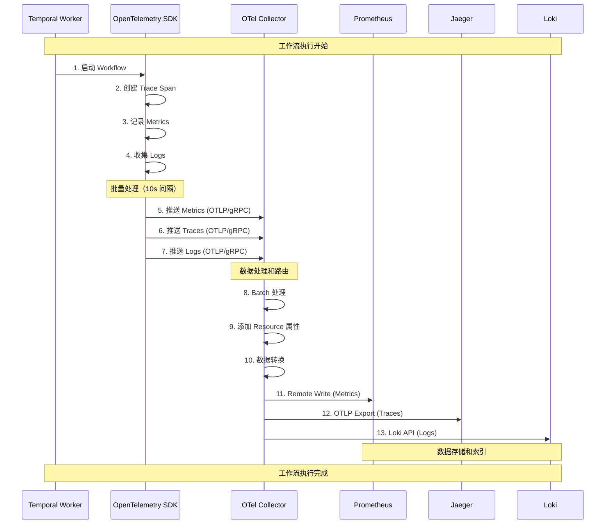
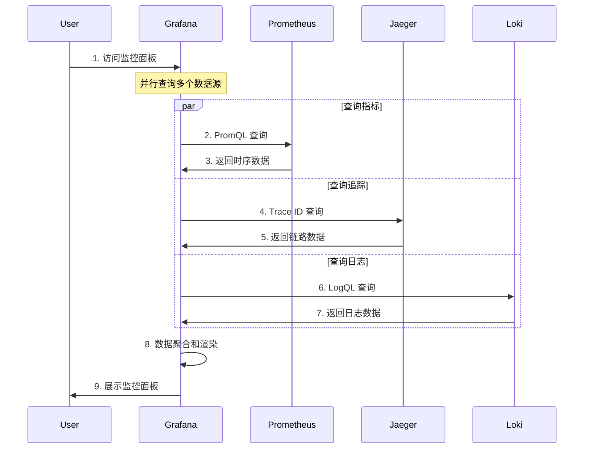
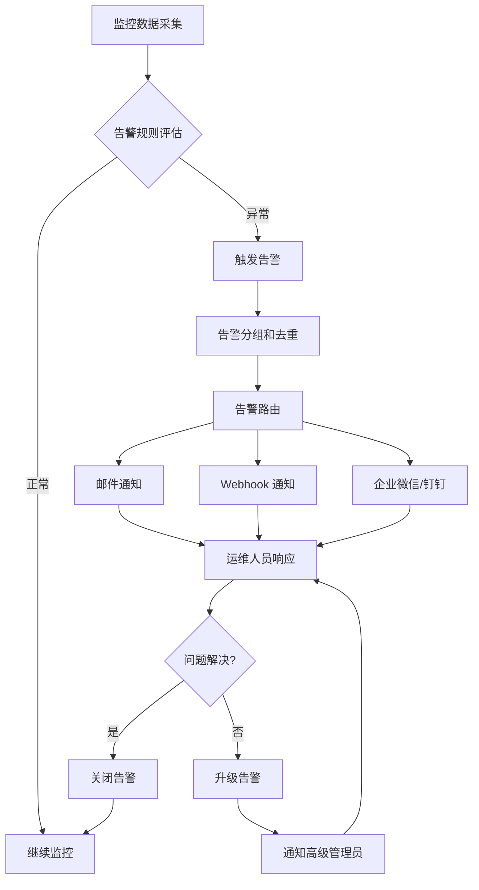

# 工作流监控方案 V1.0

**说明**：本文档基于 Temporal 工作流引擎和 OpenTelemetry + Prometheus 监控技术栈，设计实现 Websoft9 平台工作流系统的全方位可观测性方案。

## 文档元信息

- **负责人**：Websoft9 team
- **审核**：Websoft9 team
- **创建日期**：2025-12-02
- **版本**：V1.0

## 目录

- [工作流监控方案 V1.0](#工作流监控方案-v10)
  - [文档元信息](#文档元信息)
  - [目录](#目录)
  - [1. 设计目标](#1-设计目标)
    - [1.1 业务目标](#11-业务目标)
    - [1.2 技术目标](#12-技术目标)
    - [1.3 用户价值](#13-用户价值)
  - [2. 概述](#2-概述)
    - [2.1 监控架构概述](#21-监控架构概述)
    - [2.2 监控范围](#22-监控范围)
    - [2.3 技术选型](#23-技术选型)
  - [3. 技术架构](#3-技术架构)
    - [3.1 技术架构图](#31-技术架构图)
    - [3.2 部署架构图](#32-部署架构图)
  - [4. 监控业务流程](#4-监控业务流程)
    - [4.1 监控数据采集流程](#41-监控数据采集流程)
    - [4.2 监控数据查询流程](#42-监控数据查询流程)
    - [4.3 告警处理流程](#43-告警处理流程)
  - [5. 监控数据流程](#5-监控数据流程)
    - [5.1 数据流转架构](#51-数据流转架构)
    - [5.2 数据采样策略](#52-数据采样策略)
    - [5.3 数据关联机制](#53-数据关联机制)
  - [6. 指标监控实现](#6-指标监控实现)
    - [6.1 指标分类](#61-指标分类)
      - [6.1.1 工作流执行指标](#611-工作流执行指标)
      - [6.1.2 任务调度指标](#612-任务调度指标)
      - [6.1.3 组件执行指标](#613-组件执行指标)
      - [6.1.4 Worker 节点指标](#614-worker-节点指标)
      - [6.1.5 系统资源指标](#615-系统资源指标)
    - [6.2 指标采集实现](#62-指标采集实现)
      - [6.2.1 Worker 端实现（Go）](#621-worker-端实现go)
      - [6.2.2 Temporal Interceptor 集成](#622-temporal-interceptor-集成)
    - [6.3 Prometheus 查询示例](#63-prometheus-查询示例)
      - [6.3.1 工作流成功率](#631-工作流成功率)
      - [6.3.2 工作流平均执行时间](#632-工作流平均执行时间)
      - [6.3.3 组件执行失败率](#633-组件执行失败率)
      - [6.3.4 Worker 负载](#634-worker-负载)
  - [7. 追踪监控实现](#7-追踪监控实现)
    - [7.1 分布式追踪架构](#71-分布式追踪架构)
    - [7.2 追踪采集实现](#72-追踪采集实现)
      - [7.2.1 Tracer 初始化](#721-tracer-初始化)
      - [7.2.2 Temporal Tracing Interceptor](#722-temporal-tracing-interceptor)
    - [7.3 Jaeger 查询示例](#73-jaeger-查询示例)
      - [7.3.1 查询工作流执行链路](#731-查询工作流执行链路)
      - [7.3.2 服务依赖关系图](#732-服务依赖关系图)
  - [8. 日志监控实现](#8-日志监控实现)
    - [8.1 日志分类](#81-日志分类)
    - [8.2 日志采集实现](#82-日志采集实现)
      - [8.2.1 结构化日志](#821-结构化日志)
      - [8.2.2 日志推送到 Loki](#822-日志推送到-loki)
    - [8.3 Loki 查询示例](#83-loki-查询示例)
      - [8.3.1 查询工作流执行日志](#831-查询工作流执行日志)
      - [8.3.2 日志聚合统计](#832-日志聚合统计)
  - [9. OpenTelemetry Collector 配置](#9-opentelemetry-collector-配置)
    - [9.1 完整配置文件](#91-完整配置文件)
    - [9.2 Docker Compose 部署](#92-docker-compose-部署)
  - [10. Grafana 监控面板](#10-grafana-监控面板)
    - [10.1 工作流概览面板](#101-工作流概览面板)
    - [10.2 Worker 节点监控面板](#102-worker-节点监控面板)
    - [10.3 组件执行监控面板](#103-组件执行监控面板)
  - [11. 告警规则配置](#11-告警规则配置)
    - [11.1 Prometheus 告警规则](#111-prometheus-告警规则)
    - [11.2 Alertmanager 配置](#112-alertmanager-配置)
    - [11.3 告警通知渠道](#113-告警通知渠道)
  - [12. 监控最佳实践](#12-监控最佳实践)
    - [12.1 指标命名规范](#121-指标命名规范)
    - [12.2 采样策略建议](#122-采样策略建议)
    - [12.3 数据保留策略](#123-数据保留策略)
    - [12.4 性能优化建议](#124-性能优化建议)
    - [12.5 安全建议](#125-安全建议)
  - [13. 故障排查指南](#13-故障排查指南)
    - [13.1 常见问题](#131-常见问题)
      - [问题 1：Worker 无法推送监控数据](#问题-1worker-无法推送监控数据)
      - [问题 2：指标数据丢失](#问题-2指标数据丢失)
      - [问题 3：追踪数据不完整](#问题-3追踪数据不完整)
    - [13.2 性能调优](#132-性能调优)
      - [优化 1：减少监控开销](#优化-1减少监控开销)
      - [优化 2：降低采样率](#优化-2降低采样率)
      - [优化 3：过滤无用日志](#优化-3过滤无用日志)
  - [14. 验收标准](#14-验收标准)
    - [14.1 功能验收](#141-功能验收)
    - [14.2 性能验收](#142-性能验收)
    - [14.3 可靠性验收](#143-可靠性验收)
  - [15. 总结](#15-总结)

---

## 1. 设计目标

### 1.1 业务目标

- **全链路可观测**：实现工作流从调度、执行到完成的全链路监控，故障定位时间缩短 70%
- **主动运维**：通过实时指标监控和智能告警，在故障发生前预警，系统可用性达到 99.9%
- **性能优化**：基于监控数据分析工作流性能瓶颈，优化执行效率提升 40%
- **成本控制**：监控资源使用情况，识别资源浪费，降低运营成本 30%

### 1.2 技术目标

- **标准化**：采用 OpenTelemetry 标准协议，实现监控数据的统一采集和管理
- **低侵入**：通过 Interceptor 模式集成，对业务代码零侵入
- **高性能**：监控数据采集对系统性能影响 < 5%，数据推送延迟 < 1s
- **可扩展**：支持水平扩展，单 Collector 节点支持 1000+ Worker 并发推送

### 1.3 用户价值

**平台管理员**：

- 实时掌握工作流系统整体运行状况
- 快速定位和解决系统故障
- 基于数据优化资源配置

**项目经理**：

- 监控项目工作流执行情况和成功率
- 及时发现任务异常并采取措施
- 分析工作流性能数据优化流程

**开发工程师**：

- 查看工作流执行日志和错误信息
- 追踪分布式任务执行链路
- 分析性能瓶颈优化组件实现

---

## 2. 概述

### 2.1 监控架构概述

工作流监控系统采用 **OpenTelemetry + Prometheus + Jaeger + Loki** 技术栈，实现指标（Metrics）、追踪（Traces）、日志（Logs）三位一体的可观测性方案。

**核心特性**：

- **推送模式**：Worker 主动推送监控数据，无需暴露端口
- **统一收集**：OpenTelemetry Collector 作为中间层统一收集和路由
- **多后端支持**：指标发送到 Prometheus，追踪发送到 Jaeger，日志发送到 Loki
- **实时监控**：秒级数据采集和展示，支持实时告警

### 2.2 监控范围

| 监控层级   | 监控对象                          | 关键指标                   |
| ---------- | --------------------------------- | -------------------------- |
| 基础设施层 | Temporal Server、MySQL、Redis     | CPU、内存、磁盘、网络      |
| 服务层     | API Service、Workflows Dispatcher | 请求量、响应时间、错误率   |
| 工作流层   | Workflow 执行、Task 调度          | 执行次数、成功率、耗时     |
| 组件层     | Shell、HTTP、Email 等组件         | 执行次数、失败率、性能     |
| Worker 层  | Agent Worker 节点                 | 任务队列、并发数、资源使用 |

### 2.3 技术选型

| 组件                    | 用途           | 选型理由                             |
| ----------------------- | -------------- | ------------------------------------ |
| OpenTelemetry SDK       | 数据采集       | 云原生标准、厂商中立、功能完整       |
| OpenTelemetry Collector | 数据收集和路由 | 统一收集、灵活路由、协议转换         |
| Prometheus              | 指标存储和查询 | 时序数据库、强大的查询语言、生态丰富 |
| Jaeger                  | 分布式追踪     | 链路追踪、性能分析、依赖关系可视化   |
| Loki                    | 日志聚合       | 轻量级、与 Prometheus 集成、标签索引 |
| Grafana                 | 可视化展示     | 统一面板、丰富的图表、告警集成       |

---

## 3. 技术架构

### 3.1 技术架构图

```
┌─────────────────────────────────────────────────────────────────────┐
│                          Visualization Layer                         │
│                                                                       │
│  ┌──────────────────────────────────────────────────────────────┐  │
│  │                        Grafana Dashboard                      │  │
│  │  ┌──────────────┐  ┌──────────────┐  ┌──────────────┐       │  │
│  │  │ Metrics Panel│  │ Traces Panel │  │  Logs Panel  │       │  │
│  │  │ (Prometheus) │  │   (Jaeger)   │  │    (Loki)    │       │  │
│  │  └──────────────┘  └──────────────┘  └──────────────┘       │  │
│  └──────────────────────────────────────────────────────────────┘  │
└───────────────────────────────┬─────────────────────────────────────┘
                                │ Query API
┌───────────────────────────────┴─────────────────────────────────────┐
│                          Storage Layer                               │
│  ┌──────────────┐  ┌──────────────┐  ┌──────────────┐              │
│  │  Prometheus  │  │    Jaeger    │  │     Loki     │              │
│  │   (Metrics)  │  │   (Traces)   │  │    (Logs)    │              │
│  └──────┬───────┘  └──────┬───────┘  └──────┬───────┘              │
└─────────┼──────────────────┼──────────────────┼──────────────────────┘
          │                  │                  │
          │ Remote Write     │ OTLP             │ Loki API
          │                  │                  │
┌─────────┴──────────────────┴──────────────────┴──────────────────────┐
│                    OpenTelemetry Collector                            │
│  ┌────────────────────────────────────────────────────────────────┐  │
│  │  Receivers:  OTLP (gRPC:4317, HTTP:4318)                       │  │
│  ├────────────────────────────────────────────────────────────────┤  │
│  │  Processors: Batch, Resource, Attributes                       │  │
│  ├────────────────────────────────────────────────────────────────┤  │
│  │  Exporters:  Prometheus Remote Write, Jaeger, Loki            │  │
│  └────────────────────────────────────────────────────────────────┘  │
└───────────────────────────────┬─────────────────────────────────────┘
                                │ OTLP Push (gRPC/HTTP)
┌───────────────────────────────┴─────────────────────────────────────┐
│                        Application Layer                             │
│                                                                       │
│  ┌──────────────────────────────────────────────────────────────┐  │
│  │                      API Service                              │  │
│  │  ┌────────────────────────────────────────────────────────┐  │  │
│  │  │  OpenTelemetry SDK (Metrics + Traces + Logs)           │  │  │
│  │  │  - MeterProvider (Metrics)                             │  │  │
│  │  │  - TracerProvider (Traces)                             │  │  │
│  │  │  - LoggerProvider (Logs)                               │  │  │
│  │  └────────────────────────────────────────────────────────┘  │  │
│  └──────────────────────────────────────────────────────────────┘  │
│                                                                       │
│  ┌──────────────────────────────────────────────────────────────┐  │
│  │                  Temporal Worker (Agent)                      │  │
│  │  ┌────────────────────────────────────────────────────────┐  │  │
│  │  │  OpenTelemetry SDK + Temporal Interceptor              │  │  │
│  │  │  - Workflow Interceptor (Traces)                       │  │  │
│  │  │  - Activity Interceptor (Traces)                       │  │  │
│  │  │  - Custom Metrics (Counters, Histograms)               │  │  │
│  │  └────────────────────────────────────────────────────────┘  │  │
│  │  ┌────────────────────────────────────────────────────────┐  │  │
│  │  │  Component Executors (Shell, HTTP, Email, etc.)        │  │  │
│  │  │  - Execution Metrics                                   │  │  │
│  │  │  - Error Tracking                                      │  │  │
│  │  └────────────────────────────────────────────────────────┘  │  │
│  └──────────────────────────────────────────────────────────────┘  │
└───────────────────────────────────────────────────────────────────────┘
```

### 3.2 部署架构图

```
┌─────────────────────────────────────────────────────────────────────┐
│                      Central Server (监控中心)                        │
│                                                                       │
│  ┌──────────────────────────────────────────────────────────────┐  │
│  │  Grafana (Port: 3000)                                         │  │
│  │  - 统一监控面板                                                 │  │
│  │  - 告警规则配置                                                 │  │
│  └──────────────────────────────────────────────────────────────┘  │
│                                                                       │
│  ┌──────────────┐  ┌──────────────┐  ┌──────────────┐              │
│  │ Prometheus   │  │   Jaeger     │  │     Loki     │              │
│  │ (Port: 9090) │  │(Port: 16686) │  │ (Port: 3100) │              │
│  │ - 指标存储    │  │ - 追踪存储    │  │ - 日志存储    │              │
│  │ - 告警引擎    │  │ - 链路分析    │  │ - 日志查询    │              │
│  └──────────────┘  └──────────────┘  └──────────────┘              │
│                                                                       │
│  ┌──────────────────────────────────────────────────────────────┐  │
│  │  OpenTelemetry Collector (Port: 4317/4318)                    │  │
│  │  - 接收 Worker 推送的监控数据                                   │  │
│  │  - 数据处理和路由                                               │  │
│  │  - 协议转换                                                     │  │
│  └──────────────────────────────────────────────────────────────┘  │
│                                                                       │
│  ┌──────────────────────────────────────────────────────────────┐  │
│  │  API Service + Temporal Server                                │  │
│  │  - 工作流管理 API                                               │  │
│  │  - Temporal 调度引擎                                            │  │
│  └──────────────────────────────────────────────────────────────┘  │
└───────────────────────────────┬─────────────────────────────────────┘
                                │
                                │ OTLP Push (gRPC/HTTP)
                                │ Network: Internet/VPN
                                │
        ┌───────────────────────┼───────────────────────┐
        │                       │                       │
┌───────┴────────┐    ┌─────────┴────────┐    ┌───────┴────────┐
│  Agent Node 1  │    │  Agent Node 2    │    │  Agent Node N  │
│                │    │                  │    │                │
│ ┌────────────┐ │    │ ┌────────────┐  │    │ ┌────────────┐ │
│ │   Worker   │ │    │ │   Worker   │  │    │ │   Worker   │ │
│ │            │ │    │ │            │  │    │ │            │ │
│ │ OTel SDK   │ │    │ │ OTel SDK   │  │    │ │ OTel SDK   │ │
│ │ (推送模式)  │ │    │ │ (推送模式)  │  │    │ │ (推送模式)  │ │
│ │            │ │    │ │            │  │    │ │            │ │
│ │ 无需暴露端口│ │    │ │ 无需暴露端口│  │    │ │ 无需暴露端口│ │
│ └────────────┘ │    │ └────────────┘  │    │ └────────────┘ │
│                │    │                  │    │                │
│ Server 1       │    │ Server 2         │    │ Server N       │
└────────────────┘    └──────────────────┘    └────────────────┘
```

**部署说明**：

1. **中心服务器**：
   - 部署监控基础设施（Prometheus、Jaeger、Loki、Grafana）
   - 部署 OpenTelemetry Collector 接收数据
   - 可与 API Service 部署在同一服务器或独立部署

2. **Agent 节点**：
   - 每个纳管服务器部署 Temporal Worker
   - Worker 集成 OpenTelemetry SDK
   - 主动推送监控数据到 Collector，无需暴露端口

3. **网络要求**：
   - Agent 节点需要能访问 Collector 的 4317/4318 端口
   - 支持公网、VPN、内网等多种网络环境

---

## 4. 监控业务流程

### 4.1 监控数据采集流程



### 4.2 监控数据查询流程



### 4.3 告警处理流程



---

## 5. 监控数据流程

### 5.1 数据流转架构

```
┌─────────────────────────────────────────────────────────────────┐
│                    Data Generation Layer                        │
│                                                                  │
│  Temporal Worker (Agent)                                        │
│  ├─ Workflow Execution                                          │
│  │  ├─ Start Span (trace_id, span_id)                          │
│  │  ├─ Record Metrics (counter, histogram)                     │
│  │  └─ Emit Logs (level, message, context)                     │
│  │                                                              │
│  ├─ Activity Execution                                          │
│  │  ├─ Child Span (parent_span_id)                             │
│  │  ├─ Component Metrics                                        │
│  │  └─ Execution Logs                                           │
│  │                                                              │
│  └─ Component Execution (Shell, HTTP, etc.)                    │
│     ├─ Operation Span                                           │
│     ├─ Performance Metrics                                      │
│     └─ Error Logs                                               │
└──────────────────────────┬──────────────────────────────────────┘
                           │
                           │ OTLP Protocol (gRPC/HTTP)
                           │ Batch: 10s interval, 1024 items
                           │
┌──────────────────────────┴──────────────────────────────────────┐
│                  Data Collection Layer                          │
│                                                                  │
│  OpenTelemetry Collector                                        │
│  ├─ Receivers                                                   │
│  │  ├─ OTLP gRPC (0.0.0.0:4317)                                │
│  │  └─ OTLP HTTP (0.0.0.0:4318)                                │
│  │                                                              │
│  ├─ Processors                                                  │
│  │  ├─ Batch (timeout: 10s, size: 1024)                        │
│  │  ├─ Resource (add: service.name, host.name)                 │
│  │  ├─ Attributes (add: environment, region)                   │
│  │  └─ Filter (drop: debug logs)                               │
│  │                                                              │
│  └─ Exporters                                                   │
│     ├─ Prometheus Remote Write                                  │
│     ├─ Jaeger OTLP                                              │
│     └─ Loki HTTP                                                │
└──────────────────────────┬──────────────────────────────────────┘
                           │
                           │ Multiple Protocols
                           │
        ┌──────────────────┼──────────────────┐
        │                  │                  │
┌───────┴────────┐  ┌──────┴──────┐  ┌───────┴────────┐
│   Prometheus   │  │   Jaeger    │  │      Loki      │
│                │  │             │  │                │
│ - Time Series  │  │ - Traces    │  │ - Logs         │
│ - Aggregation  │  │ - Spans     │  │ - Labels       │
│ - Retention    │  │ - Relations │  │ - Full-text    │
└───────┬────────┘  └──────┬──────┘  └───────┬────────┘
        │                  │                  │
        └──────────────────┼──────────────────┘
                           │
┌──────────────────────────┴──────────────────────────────────────┐
│                  Data Visualization Layer                        │
│                                                                  │
│  Grafana Dashboard                                              │
│  ├─ Metrics Panels (Prometheus)                                 │
│  │  ├─ Workflow Execution Rate                                  │
│  │  ├─ Success/Failure Rate                                     │
│  │  ├─ Execution Duration                                       │
│  │  └─ Resource Usage                                           │
│  │                                                              │
│  ├─ Traces Panels (Jaeger)                                      │
│  │  ├─ Trace Timeline                                           │
│  │  ├─ Service Dependencies                                     │
│  │  └─ Latency Analysis                                         │
│  │                                                              │
│  └─ Logs Panels (Loki)                                          │
│     ├─ Error Logs                                               │
│     ├─ Execution Logs                                           │
│     └─ Audit Logs                                               │
└──────────────────────────────────────────────────────────────────┘
```

### 5.2 数据采样策略

| 数据类型            | 采样策略      | 保留时间 | 存储成本 |
| ------------------- | ------------- | -------- | -------- |
| **Metrics（指标）** | 100% 采集     | 30 天    | 低       |
| **Traces（追踪）**  | 智能采样      | 7 天     | 中       |
| - 错误请求          | 100%          | 7 天     | -        |
| - 慢请求 (>5s)      | 100%          | 7 天     | -        |
| - 正常请求          | 5%            | 7 天     | -        |
| **Logs（日志）**    | 分级采集      | 15 天    | 高       |
| - ERROR 级别        | 100%          | 15 天    | -        |
| - WARN 级别         | 100%          | 15 天    | -        |
| - INFO 级别         | 50%           | 7 天     | -        |
| - DEBUG 级别        | 0% (生产环境) | -        | -        |

**采样配置示例**：

```yaml
# OpenTelemetry Collector 配置
processors:
  # 批量处理
  batch:
    timeout: 10s
    send_batch_size: 1024
    send_batch_max_size: 2048

  # 追踪采样
  probabilistic_sampler:
    sampling_percentage: 5  # 正常请求 5% 采样

  tail_sampling:
    policies:
      - name: error-traces
        type: status_code
        status_code: {status_codes: [ERROR]}
        # 错误请求 100% 采样

      - name: slow-traces
        type: latency
        latency: {threshold_ms: 5000}
        # 慢请求 100% 采样

      - name: normal-traces
        type: probabilistic
        probabilistic: {sampling_percentage: 5}
        # 正常请求 5% 采样

  # 日志过滤
  filter/logs:
    logs:
      exclude:
        match_type: strict
        log_records:
          - 'severity_text == "DEBUG"'  # 过滤 DEBUG 日志
```

### 5.3 数据关联机制

**Trace ID 关联**：

```
Workflow Execution
├─ trace_id: 550e8400-e29b-41d4-a716-446655440000
├─ span_id: 7a085853-1b2c-4e3a-9e5f-8f9c0d1e2f3a
│
├─ Metrics (关联 trace_id)
│  ├─ workflow_execution_total{trace_id="550e8400..."}
│  ├─ workflow_duration_seconds{trace_id="550e8400..."}
│  └─ workflow_status{trace_id="550e8400...", status="success"}
│
├─ Traces (Span 层级)
│  ├─ Workflow Span (parent)
│  │  ├─ Activity Span 1 (child)
│  │  │  └─ Component Span 1.1 (child)
│  │  ├─ Activity Span 2 (child)
│  │  └─ Activity Span 3 (child)
│  │
│  └─ Span Attributes
│     ├─ workflow.id
│     ├─ workflow.name
│     ├─ project.id
│     └─ user.id
│
└─ Logs (关联 trace_id)
   ├─ [INFO] Workflow started {trace_id="550e8400..."}
   ├─ [INFO] Activity executed {trace_id="550e8400...", span_id="7a085853..."}
   └─ [INFO] Workflow completed {trace_id="550e8400..."}
```

---

## 6. 指标监控实现

### 6.1 指标分类

#### 6.1.1 工作流执行指标

| 指标名称                              | 类型      | 标签                                | 说明               |
| ------------------------------------- | --------- | ----------------------------------- | ------------------ |
| `workflow_execution_total`            | Counter   | workflow_id, status, project_id     | 工作流执行总次数   |
| `workflow_execution_duration_seconds` | Histogram | workflow_id, project_id             | 工作流执行耗时分布 |
| `workflow_execution_success_total`    | Counter   | workflow_id, project_id             | 工作流执行成功次数 |
| `workflow_execution_failure_total`    | Counter   | workflow_id, project_id, error_type | 工作流执行失败次数 |
| `workflow_execution_retry_total`      | Counter   | workflow_id, project_id             | 工作流重试次数     |
| `workflow_execution_timeout_total`    | Counter   | workflow_id, project_id             | 工作流超时次数     |

#### 6.1.2 任务调度指标

| 指标名称                      | 类型      | 标签                   | 说明           |
| ----------------------------- | --------- | ---------------------- | -------------- |
| `task_schedule_total`         | Counter   | task_id, schedule_type | 任务调度总次数 |
| `task_schedule_delay_seconds` | Histogram | task_id                | 任务调度延迟   |
| `task_active_count`           | Gauge     | -                      | 活跃任务数量   |
| `task_paused_count`           | Gauge     | -                      | 暂停任务数量   |
| `task_queue_length`           | Gauge     | queue_name             | 任务队列长度   |

#### 6.1.3 组件执行指标

| 指标名称                               | 类型      | 标签                       | 说明               |
| -------------------------------------- | --------- | -------------------------- | ------------------ |
| `component_execution_total`            | Counter   | component_type, status     | 组件执行总次数     |
| `component_execution_duration_seconds` | Histogram | component_type             | 组件执行耗时       |
| `component_execution_failure_total`    | Counter   | component_type, error_type | 组件执行失败次数   |
| `shell_command_execution_total`        | Counter   | exit_code                  | Shell 命令执行次数 |
| `http_request_total`                   | Counter   | method, status_code        | HTTP 请求次数      |
| `email_send_total`                     | Counter   | status                     | 邮件发送次数       |

#### 6.1.4 Worker 节点指标

| 指标名称                      | 类型  | 标签            | 说明                |
| ----------------------------- | ----- | --------------- | ------------------- |
| `worker_active_count`         | Gauge | worker_id, host | 活跃 Worker 数量    |
| `worker_task_slots_available` | Gauge | worker_id       | Worker 可用任务槽位 |
| `worker_task_slots_used`      | Gauge | worker_id       | Worker 已用任务槽位 |
| `worker_heartbeat_timestamp`  | Gauge | worker_id       | Worker 心跳时间戳   |
| `worker_cpu_usage_percent`    | Gauge | worker_id       | Worker CPU 使用率   |
| `worker_memory_usage_bytes`   | Gauge | worker_id       | Worker 内存使用量   |

#### 6.1.5 系统资源指标

| 指标名称                             | 类型  | 标签 | 说明                       |
| ------------------------------------ | ----- | ---- | -------------------------- |
| `temporal_server_cpu_usage_percent`  | Gauge | -    | Temporal Server CPU 使用率 |
| `temporal_server_memory_usage_bytes` | Gauge | -    | Temporal Server 内存使用量 |
| `mysql_connections_active`           | Gauge | -    | MySQL 活跃连接数           |
| `redis_memory_usage_bytes`           | Gauge | -    | Redis 内存使用量           |

### 6.2 指标采集实现

#### 6.2.1 Worker 端实现（Go）

```go
package monitoring

import (
    "context"
    "time"

    "go.opentelemetry.io/otel"
    "go.opentelemetry.io/otel/attribute"
    "go.opentelemetry.io/otel/exporters/otlp/otlpmetric/otlpmetricgrpc"
    "go.opentelemetry.io/otel/metric"
    sdkmetric "go.opentelemetry.io/otel/sdk/metric"
    "go.opentelemetry.io/otel/sdk/resource"
    semconv "go.opentelemetry.io/otel/semconv/v1.17.0"
)

// MetricsCollector 指标收集器
type MetricsCollector struct {
    meterProvider *sdkmetric.MeterProvider
    meter         metric.Meter

    // 工作流指标
    workflowExecutionTotal    metric.Int64Counter
    workflowExecutionDuration metric.Float64Histogram
    workflowExecutionSuccess  metric.Int64Counter
    workflowExecutionFailure  metric.Int64Counter

    // 组件指标
    componentExecutionTotal    metric.Int64Counter
    componentExecutionDuration metric.Float64Histogram

    // Worker 指标
    workerTaskSlotsAvailable metric.Int64Gauge
    workerTaskSlotsUsed      metric.Int64Gauge
}

// NewMetricsCollector 创建指标收集器
func NewMetricsCollector(collectorEndpoint string) (*MetricsCollector, error) {
    ctx := context.Background()

    // 创建 OTLP Exporter
    exporter, err := otlpmetricgrpc.New(
        ctx,
        otlpmetricgrpc.WithEndpoint(collectorEndpoint),
        otlpmetricgrpc.WithInsecure(), // 生产环境使用 TLS
    )
    if err != nil {
        return nil, err
    }

    // 创建 Resource
    res, err := resource.New(
        ctx,
        resource.WithAttributes(
            semconv.ServiceName("temporal-worker"),
            semconv.ServiceVersion("1.0.0"),
            attribute.String("environment", "production"),
        ),
    )
    if err != nil {
        return nil, err
    }

    // 创建 MeterProvider
    meterProvider := sdkmetric.NewMeterProvider(
        sdkmetric.WithResource(res),
        sdkmetric.WithReader(
            sdkmetric.NewPeriodicReader(
                exporter,
                sdkmetric.WithInterval(10*time.Second), // 每 10 秒推送
            ),
        ),
    )

    otel.SetMeterProvider(meterProvider)

    meter := meterProvider.Meter("temporal-workflow")

    collector := &MetricsCollector{
        meterProvider: meterProvider,
        meter:         meter,
    }

    // 初始化指标
    if err := collector.initMetrics(); err != nil {
        return nil, err
    }

    return collector, nil
}

// initMetrics 初始化所有指标
func (c *MetricsCollector) initMetrics() error {
    var err error

    // 工作流执行总次数
    c.workflowExecutionTotal, err = c.meter.Int64Counter(
        "workflow_execution_total",
        metric.WithDescription("Total number of workflow executions"),
    )
    if err != nil {
        return err
    }

    // 工作流执行耗时
    c.workflowExecutionDuration, err = c.meter.Float64Histogram(
        "workflow_execution_duration_seconds",
        metric.WithDescription("Workflow execution duration in seconds"),
        metric.WithUnit("s"),
    )
    if err != nil {
        return err
    }

    // 工作流执行成功次数
    c.workflowExecutionSuccess, err = c.meter.Int64Counter(
        "workflow_execution_success_total",
        metric.WithDescription("Total number of successful workflow executions"),
    )
    if err != nil {
        return err
    }

    // 工作流执行失败次数
    c.workflowExecutionFailure, err = c.meter.Int64Counter(
        "workflow_execution_failure_total",
        metric.WithDescription("Total number of failed workflow executions"),
    )
    if err != nil {
        return err
    }

    // 组件执行总次数
    c.componentExecutionTotal, err = c.meter.Int64Counter(
        "component_execution_total",
        metric.WithDescription("Total number of component executions"),
    )
    if err != nil {
        return err
    }

    // 组件执行耗时
    c.componentExecutionDuration, err = c.meter.Float64Histogram(
        "component_execution_duration_seconds",
        metric.WithDescription("Component execution duration in seconds"),
        metric.WithUnit("s"),
    )
    if err != nil {
        return err
    }

    // Worker 可用任务槽位
    c.workerTaskSlotsAvailable, err = c.meter.Int64Gauge(
        "worker_task_slots_available",
        metric.WithDescription("Number of available task slots in worker"),
    )
    if err != nil {
        return err
    }

    // Worker 已用任务槽位
    c.workerTaskSlotsUsed, err = c.meter.Int64Gauge(
        "worker_task_slots_used",
        metric.WithDescription("Number of used task slots in worker"),
    )
    if err != nil {
        return err
    }

    return nil
}

// RecordWorkflowExecution 记录工作流执行
func (c *MetricsCollector) RecordWorkflowExecution(
    ctx context.Context,
    workflowID string,
    projectID string,
    duration time.Duration,
    success bool,
    errorType string,
) {
    attrs := []attribute.KeyValue{
        attribute.String("workflow_id", workflowID),
        attribute.String("project_id", projectID),
    }

    // 记录执行总次数
    status := "success"
    if !success {
        status = "failure"
        attrs = append(attrs, attribute.String("error_type", errorType))
    }
    attrs = append(attrs, attribute.String("status", status))

    c.workflowExecutionTotal.Add(ctx, 1, metric.WithAttributes(attrs...))

    // 记录执行耗时
    c.workflowExecutionDuration.Record(ctx, duration.Seconds(), metric.WithAttributes(attrs...))

    // 记录成功/失败次数
    if success {
        c.workflowExecutionSuccess.Add(ctx, 1, metric.WithAttributes(attrs...))
    } else {
        c.workflowExecutionFailure.Add(ctx, 1, metric.WithAttributes(attrs...))
    }
}

// RecordComponentExecution 记录组件执行
func (c *MetricsCollector) RecordComponentExecution(
    ctx context.Context,
    componentType string,
    duration time.Duration,
    success bool,
) {
    attrs := []attribute.KeyValue{
        attribute.String("component_type", componentType),
    }

    status := "success"
    if !success {
        status = "failure"
    }
    attrs = append(attrs, attribute.String("status", status))

    c.componentExecutionTotal.Add(ctx, 1, metric.WithAttributes(attrs...))
    c.componentExecutionDuration.Record(ctx, duration.Seconds(), metric.WithAttributes(attrs...))
}

// UpdateWorkerTaskSlots 更新 Worker 任务槽位
func (c *MetricsCollector) UpdateWorkerTaskSlots(
    ctx context.Context,
    workerID string,
    available int64,
    used int64,
) {
    attrs := []attribute.KeyValue{
        attribute.String("worker_id", workerID),
    }

    c.workerTaskSlotsAvailable.Record(ctx, available, metric.WithAttributes(attrs...))
    c.workerTaskSlotsUsed.Record(ctx, used, metric.WithAttributes(attrs...))
}

// Shutdown 关闭指标收集器
func (c *MetricsCollector) Shutdown(ctx context.Context) error {
    return c.meterProvider.Shutdown(ctx)
}
```

#### 6.2.2 Temporal Interceptor 集成

```go
package monitoring

import (
    "context"
    "time"

    "go.temporal.io/sdk/interceptor"
    "go.temporal.io/sdk/workflow"
)

// WorkflowInterceptor 工作流拦截器
type WorkflowInterceptor struct {
    interceptor.WorkflowInboundInterceptorBase
    metrics *MetricsCollector
}

// NewWorkflowInterceptor 创建工作流拦截器
func NewWorkflowInterceptor(metrics *MetricsCollector) *WorkflowInterceptor {
    return &WorkflowInterceptor{
        metrics: metrics,
    }
}

// ExecuteWorkflow 拦截工作流执行
func (w *WorkflowInterceptor) ExecuteWorkflow(
    ctx workflow.Context,
    in *interceptor.ExecuteWorkflowInput,
) (interface{}, error) {
    startTime := time.Now()

    workflowInfo := workflow.GetInfo(ctx)
    workflowID := workflowInfo.WorkflowExecution.ID

    // 执行工作流
    result, err := w.Next.ExecuteWorkflow(ctx, in)

    duration := time.Since(startTime)
    success := err == nil
    errorType := ""
    if err != nil {
        errorType = err.Error()
    }

    // 记录指标
    w.metrics.RecordWorkflowExecution(
        context.Background(),
        workflowID,
        "project_id", // 从 workflow input 获取
        duration,
        success,
        errorType,
    )

    return result, err
}

// ActivityInterceptor 活动拦截器
type ActivityInterceptor struct {
    interceptor.WorkerInterceptorBase
    metrics *MetricsCollector
}

// NewActivityInterceptor 创建活动拦截器
func NewActivityInterceptor(metrics *MetricsCollector) *ActivityInterceptor {
    return &ActivityInterceptor{
        metrics: metrics,
    }
}

// InterceptActivity 拦截活动执行
func (a *ActivityInterceptor) InterceptActivity(
    ctx context.Context,
    next interceptor.ActivityInboundInterceptor,
) interceptor.ActivityInboundInterceptor {
    return &activityInboundInterceptor{
        ActivityInboundInterceptorBase: interceptor.ActivityInboundInterceptorBase{
            Next: next,
        },
        metrics: a.metrics,
    }
}

type activityInboundInterceptor struct {
    interceptor.ActivityInboundInterceptorBase
    metrics *MetricsCollector
}

func (a *activityInboundInterceptor) ExecuteActivity(
    ctx context.Context,
    in *interceptor.ExecuteActivityInput,
) (interface{}, error) {
    startTime := time.Now()

    // 执行活动
    result, err := a.Next.ExecuteActivity(ctx, in)

    duration := time.Since(startTime)
    success := err == nil

    // 记录组件执行指标
    a.metrics.RecordComponentExecution(
        ctx,
        in.ActivityType.Name,
        duration,
        success,
    )

    return result, err
}
```

### 6.3 Prometheus 查询示例

#### 6.3.1 工作流成功率

```promql
# 工作流成功率（按工作流 ID）
sum(rate(workflow_execution_success_total[5m])) by (workflow_id)
/
sum(rate(workflow_execution_total[5m])) by (workflow_id)
* 100
```

#### 6.3.2 工作流平均执行时间

```promql
# 工作流平均执行时间（P50, P95, P99）
histogram_quantile(0.50,
  sum(rate(workflow_execution_duration_seconds_bucket[5m])) by (le, workflow_id)
)

histogram_quantile(0.95,
  sum(rate(workflow_execution_duration_seconds_bucket[5m])) by (le, workflow_id)
)

histogram_quantile(0.99,
  sum(rate(workflow_execution_duration_seconds_bucket[5m])) by (le, workflow_id)
)
```

#### 6.3.3 组件执行失败率

```promql
# 组件执行失败率（按组件类型）
sum(rate(component_execution_total{status="failure"}[5m])) by (component_type)
/
sum(rate(component_execution_total[5m])) by (component_type)
* 100
```

#### 6.3.4 Worker 负载

```promql
# Worker 任务槽位使用率
worker_task_slots_used / (worker_task_slots_available + worker_task_slots_used) * 100
```

---

## 7. 追踪监控实现

### 7.1 分布式追踪架构

```
Workflow Execution Trace
│
├─ Span: Workflow Start
│  ├─ trace_id: 550e8400-e29b-41d4-a716-446655440000
│  ├─ span_id: 7a085853-1b2c-4e3a-9e5f-8f9c0d1e2f3a
│  ├─ start_time: 2025-12-02T10:00:00Z
│  ├─ attributes:
│  │  ├─ workflow.id: "workflow_001"
│  │  ├─ workflow.name: "应用自动部署"
│  │  ├─ project.id: "1"
│  │  └─ user.id: "admin"
│  │
│  ├─ Span: Activity - Shell Command
│  │  ├─ span_id: 8b196964-2c3d-5f4b-af6g-9g0d2f3e4g5b
│  │  ├─ parent_span_id: 7a085853-1b2c-4e3a-9e5f-8f9c0d1e2f3a
│  │  ├─ start_time: 2025-12-02T10:00:01Z
│  │  ├─ duration: 2.5s
│  │  ├─ attributes:
│  │  │  ├─ component.type: "SHELL"
│  │  │  ├─ command: "docker ps"
│  │  │  └─ exit_code: 0
│  │  └─ status: OK
│  │
│  ├─ Span: Activity - HTTP Request
│  │  ├─ span_id: 9c2a7a75-3d4e-6g5c-bg7h-ah1e3g4f5h6c
│  │  ├─ parent_span_id: 7a085853-1b2c-4e3a-9e5f-8f9c0d1e2f3a
│  │  ├─ start_time: 2025-12-02T10:00:04Z
│  │  ├─ duration: 1.2s
│  │  ├─ attributes:
│  │  │  ├─ component.type: "HTTP"
│  │  │  ├─ http.method: "POST"
│  │  │  ├─ http.url: "https://api.example.com/deploy"
│  │  │  ├─ http.status_code: 200
│  │  │  └─ http.response_size: 1024
│  │  └─ status: OK
│  │
│  ├─ Span: Activity - Email Notification
│  │  ├─ span_id: ad3b8b86-4e5f-7h6d-ch8i-bi2f4h5g6i7d
│  │  ├─ parent_span_id: 7a085853-1b2c-4e3a-9e5f-8f9c0d1e2f3a
│  │  ├─ start_time: 2025-12-02T10:00:06Z
│  │  ├─ duration: 0.8s
│  │  ├─ attributes:
│  │  │  ├─ component.type: "EMAIL"
│  │  │  ├─ email.to: "admin@example.com"
│  │  │  └─ email.subject: "部署成功通知"
│  │  └─ status: OK
│  │
│  ├─ end_time: 2025-12-02T10:00:07Z
│  ├─ duration: 7.0s
│  └─ status: OK
```

### 7.2 追踪采集实现

#### 7.2.1 Tracer 初始化

```go
package monitoring

import (
    "context"

    "go.opentelemetry.io/otel"
    "go.opentelemetry.io/otel/exporters/otlp/otlptrace/otlptracegrpc"
    "go.opentelemetry.io/otel/sdk/resource"
    sdktrace "go.opentelemetry.io/otel/sdk/trace"
    semconv "go.opentelemetry.io/otel/semconv/v1.17.0"
    "go.opentelemetry.io/otel/trace"
)

// TracingCollector 追踪收集器
type TracingCollector struct {
    tracerProvider *sdktrace.TracerProvider
    tracer         trace.Tracer
}

// NewTracingCollector 创建追踪收集器
func NewTracingCollector(collectorEndpoint string) (*TracingCollector, error) {
    ctx := context.Background()

    // 创建 OTLP Trace Exporter
    exporter, err := otlptracegrpc.New(
        ctx,
        otlptracegrpc.WithEndpoint(collectorEndpoint),
        otlptracegrpc.WithInsecure(), // 生产环境使用 TLS
    )
    if err != nil {
        return nil, err
    }

    // 创建 Resource
    res, err := resource.New(
        ctx,
        resource.WithAttributes(
            semconv.ServiceName("temporal-worker"),
            semconv.ServiceVersion("1.0.0"),
        ),
    )
    if err != nil {
        return nil, err
    }

    // 创建 TracerProvider
    tracerProvider := sdktrace.NewTracerProvider(
        sdktrace.WithResource(res),
        sdktrace.WithBatcher(exporter),
        sdktrace.WithSampler(
            // 智能采样：错误和慢请求 100%，正常请求 5%
            sdktrace.ParentBased(
                sdktrace.TraceIDRatioBased(0.05),
            ),
        ),
    )

    otel.SetTracerProvider(tracerProvider)

    tracer := tracerProvider.Tracer("temporal-workflow")

    return &TracingCollector{
        tracerProvider: tracerProvider,
        tracer:         tracer,
    }, nil
}

// StartWorkflowSpan 开始工作流 Span
func (t *TracingCollector) StartWorkflowSpan(
    ctx context.Context,
    workflowID string,
    workflowName string,
) (context.Context, trace.Span) {
    return t.tracer.Start(
        ctx,
        "workflow.execute",
        trace.WithAttributes(
            attribute.String("workflow.id", workflowID),
            attribute.String("workflow.name", workflowName),
        ),
        trace.WithSpanKind(trace.SpanKindServer),
    )
}

// StartActivitySpan 开始活动 Span
func (t *TracingCollector) StartActivitySpan(
    ctx context.Context,
    activityName string,
    componentType string,
) (context.Context, trace.Span) {
    return t.tracer.Start(
        ctx,
        "activity.execute",
        trace.WithAttributes(
            attribute.String("activity.name", activityName),
            attribute.String("component.type", componentType),
        ),
        trace.WithSpanKind(trace.SpanKindInternal),
    )
}

// StartComponentSpan 开始组件 Span
func (t *TracingCollector) StartComponentSpan(
    ctx context.Context,
    componentType string,
    operation string,
) (context.Context, trace.Span) {
    return t.tracer.Start(
        ctx,
        fmt.Sprintf("component.%s.%s", componentType, operation),
        trace.WithAttributes(
            attribute.String("component.type", componentType),
            attribute.String("operation", operation),
        ),
        trace.WithSpanKind(trace.SpanKindClient),
    )
}

// Shutdown 关闭追踪收集器
func (t *TracingCollector) Shutdown(ctx context.Context) error {
    return t.tracerProvider.Shutdown(ctx)
}
```

#### 7.2.2 Temporal Tracing Interceptor

```go
package monitoring

import (
    "context"

    "go.opentelemetry.io/otel/codes"
    "go.opentelemetry.io/otel/trace"
    "go.temporal.io/sdk/interceptor"
    "go.temporal.io/sdk/workflow"
)

// TracingWorkflowInterceptor 追踪工作流拦截器
type TracingWorkflowInterceptor struct {
    interceptor.WorkflowInboundInterceptorBase
    tracing *TracingCollector
}

// NewTracingWorkflowInterceptor 创建追踪工作流拦截器
func NewTracingWorkflowInterceptor(tracing *TracingCollector) *TracingWorkflowInterceptor {
    return &TracingWorkflowInterceptor{
        tracing: tracing,
    }
}

// ExecuteWorkflow 拦截工作流执行
func (t *TracingWorkflowInterceptor) ExecuteWorkflow(
    ctx workflow.Context,
    in *interceptor.ExecuteWorkflowInput,
) (interface{}, error) {
    workflowInfo := workflow.GetInfo(ctx)

    // 开始 Workflow Span
    spanCtx, span := t.tracing.StartWorkflowSpan(
        context.Background(),
        workflowInfo.WorkflowExecution.ID,
        workflowInfo.WorkflowType.Name,
    )
    defer span.End()

    // 添加额外属性
    span.SetAttributes(
        attribute.String("workflow.run_id", workflowInfo.WorkflowExecution.RunID),
        attribute.String("workflow.namespace", workflowInfo.Namespace),
    )

    // 执行工作流
    result, err := t.Next.ExecuteWorkflow(ctx, in)

    // 记录错误
    if err != nil {
        span.RecordError(err)
        span.SetStatus(codes.Error, err.Error())
    } else {
        span.SetStatus(codes.Ok, "workflow completed successfully")
    }

    return result, err
}

// TracingActivityInterceptor 追踪活动拦截器
type TracingActivityInterceptor struct {
    interceptor.WorkerInterceptorBase
    tracing *TracingCollector
}

// NewTracingActivityInterceptor 创建追踪活动拦截器
func NewTracingActivityInterceptor(tracing *TracingCollector) *TracingActivityInterceptor {
    return &TracingActivityInterceptor{
        tracing: tracing,
    }
}

// InterceptActivity 拦截活动执行
func (t *TracingActivityInterceptor) InterceptActivity(
    ctx context.Context,
    next interceptor.ActivityInboundInterceptor,
) interceptor.ActivityInboundInterceptor {
    return &tracingActivityInboundInterceptor{
        ActivityInboundInterceptorBase: interceptor.ActivityInboundInterceptorBase{
            Next: next,
        },
        tracing: t.tracing,
    }
}

type tracingActivityInboundInterceptor struct {
    interceptor.ActivityInboundInterceptorBase
    tracing *TracingCollector
}

func (t *tracingActivityInboundInterceptor) ExecuteActivity(
    ctx context.Context,
    in *interceptor.ExecuteActivityInput,
) (interface{}, error) {
    // 开始 Activity Span
    spanCtx, span := t.tracing.StartActivitySpan(
        ctx,
        in.ActivityType.Name,
        "ACTIVITY", // 从 input 获取实际组件类型
    )
    defer span.End()

    // 执行活动
    result, err := t.Next.ExecuteActivity(spanCtx, in)

    // 记录错误
    if err != nil {
        span.RecordError(err)
        span.SetStatus(codes.Error, err.Error())
    } else {
        span.SetStatus(codes.Ok, "activity completed successfully")
    }

    return result, err
}
```

### 7.3 Jaeger 查询示例

#### 7.3.1 查询工作流执行链路

```
# 通过 Workflow ID 查询
Service: temporal-worker
Operation: workflow.execute
Tags: workflow.id="workflow_001"

# 查询慢请求
Service: temporal-worker
Min Duration: 5s

# 查询错误请求
Service: temporal-worker
Tags: error=true
```

#### 7.3.2 服务依赖关系图

Jaeger UI 自动生成服务依赖关系图：

```
API Service
    ↓
Temporal Server
    ↓
Temporal Worker
    ├─→ Shell Executor
    ├─→ HTTP Client
    ├─→ Email Service
    └─→ File System
```

---

## 8. 日志监控实现

### 8.1 日志分类

| 日志类型 | 级别  | 用途               | 示例                                          |
| -------- | ----- | ------------------ | --------------------------------------------- |
| 执行日志 | INFO  | 记录工作流执行过程 | "Workflow started", "Activity completed"      |
| 错误日志 | ERROR | 记录执行错误       | "Component execution failed", "Timeout error" |
| 审计日志 | INFO  | 记录用户操作       | "User created workflow", "Task deleted"       |
| 性能日志 | DEBUG | 记录性能数据       | "Execution time: 2.5s", "Memory usage: 512MB" |
| 系统日志 | WARN  | 记录系统事件       | "Worker disconnected", "Queue full"           |

### 8.2 日志采集实现

#### 8.2.1 结构化日志

```go
package monitoring

import (
    "context"

    "go.opentelemetry.io/otel/attribute"
    "go.opentelemetry.io/otel/trace"
    "go.uber.org/zap"
    "go.uber.org/zap/zapcore"
)

// Logger 结构化日志器
type Logger struct {
    logger *zap.Logger
    tracer trace.Tracer
}

// NewLogger 创建日志器
func NewLogger(tracer trace.Tracer) (*Logger, error) {
    config := zap.NewProductionConfig()
    config.EncoderConfig.TimeKey = "timestamp"
    config.EncoderConfig.EncodeTime = zapcore.ISO8601TimeEncoder

    logger, err := config.Build()
    if err != nil {
        return nil, err
    }

    return &Logger{
        logger: logger,
        tracer: tracer,
    }, nil
}

// InfoWithTrace 记录 INFO 日志并关联 Trace
func (l *Logger) InfoWithTrace(ctx context.Context, msg string, fields ...zap.Field) {
    // 获取当前 Span
    span := trace.SpanFromContext(ctx)
    if span.SpanContext().IsValid() {
        fields = append(fields,
            zap.String("trace_id", span.SpanContext().TraceID().String()),
            zap.String("span_id", span.SpanContext().SpanID().String()),
        )
    }

    l.logger.Info(msg, fields...)
}

// ErrorWithTrace 记录 ERROR 日志并关联 Trace
func (l *Logger) ErrorWithTrace(ctx context.Context, msg string, err error, fields ...zap.Field) {
    span := trace.SpanFromContext(ctx)
    if span.SpanContext().IsValid() {
        fields = append(fields,
            zap.String("trace_id", span.SpanContext().TraceID().String()),
            zap.String("span_id", span.SpanContext().SpanID().String()),
        )

        // 在 Span 中记录错误
        span.RecordError(err)
    }

    fields = append(fields, zap.Error(err))
    l.logger.Error(msg, fields...)
}

// WarnWithTrace 记录 WARN 日志并关联 Trace
func (l *Logger) WarnWithTrace(ctx context.Context, msg string, fields ...zap.Field) {
    span := trace.SpanFromContext(ctx)
    if span.SpanContext().IsValid() {
        fields = append(fields,
            zap.String("trace_id", span.SpanContext().TraceID().String()),
            zap.String("span_id", span.SpanContext().SpanID().String()),
        )
    }

    l.logger.Warn(msg, fields...)
}

// WorkflowLog 工作流执行日志
func (l *Logger) WorkflowLog(ctx context.Context, workflowID, message string, fields ...zap.Field) {
    fields = append(fields,
        zap.String("workflow_id", workflowID),
        zap.String("log_type", "workflow_execution"),
    )
    l.InfoWithTrace(ctx, message, fields...)
}

// ComponentLog 组件执行日志
func (l *Logger) ComponentLog(ctx context.Context, componentType, message string, fields ...zap.Field) {
    fields = append(fields,
        zap.String("component_type", componentType),
        zap.String("log_type", "component_execution"),
    )
    l.InfoWithTrace(ctx, message, fields...)
}

// AuditLog 审计日志
func (l *Logger) AuditLog(ctx context.Context, userID, action, resource string, fields ...zap.Field) {
    fields = append(fields,
        zap.String("user_id", userID),
        zap.String("action", action),
        zap.String("resource", resource),
        zap.String("log_type", "audit"),
    )
    l.InfoWithTrace(ctx, "Audit log", fields...)
}
```

#### 8.2.2 日志推送到 Loki

```go
package monitoring

import (
    "bytes"
    "context"
    "encoding/json"
    "fmt"
    "net/http"
    "time"
)

// LokiExporter Loki 日志导出器
type LokiExporter struct {
    endpoint string
    client   *http.Client
    labels   map[string]string
}

// NewLokiExporter 创建 Loki 导出器
func NewLokiExporter(endpoint string, labels map[string]string) *LokiExporter {
    return &LokiExporter{
        endpoint: endpoint,
        client:   &http.Client{Timeout: 10 * time.Second},
        labels:   labels,
    }
}

// LokiStream Loki 日志流
type LokiStream struct {
    Stream map[string]string `json:"stream"`
    Values [][]string        `json:"values"`
}

// LokiPushRequest Loki 推送请求
type LokiPushRequest struct {
    Streams []LokiStream `json:"streams"`
}

// PushLog 推送日志到 Loki
func (l *LokiExporter) PushLog(ctx context.Context, level, message string, fields map[string]interface{}) error {
    // 构建标签
    labels := make(map[string]string)
    for k, v := range l.labels {
        labels[k] = v
    }
    labels["level"] = level

    // 提取特定字段作为标签
    if workflowID, ok := fields["workflow_id"].(string); ok {
        labels["workflow_id"] = workflowID
    }
    if componentType, ok := fields["component_type"].(string); ok {
        labels["component_type"] = componentType
    }
    if traceID, ok := fields["trace_id"].(string); ok {
        labels["trace_id"] = traceID
    }

    // 构建日志内容
    logLine, err := json.Marshal(map[string]interface{}{
        "message": message,
        "fields":  fields,
    })
    if err != nil {
        return err
    }

    // 构建 Loki 请求
    timestamp := fmt.Sprintf("%d", time.Now().UnixNano())
    req := LokiPushRequest{
        Streams: []LokiStream{
            {
                Stream: labels,
                Values: [][]string{
                    {timestamp, string(logLine)},
                },
            },
        },
    }

    // 发送请求
    body, err := json.Marshal(req)
    if err != nil {
        return err
    }

    httpReq, err := http.NewRequestWithContext(
        ctx,
        "POST",
        fmt.Sprintf("%s/loki/api/v1/push", l.endpoint),
        bytes.NewReader(body),
    )
    if err != nil {
        return err
    }

    httpReq.Header.Set("Content-Type", "application/json")

    resp, err := l.client.Do(httpReq)
    if err != nil {
        return err
    }
    defer resp.Body.Close()

    if resp.StatusCode != http.StatusNoContent {
        return fmt.Errorf("loki push failed with status: %d", resp.StatusCode)
    }

    return nil
}
```

### 8.3 Loki 查询示例

#### 8.3.1 查询工作流执行日志

```logql
# 查询特定工作流的日志
{job="temporal-worker", workflow_id="workflow_001"}

# 查询错误日志
{job="temporal-worker", level="ERROR"}

# 查询特定时间范围的日志
{job="temporal-worker"} |= "workflow" | json | line_format "{{.timestamp}} {{.message}}"

# 查询包含特定关键词的日志
{job="temporal-worker"} |~ "failed|error|timeout"
```

#### 8.3.2 日志聚合统计

```logql
# 统计错误日志数量
sum(count_over_time({job="temporal-worker", level="ERROR"}[5m]))

# 按组件类型统计日志
sum by (component_type) (count_over_time({job="temporal-worker"}[5m]))

# 统计慢执行日志
{job="temporal-worker"} | json | duration > 5s
```

---

## 9. OpenTelemetry Collector 配置

### 9.1 完整配置文件

```yaml
# otel-collector-config.yaml

receivers:
  # OTLP 接收器（接收 Worker 推送的数据）
  otlp:
    protocols:
      grpc:
        endpoint: 0.0.0.0:4317
      http:
        endpoint: 0.0.0.0:4318

processors:
  # 批量处理器
  batch:
    timeout: 10s
    send_batch_size: 1024
    send_batch_max_size: 2048

  # 资源处理器（添加全局属性）
  resource:
    attributes:
      - key: service.namespace
        value: websoft9
        action: insert
      - key: deployment.environment
        value: production
        action: insert

  # 属性处理器（添加自定义属性）
  attributes:
    actions:
      - key: region
        value: us-west-1
        action: insert

  # 内存限制器（防止 OOM）
  memory_limiter:
    check_interval: 1s
    limit_mib: 512
    spike_limit_mib: 128

  # 尾部采样（智能采样）
  tail_sampling:
    decision_wait: 10s
    num_traces: 100
    expected_new_traces_per_sec: 10
    policies:
      # 错误请求 100% 采样
      - name: error-traces
        type: status_code
        status_code:
          status_codes: [ERROR]

      # 慢请求 100% 采样
      - name: slow-traces
        type: latency
        latency:
          threshold_ms: 5000

      # 正常请求 5% 采样
      - name: normal-traces
        type: probabilistic
        probabilistic:
          sampling_percentage: 5

  # 日志过滤器（过滤 DEBUG 日志）
  filter/logs:
    logs:
      exclude:
        match_type: strict
        log_records:
          - 'severity_text == "DEBUG"'

exporters:
  # Prometheus Remote Write（指标）
  prometheusremotewrite:
    endpoint: http://prometheus:9090/api/v1/write
    tls:
      insecure: true
    retry_on_failure:
      enabled: true
      initial_interval: 5s
      max_interval: 30s
      max_elapsed_time: 300s

  # Jaeger（追踪）
  otlp/jaeger:
    endpoint: jaeger:4317
    tls:
      insecure: true
    retry_on_failure:
      enabled: true
      initial_interval: 5s
      max_interval: 30s

  # Loki（日志）
  loki:
    endpoint: http://loki:3100/loki/api/v1/push
    tls:
      insecure: true
    retry_on_failure:
      enabled: true
      initial_interval: 5s
      max_interval: 30s

  # Logging（调试用）
  logging:
    loglevel: info
    sampling_initial: 5
    sampling_thereafter: 200

service:
  pipelines:
    # 指标管道
    metrics:
      receivers: [otlp]
      processors: [memory_limiter, batch, resource, attributes]
      exporters: [prometheusremotewrite, logging]

    # 追踪管道
    traces:
      receivers: [otlp]
      processors: [memory_limiter, tail_sampling, batch, resource, attributes]
      exporters: [otlp/jaeger, logging]

    # 日志管道
    logs:
      receivers: [otlp]
      processors: [memory_limiter, filter/logs, batch, resource, attributes]
      exporters: [loki, logging]

  extensions: [health_check, pprof, zpages]
  telemetry:
    logs:
      level: info
    metrics:
      level: detailed
      address: 0.0.0.0:8888

extensions:
  # 健康检查
  health_check:
    endpoint: 0.0.0.0:13133

  # 性能分析
  pprof:
    endpoint: 0.0.0.0:1777

  # 内部监控
  zpages:
    endpoint: 0.0.0.0:55679
```

### 9.2 Docker Compose 部署

```yaml
# docker-compose.yml

version: '3.8'

services:
  # OpenTelemetry Collector
  otel-collector:
    image: otel/opentelemetry-collector-contrib:latest
    container_name: otel-collector
    command: ["--config=/etc/otel-collector-config.yaml"]
    volumes:
      - ./otel-collector-config.yaml:/etc/otel-collector-config.yaml
    ports:
      - "4317:4317"   # OTLP gRPC
      - "4318:4318"   # OTLP HTTP
      - "8888:8888"   # Metrics
      - "13133:13133" # Health check
    networks:
      - monitoring
    restart: unless-stopped

  # Prometheus
  prometheus:
    image: prom/prometheus:latest
    container_name: prometheus
    command:
      - '--config.file=/etc/prometheus/prometheus.yml'
      - '--storage.tsdb.path=/prometheus'
      - '--web.enable-remote-write-receiver'
      - '--web.enable-lifecycle'
    volumes:
      - ./prometheus.yml:/etc/prometheus/prometheus.yml
      - prometheus-data:/prometheus
    ports:
      - "9090:9090"
    networks:
      - monitoring
    restart: unless-stopped

  # Jaeger
  jaeger:
    image: jaegertracing/all-in-one:latest
    container_name: jaeger
    environment:
      - COLLECTOR_OTLP_ENABLED=true
    ports:
      - "16686:16686" # Jaeger UI
      - "4317:4317"   # OTLP gRPC
    networks:
      - monitoring
    restart: unless-stopped

  # Loki
  loki:
    image: grafana/loki:latest
    container_name: loki
    command: -config.file=/etc/loki/local-config.yaml
    volumes:
      - ./loki-config.yaml:/etc/loki/local-config.yaml
      - loki-data:/loki
    ports:
      - "3100:3100"
    networks:
      - monitoring
    restart: unless-stopped

  # Grafana
  grafana:
    image: grafana/grafana:latest
    container_name: grafana
    environment:
      - GF_SECURITY_ADMIN_PASSWORD=admin
      - GF_USERS_ALLOW_SIGN_UP=false
    volumes:
      - grafana-data:/var/lib/grafana
      - ./grafana/provisioning:/etc/grafana/provisioning
    ports:
      - "3000:3000"
    networks:
      - monitoring
    restart: unless-stopped
    depends_on:
      - prometheus
      - jaeger
      - loki

networks:
  monitoring:
    driver: bridge

volumes:
  prometheus-data:
  loki-data:
  grafana-data:
```

---

## 10. Grafana 监控面板

### 10.1 工作流概览面板

**面板布局**：

```
┌─────────────────────────────────────────────────────────────────┐
│                    工作流监控概览                                 │
├─────────────────────────────────────────────────────────────────┤
│                                                                  │
│  ┌──────────────┐  ┌──────────────┐  ┌──────────────┐          │
│  │ 执行总次数    │  │ 成功率        │  │ 平均耗时      │          │
│  │   12,345     │  │   98.5%      │  │   3.2s       │          │
│  └──────────────┘  └──────────────┘  └──────────────┘          │
│                                                                  │
│  ┌──────────────┐  ┌──────────────┐  ┌──────────────┐          │
│  │ 活跃任务数    │  │ Worker 数量   │  │ 队列长度      │          │
│  │     45       │  │      8       │  │     12       │          │
│  └──────────────┘  └──────────────┘  └──────────────┘          │
│                                                                  │
├─────────────────────────────────────────────────────────────────┤
│  工作流执行趋势（时间序列图）                                      │
│  ┌──────────────────────────────────────────────────────────┐  │
│  │                                                           │  │
│  │  执行次数 ▲                                               │  │
│  │         │     ╱╲                                         │  │
│  │         │    ╱  ╲      ╱╲                               │  │
│  │         │   ╱    ╲    ╱  ╲    ╱╲                        │  │
│  │         │  ╱      ╲  ╱    ╲  ╱  ╲                       │  │
│  │         └──────────────────────────────────────────────→ │  │
│  │                                                  时间     │  │
│  └──────────────────────────────────────────────────────────┘  │
│                                                                  │
├─────────────────────────────────────────────────────────────────┤
│  工作流执行耗时分布（直方图）                                      │
│  ┌──────────────────────────────────────────────────────────┐  │
│  │  P50: 2.1s  │  P95: 5.3s  │  P99: 8.7s                   │  │
│  └──────────────────────────────────────────────────────────┘  │
│                                                                  │
├─────────────────────────────────────────────────────────────────┤
│  Top 10 工作流（按执行次数）                                      │
│  ┌──────────────────────────────────────────────────────────┐  │
│  │ 1. 应用自动部署        2,345 次    成功率: 99.2%          │  │
│  │ 2. 数据备份            1,890 次    成功率: 100%           │  │
│  │ 3. 健康检查            1,567 次    成功率: 98.5%          │  │
│  │ ...                                                       │  │
│  └──────────────────────────────────────────────────────────┘  │
│                                                                  │
└─────────────────────────────────────────────────────────────────┘
```

**Grafana 面板配置（JSON）**：

```json
{
  "dashboard": {
    "title": "工作流监控概览",
    "panels": [
      {
        "id": 1,
        "title": "执行总次数",
        "type": "stat",
        "targets": [
          {
            "expr": "sum(workflow_execution_total)",
            "legendFormat": "总次数"
          }
        ]
      },
      {
        "id": 2,
        "title": "成功率",
        "type": "stat",
        "targets": [
          {
            "expr": "sum(rate(workflow_execution_success_total[5m])) / sum(rate(workflow_execution_total[5m])) * 100",
            "legendFormat": "成功率"
          }
        ],
        "fieldConfig": {
          "defaults": {
            "unit": "percent",
            "thresholds": {
              "steps": [
                {"value": 0, "color": "red"},
                {"value": 90, "color": "yellow"},
                {"value": 95, "color": "green"}
              ]
            }
          }
        }
      },
      {
        "id": 3,
        "title": "平均耗时",
        "type": "stat",
        "targets": [
          {
            "expr": "histogram_quantile(0.50, sum(rate(workflow_execution_duration_seconds_bucket[5m])) by (le))",
            "legendFormat": "P50"
          }
        ],
        "fieldConfig": {
          "defaults": {
            "unit": "s"
          }
        }
      },
      {
        "id": 4,
        "title": "工作流执行趋势",
        "type": "timeseries",
        "targets": [
          {
            "expr": "sum(rate(workflow_execution_total[5m])) by (status)",
            "legendFormat": "{{status}}"
          }
        ]
      },
      {
        "id": 5,
        "title": "工作流执行耗时分布",
        "type": "timeseries",
        "targets": [
          {
            "expr": "histogram_quantile(0.50, sum(rate(workflow_execution_duration_seconds_bucket[5m])) by (le))",
            "legendFormat": "P50"
          },
          {
            "expr": "histogram_quantile(0.95, sum(rate(workflow_execution_duration_seconds_bucket[5m])) by (le))",
            "legendFormat": "P95"
          },
          {
            "expr": "histogram_quantile(0.99, sum(rate(workflow_execution_duration_seconds_bucket[5m])) by (le))",
            "legendFormat": "P99"
          }
        ]
      },
      {
        "id": 6,
        "title": "Top 10 工作流",
        "type": "table",
        "targets": [
          {
            "expr": "topk(10, sum(rate(workflow_execution_total[5m])) by (workflow_id))",
            "format": "table"
          }
        ]
      }
    ]
  }
}
```

### 10.2 Worker 节点监控面板

**关键指标**：

- Worker 在线状态
- 任务槽位使用率
- CPU 和内存使用率
- 任务执行队列长度
- 心跳延迟

**PromQL 查询**：

```promql
# Worker 在线数量
count(worker_heartbeat_timestamp > (time() - 60))

# Worker 任务槽位使用率
worker_task_slots_used / (worker_task_slots_available + worker_task_slots_used) * 100

# Worker CPU 使用率
worker_cpu_usage_percent

# Worker 内存使用量
worker_memory_usage_bytes / 1024 / 1024 / 1024  # 转换为 GB
```

### 10.3 组件执行监控面板

**关键指标**：

- 各组件执行次数
- 组件执行成功率
- 组件执行耗时
- 组件错误类型分布

**PromQL 查询**：

```promql
# 组件执行次数（按类型）
sum(rate(component_execution_total[5m])) by (component_type)

# 组件执行成功率
sum(rate(component_execution_total{status="success"}[5m])) by (component_type)
/
sum(rate(component_execution_total[5m])) by (component_type)
* 100

# 组件执行耗时（P95）
histogram_quantile(0.95,
  sum(rate(component_execution_duration_seconds_bucket[5m])) by (le, component_type)
)
```

---

## 11. 告警规则配置

### 11.1 Prometheus 告警规则

```yaml
# prometheus-alerts.yml

groups:
  - name: workflow_alerts
    interval: 30s
    rules:
      # 工作流执行失败率过高
      - alert: HighWorkflowFailureRate
        expr: |
          (
            sum(rate(workflow_execution_failure_total[5m]))
            /
            sum(rate(workflow_execution_total[5m]))
          ) * 100 > 5
        for: 5m
        labels:
          severity: warning
          component: workflow
        annotations:
          summary: "工作流执行失败率过高"
          description: "工作流执行失败率为 {{ $value | humanizePercentage }}，超过 5% 阈值"

      # 工作流执行耗时过长
      - alert: SlowWorkflowExecution
        expr: |
          histogram_quantile(0.95,
            sum(rate(workflow_execution_duration_seconds_bucket[5m])) by (le, workflow_id)
          ) > 10
        for: 10m
        labels:
          severity: warning
          component: workflow
        annotations:
          summary: "工作流执行耗时过长"
          description: "工作流 {{ $labels.workflow_id }} 的 P95 执行耗时为 {{ $value }}s，超过 10s 阈值"

      # 工作流执行超时
      - alert: WorkflowExecutionTimeout
        expr: |
          sum(rate(workflow_execution_timeout_total[5m])) by (workflow_id) > 0
        for: 5m
        labels:
          severity: critical
          component: workflow
        annotations:
          summary: "工作流执行超时"
          description: "工作流 {{ $labels.workflow_id }} 发生超时，超时次数: {{ $value }}"

      # Worker 节点离线
      - alert: WorkerNodeDown
        expr: |
          (time() - worker_heartbeat_timestamp) > 120
        for: 2m
        labels:
          severity: critical
          component: worker
        annotations:
          summary: "Worker 节点离线"
          description: "Worker {{ $labels.worker_id }} 已离线超过 2 分钟"

      # Worker 任务槽位耗尽
      - alert: WorkerTaskSlotsExhausted
        expr: |
          worker_task_slots_available == 0
        for: 5m
        labels:
          severity: warning
          component: worker
        annotations:
          summary: "Worker 任务槽位耗尽"
          description: "Worker {{ $labels.worker_id }} 的任务槽位已耗尽"

      # 任务队列积压
      - alert: TaskQueueBacklog
        expr: |
          task_queue_length > 100
        for: 10m
        labels:
          severity: warning
          component: scheduler
        annotations:
          summary: "任务队列积压"
          description: "任务队列 {{ $labels.queue_name }} 积压 {{ $value }} 个任务"

      # 组件执行失败率过高
      - alert: HighComponentFailureRate
        expr: |
          (
            sum(rate(component_execution_total{status="failure"}[5m])) by (component_type)
            /
            sum(rate(component_execution_total[5m])) by (component_type)
          ) * 100 > 10
        for: 5m
        labels:
          severity: warning
          component: executor
        annotations:
          summary: "组件执行失败率过高"
          description: "组件 {{ $labels.component_type }} 执行失败率为 {{ $value | humanizePercentage }}，超过 10% 阈值"

      # Temporal Server 不可用
      - alert: TemporalServerDown
        expr: |
          up{job="temporal-server"} == 0
        for: 1m
        labels:
          severity: critical
          component: temporal
        annotations:
          summary: "Temporal Server 不可用"
          description: "Temporal Server 已离线超过 1 分钟"

      # 数据库连接数过高
      - alert: HighDatabaseConnections
        expr: |
          mysql_connections_active > 100
        for: 5m
        labels:
          severity: warning
          component: database
        annotations:
          summary: "数据库连接数过高"
          description: "MySQL 活跃连接数为 {{ $value }}，超过 100 阈值"

      # Redis 内存使用过高
      - alert: HighRedisMemoryUsage
        expr: |
          redis_memory_usage_bytes / 1024 / 1024 / 1024 > 8
        for: 5m
        labels:
          severity: warning
          component: redis
        annotations:
          summary: "Redis 内存使用过高"
          description: "Redis 内存使用为 {{ $value }}GB，超过 8GB 阈值"
```

### 11.2 Alertmanager 配置

```yaml
# alertmanager.yml

global:
  resolve_timeout: 5m
  smtp_smarthost: 'smtp.example.com:587'
  smtp_from: 'alertmanager@example.com'
  smtp_auth_username: 'alertmanager@example.com'
  smtp_auth_password: 'password'

# 告警路由
route:
  group_by: ['alertname', 'component']
  group_wait: 10s
  group_interval: 10s
  repeat_interval: 12h
  receiver: 'default'

  routes:
    # 严重告警立即通知
    - match:
        severity: critical
      receiver: 'critical-alerts'
      continue: true

    # 工作流告警
    - match:
        component: workflow
      receiver: 'workflow-team'

    # Worker 告警
    - match:
        component: worker
      receiver: 'ops-team'

# 告警接收器
receivers:
  - name: 'default'
    email_configs:
      - to: 'team@example.com'
        headers:
          Subject: '[Websoft9] 监控告警'

  - name: 'critical-alerts'
    email_configs:
      - to: 'oncall@example.com'
        headers:
          Subject: '[CRITICAL] Websoft9 严重告警'
    webhook_configs:
      - url: 'https://hooks.slack.com/services/xxx'
        send_resolved: true

  - name: 'workflow-team'
    email_configs:
      - to: 'workflow-team@example.com'
        headers:
          Subject: '[Workflow] 工作流告警'

  - name: 'ops-team'
    email_configs:
      - to: 'ops-team@example.com'
        headers:
          Subject: '[Ops] 运维告警'

# 告警抑制规则
inhibit_rules:
  # 如果 Temporal Server 离线，抑制所有 Worker 告警
  - source_match:
      alertname: 'TemporalServerDown'
    target_match:
      component: 'worker'
    equal: ['instance']
```

### 11.3 告警通知渠道

| 渠道      | 用途           | 配置示例              |
| --------- | -------------- | --------------------- |
| 邮件      | 标准告警通知   | SMTP 配置             |
| Webhook   | 集成第三方系统 | Slack、钉钉、企业微信 |
| PagerDuty | 值班轮换       | API Key 配置          |
| 短信      | 紧急告警       | 短信网关 API          |

---

## 12. 监控最佳实践

### 12.1 指标命名规范

**命名格式**：`<namespace>_<subsystem>_<name>_<unit>`

**示例**：

- `workflow_execution_total` - 工作流执行总次数
- `workflow_execution_duration_seconds` - 工作流执行耗时（秒）
- `component_execution_failure_total` - 组件执行失败总次数
- `worker_task_slots_available` - Worker 可用任务槽位

**标签规范**：

- 使用小写字母和下划线
- 避免高基数标签（如 user_id、timestamp）
- 常用标签：workflow_id、component_type、status、project_id

### 12.2 采样策略建议

| 环境     | Metrics | Traces   | Logs              |
| -------- | ------- | -------- | ----------------- |
| 开发环境 | 100%    | 100%     | 100% (包括 DEBUG) |
| 测试环境 | 100%    | 50%      | 100% (INFO+)      |
| 生产环境 | 100%    | 智能采样 | 分级采集          |

**生产环境智能采样**：

- 错误请求：100%
- 慢请求（>5s）：100%
- 正常请求：5%

### 12.3 数据保留策略

| 数据类型 | 保留时间 | 降采样策略 |
| -------- | -------- | ---------- |
| 原始指标 | 30 天    | 无         |
| 聚合指标 | 90 天    | 5 分钟粒度 |
| 追踪数据 | 7 天     | 无         |
| 错误日志 | 30 天    | 无         |
| 普通日志 | 7 天     | 无         |

### 12.4 性能优化建议

1. **批量推送**：设置合理的批量大小（1024）和超时时间（10s）
2. **异步处理**：监控数据采集不阻塞业务逻辑
3. **连接复用**：使用连接池减少连接开销
4. **压缩传输**：启用 gRPC 压缩减少网络带宽
5. **本地缓存**：Worker 本地缓存监控数据，批量推送

### 12.5 安全建议

1. **TLS 加密**：生产环境启用 TLS 加密传输
2. **认证授权**：配置 API Key 或 Token 认证
3. **敏感数据脱敏**：日志中脱敏密码、密钥等敏感信息
4. **访问控制**：限制监控端点的访问权限
5. **审计日志**：记录监控配置变更操作

---

## 13. 故障排查指南

### 13.1 常见问题

#### 问题 1：Worker 无法推送监控数据

**症状**：Grafana 面板无数据显示

**排查步骤**：

1. 检查 Worker 日志是否有连接错误
2. 验证 Collector 端点是否可访问：`telnet otel-collector 4317`
3. 检查 Collector 日志：`docker logs otel-collector`
4. 验证网络防火墙规则

**解决方案**：

```bash
# 测试 Collector 连接
curl -v http://otel-collector:4318/v1/metrics

# 检查 Collector 健康状态
curl http://otel-collector:13133/
```

#### 问题 2：指标数据丢失

**症状**：部分时间段指标数据缺失

**排查步骤**：

1. 检查 Collector 内存限制是否触发
2. 查看 Prometheus Remote Write 错误日志
3. 验证 Prometheus 存储空间是否充足

**解决方案**：

```yaml
# 增加 Collector 内存限制
processors:
  memory_limiter:
    limit_mib: 1024  # 增加到 1GB
    spike_limit_mib: 256
```

#### 问题 3：追踪数据不完整

**症状**：Jaeger 中看不到完整的 Span 链路

**排查步骤**：

1. 检查采样率配置
2. 验证 Trace Context 是否正确传播
3. 查看 Jaeger 存储容量

**解决方案**：

```go
// 确保 Context 正确传递
ctx = trace.ContextWithSpan(ctx, span)
result, err := activity.ExecuteActivity(ctx, ...)
```

### 13.2 性能调优

#### 优化 1：减少监控开销

```yaml
# Collector 配置优化
processors:
  batch:
    timeout: 30s  # 增加批量超时
    send_batch_size: 2048  # 增加批量大小
```

#### 优化 2：降低采样率

```yaml
# 降低正常请求采样率
tail_sampling:
  policies:
    - name: normal-traces
      type: probabilistic
      probabilistic:
        sampling_percentage: 1  # 从 5% 降低到 1%
```

#### 优化 3：过滤无用日志

```yaml
# 过滤 DEBUG 和 INFO 日志
filter/logs:
  logs:
    exclude:
      match_type: regexp
      log_records:
        - 'severity_text == "DEBUG|INFO"'
```

---

## 14. 验收标准

### 14.1 功能验收

| 验收项   | 验收标准               | 验收方法                     |
| -------- | ---------------------- | ---------------------------- |
| 指标采集 | 所有定义的指标正常采集 | 查询 Prometheus 验证指标存在 |
| 追踪采集 | 工作流执行链路完整     | Jaeger UI 查看完整 Trace     |
| 日志采集 | 日志正常推送到 Loki    | Grafana Explore 查询日志     |
| 监控面板 | 所有面板正常展示       | 访问 Grafana Dashboard       |
| 告警规则 | 告警规则正常触发       | 模拟故障验证告警             |
| 数据关联 | Trace ID 正确关联      | 通过 Trace ID 查询日志       |

### 14.2 性能验收

| 指标             | 目标值           | 验收方法     |
| ---------------- | ---------------- | ------------ |
| 监控数据采集延迟 | < 1s             | 对比时间戳   |
| 监控开销         | < 5% CPU/内存    | 性能测试对比 |
| Collector 吞吐量 | > 10,000 spans/s | 压力测试     |
| Grafana 查询响应 | < 2s             | 面板加载时间 |
| 告警延迟         | < 1min           | 故障注入测试 |

### 14.3 可靠性验收

| 场景            | 预期行为             | 验收方法            |
| --------------- | -------------------- | ------------------- |
| Collector 重启  | 数据自动重连推送     | 重启 Collector 验证 |
| 网络中断        | 本地缓存，恢复后推送 | 断网测试            |
| Prometheus 故障 | Collector 重试机制   | 停止 Prometheus     |
| Worker 离线     | 告警正常触发         | 停止 Worker 节点    |

---

## 15. 总结

本监控方案基于 OpenTelemetry + Prometheus + Jaeger + Loki 技术栈，实现了 Websoft9 工作流系统的全方位可观测性。通过推送模式，Worker 节点无需暴露端口即可将监控数据发送到中心 Collector，再由 Collector 路由到不同的后端存储。

**核心优势**：

- **标准化**：采用 OpenTelemetry 云原生标准
- **低侵入**：通过 Interceptor 模式集成，对业务代码零侵入
- **全链路**：指标、追踪、日志三位一体，完整覆盖
- **易扩展**：支持水平扩展，满足大规模部署需求
- **安全性**：推送模式，Worker 无需暴露端口

通过本方案，平台管理员可以实时掌握工作流系统运行状况，快速定位和解决问题，持续优化系统性能，确保业务稳定运行。
