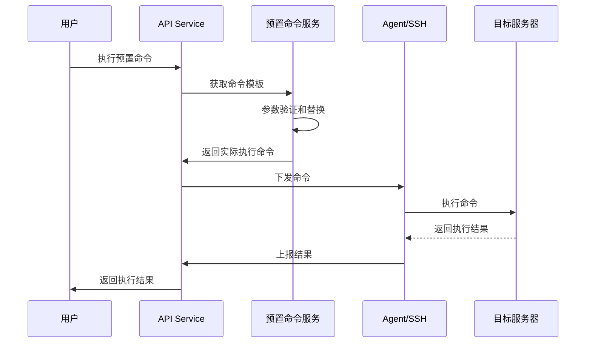

# 服务器管理功能详细设计 V1.1

**文档元信息**
- 文档名称：服务器管理功能详细设计
- 版本：V1.1
- 负责人：开发团队
- 审核：技术负责人
- 创建日期：2025-09-26
- 变更记录：V1.1 - 拆分服务器注册接口，明确模块依赖，优化SSH连接状态检查

**目录**
- [1. 引言](#1-引言)
- [2. 功能概述](#2-功能概述)
- [3. 依赖关系](#3-依赖关系)
- [4. 业务目标与用户故事](#4-业务目标与用户故事)
- [5. 模块与职责](#5-模块与职责)
- [6. API 与契约](#6-api-与契约)
- [7. 数据模型与存储设计](#7-数据模型与存储设计)
- [8. 实现要点与关键数据流](#8-实现要点与关键数据流)
- [9. 非功能需求](#9-非功能需求)
- [10. 测试与验收标准](#10-测试与验收标准)
- [11. 部署与迁移策略](#11-部署与迁移策略)
- [12. 风险与应对](#12-风险与应对)
- [13. 附录](#13-附录)

## 1. 引言

### 1.1 目的
提供统一的服务器资源管理功能，支持服务器的接入、配置、操作和维护，为应用部署提供基础设施支撑。

### 1.2 范围
- **功能边界**：服务器生命周期管理（接入、配置、操作、移除）
- **非目标**：不涉及服务器性能监控、基础组件管理、物理服务器采购、网络基础设施配置

### 1.3 背景
在Websoft9平台中，服务器作为基础设施层的核心资源，需要提供标准化的管理界面和API，支持多种操作系统和云环境。服务器监控功能由专门的监控Feature实现，基础组件管理由独立的Feature处理。

## 2. 功能概述

### 2.1 功能定位
服务器管理模块作为Websoft9平台的基础设施管理层，提供服务器资源的全生命周期管理能力。

### 2.2 核心特性
- **Pull模式优先**：Agent主动拉取任务，适应内网环境
- **SSH功能条件性**：仅在网络可达时提供终端和文件管理
- **文件管理简化**：API仅提供基础CRUD，复杂功能由前端组件实现
- **数据来源分离**：配置数据存储于MySQL，实时数据存储于Redis

### 2.3 目标用户/使用场景
- **系统管理员**：服务器接入、配置管理
- **开发人员**：应用部署前的服务器选择和环境检查
- **运维人员**：服务器状态监控、故障排查、批量运维

### 2.4 功能详情

1. 【服务器查询】

支持分页查询和多条件筛选，查询条件包括：

| 查询条件   | 示例         | 描述                                                   |
| ---------- | ------------ | ------------------------------------------------------ |
| 服务器名称 | web-server-1 | 文本输入框，支持服务器名称关键词的模糊查询。           |
| 服务器状态 | 运行中       | 多选下拉选项，支持按服务器状态筛选，参考附录状态字典。 |
| 资源组     | 生产环境     | 单选下拉选项，支持按资源组筛选。                       |
| 更新时间   | 近7天        | 日期范围选择器，支持按接入时间范围筛选。               |

2. 【服务器列表】

按照服务器名称排序，以列表方式展示已纳管的服务器，展示信息包括：
- 服务器名称、服务器状态、操作系统信息
- 主机地址（IP或域名）、SSH端口、SSH连接状态
- 接入时间、最后心跳时间
- 所属资源组、服务器描述
- 操作按钮：管理、终端、文件管理、重启、更多操作

3. 【服务器新增】

通过服务器配置向导分步添加新服务器：
- 【添加服务器】填写服务器基本信息并保存到数据库
- 【检查环境】验证SSH连接并获取系统信息
- 【安装组件】自动安装Websoft9 Agent等必要组件
- 【完成确认】显示接入结果和服务器基本信息

4. 【服务器配置】

支持修改服务器的配置信息：
- 【基本信息】服务器名称、描述、资源组
- 【连接配置】主机地址、SSH端口、登录凭据
- 【权限设置】终端访问权限、文件管理权限、ROOT登录权限

5. 【服务器操作】

- 【终端访问】提供Web终端界面，支持命令行操作（SSH可用时）
- 【文件管理】提供Web文件管理界面，支持文件上传、下载、编辑（SSH可用时）
- 【系统服务】查看和管理系统服务的启停状态
- 【系统信息】查看硬件信息、系统版本、内核信息

6. 【服务器移除】

通过服务器移除向导安全移除服务器：
- 【移除前检查】检查是否有运行中的应用和任务
- 【应用迁移】提示迁移或停止服务器上的应用
- 【Agent卸载】卸载Websoft9 Agent客户端
- 【完成确认】确认移除操作并清理相关数据

7. 【服务器详情】

点击服务器名称进入详情页面，包含：
- 【基本信息】服务器配置、系统信息、网络信息（来源：MySQL + Redis）
- 【应用列表】运行在该服务器上的应用实例
- 【系统服务】系统服务的状态和管理
- 【操作记录】服务器操作的历史记录

8. 【批量操作】

支持多选服务器进行批量操作：
- 批量重启/关机
- 批量修改资源组
- 批量更新Agent
- 批量执行命令
- 批量配置同步

## 3. 依赖关系

### 3.1 依赖Feature列表
- **用户管理**（强依赖）：服务器权限控制和所有者管理
- **项目管理**（强依赖）：服务器资源组织和项目资源分配
- **权限管理**（强依赖）：服务器操作权限控制
- **审计日志**（弱依赖）：服务器操作审计记录

### 3.2 依赖服务与接口契约
- **认证服务**：JWT Token验证，API调用权限检查
- **权限服务**：RBAC权限验证，操作授权检查
- **审计服务**：操作日志记录，审计事件上报

### 3.3 基础设施依赖
- **MySQL**：服务器配置数据存储（配置、状态、关系数据）
- **Redis**：实时状态数据、会话存储、任务队列（Agent写入的动态数据）
- **gRPC**：与Agent的安全通信（支持双向流）
- **WebSocket**：Web终端实时交互

## 4. 业务目标与用户故事

### 4.1 业务目标
1. **提高运维效率**：通过统一界面管理所有服务器，减少手动操作
2. **简化接入流程**：提供向导式服务器接入，降低使用门槛
3. **保障基础环境**：统一管理基础组件，确保环境一致性

### 4.2 用户故事

| 用户角色 | 用户故事 | 验收条件 |
|----------|----------|----------|
| 系统管理员 | 作为系统管理员，我希望能够快速接入新服务器，以便扩展平台资源 | ✓ 通过向导完成服务器接入<br>✓ 自动检测Agent状态<br>✓ 显示服务器基本信息 |
| 系统管理员 | 作为系统管理员，我希望能够通过Web界面管理服务器，以便提高管理效率 | ✓ 支持终端和文件管理功能<br>✓ 提供系统服务管理<br>✓ 显示服务器详细信息 |
| 运维人员 | 作为运维人员，我希望能够批量管理多台服务器，以便提高运维效率 | ✓ 支持多选服务器<br>✓ 批量执行操作<br>✓ 显示操作进度和结果 |

## 5. 模块与职责

### 5.1 模块清单

| 模块名称 | 核心职责 | 交付物 |
|----------|----------|--------|
| 服务器管理服务 | 服务器CRUD操作、状态管理 | ServerService、ServerRepository |
| Agent通信服务 | 与Agent的gRPC通信管理 | AgentService、AgentRepository |
| 终端访问服务 | SSH终端会话管理 | TerminalService |
| 文件管理服务 | 基础文件CRUD操作 | FileService |
| 批量操作服务 | 多服务器并发操作 | BatchOperationService |

### 5.2 服务层架构
```
Controller → Service → Repository → Model
    ↓         ↓          ↓
   DTO    Business    Database/Redis
```

## 6. API 与契约

### 6.1 总则
- **统一前缀**：`/api/v1/servers`
- **认证方式**：JWT Bearer Token
- **响应格式**：`{code: int, message: string, data: object}`
- **分页规则**：`page`、`page_size`参数，返回`pagination`信息

### 6.2 API接口汇总

| 序号 | 接口名称 | 方法 | 路径 | 功能描述 | 实现方式 | 依赖模块 |
|------|----------|------|------|----------|----------|----------|
| 1 | 获取服务器列表 | GET | `/api/v1/servers` | 分页查询服务器列表，支持筛选 | - | 用户管理、项目管理 |
| 2 | 添加服务器 | POST | `/api/v1/servers` | 添加服务器基本信息到数据库 | - | 用户管理、项目管理 |
| 3 | 获取服务器详情 | GET | `/api/v1/servers/{id}` | 获取指定服务器的详细信息 | - | 用户管理、项目管理、应用管理 |
| 4 | 更新服务器信息 | PUT | `/api/v1/servers/{id}` | 修改服务器配置信息 | - | 用户管理、项目管理 |
| 5 | 删除服务器 | DELETE | `/api/v1/servers/{id}` | 从平台移除服务器 | - | 应用管理、审计日志 |
| 6 | 检查单个服务器 | POST | `/api/v1/servers/{id}/check` | 检查服务器环境、组件、连接状态 | SSH直连 | 无 |
| 7 | 批量检查服务器 | POST | `/api/v1/servers/checks` | 批量检查多个服务器状态（同步） | SSH直连 | 无 |
| 8 | 安装服务器组件 | POST | `/api/v1/servers/{id}/setup` | 安装Agent等必要组件 | SSH直连 | 基础组件管理 |
| 9 | 服务器操作 | POST | `/api/v1/servers/{id}/actions` | 执行服务器管理操作 | Agent优先，SSH备选 | 无 |
| 10 | 服务器批量操作 | POST | `/api/v1/servers/batch/actions` | 批量管理多个服务器 | **Agent优先，SSH备选** | 无 |
| 11 | 获取终端访问 | GET | `/api/v1/servers/{id}/terminal` | 获取Web终端访问URL | **SSH直连** | 无 |
| 12 | 列出目录文件 | GET | `/api/v1/servers/{id}/files` | 列出服务器目录文件 | **SSH直连** | 无 |
| 13 | 上传文件 | POST | `/api/v1/servers/{id}/files` | 上传文件到服务器 | **SSH直连** | 无 |
| 14 | 下载文件 | GET | `/api/v1/servers/{id}/files/download` | 从服务器下载文件 | **SSH直连** | 无 |
| 15 | 删除文件 | DELETE | `/api/v1/servers/{id}/files` | 删除服务器文件 | **SSH直连** | 无 |
| 16 | 获取系统服务 | GET | `/api/v1/servers/{id}/services` | 获取系统服务列表 | **Agent优先，SSH备选** | 无 |
| 17 | 管理系统服务 | POST | `/api/v1/servers/{id}/services/{service_name}/actions` | 管理系统服务状态 | **Agent优先，SSH备选** | 无 |
| 18 | 获取预置命令列表 | GET | `/api/v1/preset-commands` | 获取系统预置命令列表 | - | 无 |
| 19 | 创建预置命令 | POST | `/api/v1/preset-commands` | 创建新的预置命令 | - | 无 |
| 20 | 更新预置命令 | PUT | `/api/v1/preset-commands/{id}` | 更新预置命令信息 | - | 无 |
| 21 | 删除预置命令 | DELETE | `/api/v1/preset-commands/{id}` | 删除预置命令 | - | 无 |

**实现方式说明：**
- **Agent优先，SSH备选**：优先通过Agent Pull模式执行，网络不可达时降级为SSH直连
- **SSH直连**：仅支持SSH直连方式，需要网络可达性
- **-**：不涉及服务器通信，仅平台内部处理

**依赖说明：**
- **用户管理**：权限验证、所有者信息查询
- **项目管理**：资源组信息查询和验证
- **应用管理**：查询服务器上运行的应用、检查应用依赖
- **基础组件管理**：Agent和Docker等组件的安装管理
- **审计日志**：记录删除操作等重要变更

### 6.3 核心API详细说明

#### 6.3.1 获取服务器列表
- **描述**：分页查询服务器列表，支持多条件筛选，包含SSH连接状态
- **方法/路径**：`GET /api/v1/servers`
- **请求参数**：

| 参数 | 类型 | 必填 | 默认值 | 说明 |
|------|------|------|--------|------|
| page | integer | 否 | 1 | 页码 |
| page_size | integer | 否 | 20 | 每页数量 |
| keyword | string | 否 | - | 搜索关键词（服务器名称、主机地址） |
| status | string | 否 | - | 服务器状态筛选 |
| resource_group_id | integer | 否 | - | 资源组ID筛选 |

- **响应示例**：
```json
{
  "code": 200,
  "message": "success",
  "data": {
    "items": [
      {
        "id": 1,
        "name": "Web服务器01",
        "hostname": "web01.example.com",
        "host": "192.168.1.100",
        "internal_ip": "10.0.1.100",
        "ssh_port": 22,
        "ssh_available": true,
        "ssh_last_check": "2025-07-15T10:25:00Z",
        "os_type": "Ubuntu",
        "os_version": "20.04.3 LTS",
        "status": "RUNNING",
        "last_heartbeat_at": "2025-07-15T10:30:00Z",
        "resource_group": {
          "id": 1,
          "name": "生产环境"
        },
        "owner": {
          "id": 1,
          "username": "admin",
          "nickname": "系统管理员"
        },
        "agent": {
          "status": "ONLINE",
          "version": "1.0.0"
        },
        "description": "生产环境Web服务器",
        "created_at": "2025-07-15T10:30:00Z"
      }
    ],
    "pagination": {
      "page": 1,
      "page_size": 20,
      "total": 50,
      "total_pages": 3
    }
  }
}
```

- **权限需求**：`server:read`

#### 6.3.2 添加服务器
- **描述**：添加服务器基本信息到数据库，不进行环境检查和组件安装
- **方法/路径**：`POST /api/v1/servers`
- **请求参数**：

| 参数 | 类型 | 必填 | 说明 |
|------|------|------|------|
| name | string | 是 | 服务器名称 |
| hostname | string | 是 | 主机名 |
| host | string | 是 | 主机地址（IP或域名） |
| internal_ip | string | 否 | 内网IP地址 |
| ssh_port | integer | 否 | SSH端口，默认22 |
| ssh_username | string | 否 | SSH用户名 |
| ssh_password | string | 否 | SSH密码（临时存储，用于后续环境检查） |
| ssh_key | string | 否 | SSH私钥内容（临时存储，用于后续环境检查） |
| os_type | string | 否 | 操作系统类型（可在环境检查时自动获取） |
| resource_group_id | integer | 否 | 资源组ID |
| owner_id | integer | 是 | 所有者ID |
| description | string | 否 | 服务器描述 |

- **请求示例**：
```json
{
  "name": "Web服务器01",
  "hostname": "web01.example.com",
  "host": "192.168.1.100",
  "internal_ip": "10.0.1.100",
  "ssh_port": 22,
  "ssh_username": "root",
  "ssh_password": "password123",
  "resource_group_id": 1,
  "owner_id": 1,
  "description": "生产环境Web服务器"
}
```

- **响应示例**：
```json
{
  "code": 200,
  "message": "服务器添加成功",
  "data": {
    "id": 123,
    "name": "Web服务器01",
    "status": "UNKNOWN",
    "next_step": "check_env",
    "next_step_url": "/api/v1/servers/123/check-env"
  }
}
```

- **权限需求**：`server:create`

#### 6.3.3 获取服务器详情
- **描述**：获取指定服务器的详细信息
- **方法/路径**：`GET /api/v1/servers/{id}`
- **请求参数**：

| 参数 | 类型 | 必填 | 说明 |
|------|------|------|------|
| id | integer | 是 | 服务器ID（路径参数） |

- **响应示例**：
```json
{
  "code": 200,
  "message": "success",
  "data": {
    "id": 1,
    "name": "Web服务器01",
    "hostname": "web01.example.com",
    "host": "192.168.1.100",
    "internal_ip": "10.0.1.100",
    "ssh_port": 22,
    "ssh_available": true,
    "ssh_last_check": "2025-07-15T10:25:00Z",
    "os_type": "Ubuntu",
    "os_version": "20.04.3 LTS",
    "kernel_version": "5.4.0-91-generic",
    "cpu_cores": 4,
    "memory_total": 8192,
    "disk_total": 102400,
    "architecture": "x86_64",
    "status": "RUNNING",
    "last_heartbeat_at": "2025-07-15T10:30:00Z",
    "resource_group": {
      "id": 1,
      "name": "生产环境"
    },
    "owner": {
      "id": 1,
      "username": "admin",
      "nickname": "系统管理员"
    },
    "agent": {
      "status": "ONLINE",
      "version": "1.0.0"
    },
    "apps": [
      {
        "id": 123,
        "name": "我的博客",
        "template_name": "WordPress",
        "status": "RUNNING"
      }
    ],
    "created_at": "2025-07-15T10:30:00Z",
    "updated_at": "2025-07-15T10:30:00Z"
  }
}
```

- **权限需求**：`server:read`

#### 6.3.4 更新服务器信息
- **描述**：修改服务器配置信息
- **方法/路径**：`PUT /api/v1/servers/{id}`
- **请求参数**：

| 参数 | 类型 | 必填 | 说明 |
|------|------|------|------|
| id | integer | 是 | 服务器ID（路径参数） |
| name | string | 否 | 服务器名称 |
| resource_group_id | integer | 否 | 资源组ID |
| description | string | 否 | 服务器描述 |

- **请求示例**：
```json
{
  "name": "Web服务器01-更新",
  "resource_group_id": 2,
  "description": "更新后的描述"
}
```

- **响应示例**：
```json
{
  "code": 200,
  "message": "服务器信息更新成功",
  "data": {
    "id": 1,
    "name": "Web服务器01-更新",
    "resource_group_id": 2,
    "description": "更新后的描述",
    "updated_at": "2025-07-15T11:30:00Z"
  }
}
```

- **权限需求**：`server:update`

#### 6.3.5 删除服务器
- **描述**：从平台移除服务器
- **方法/路径**：`DELETE /api/v1/servers/{id}`
- **请求参数**：

| 参数 | 类型 | 必填 | 说明 |
|------|------|------|------|
| id | integer | 是 | 服务器ID（路径参数） |
| force | boolean | 否 | 是否强制删除 |
| cleanup_apps | boolean | 否 | 是否清理应用 |
| uninstall_agent | boolean | 否 | 是否卸载客户端 |

- **请求示例**：
```json
{
  "force": false,
  "cleanup_apps": true,
  "uninstall_agent": true
}
```

- **响应示例**：
```json
{
  "code": 200,
  "message": "服务器删除成功",
  "data": {
    "id": 1,
    "deleted_at": "2025-07-15T12:00:00Z"
  }
}
```

- **权限需求**：`server:delete`

#### 6.3.6 检查服务器状态
- **描述**：检查服务器环境、组件安装状态和连接状态
- **方法/路径**：`POST /api/v1/servers/{id}/check`
- **请求参数**：

| 参数 | 类型 | 必填 | 说明 |
|------|------|------|------|
| id | integer | 是 | 服务器ID（路径参数） |
| check_types | array | 否 | 检查类型列表，默认全部检查 |
| ssh_username | string | 否 | SSH用户名（如果需要更新凭据） |
| ssh_password | string | 否 | SSH密码 |
| ssh_key | string | 否 | SSH私钥内容 |

**检查类型说明：**
- `ssh_connection`: SSH连接可用性
- `agent_status`: Agent在线状态
- `base_components`: 基础组件安装状态
- `system_info`: 系统信息获取

- **请求示例**：
```json
{
  "check_types": ["ssh_connection", "agent_status", "base_components"],
  "ssh_username": "root",
  "ssh_password": "password123"
}
```

- **响应示例（成功）**：
```json
{
  "code": 200,
  "message": "检查完成",
  "data": {
    "server_id": 123,
    "overall_status": "HEALTHY",
    "checks": {
      "ssh_connection": {
        "status": "SUCCESS",
        "available": true,
        "last_check": "2025-07-15T10:30:00Z",
        "response_time": 150
      },
      "agent_status": {
        "status": "SUCCESS",
        "online": true,
        "version": "1.0.0",
        "last_heartbeat": "2025-07-15T10:29:00Z"
      },
      "base_components": {
        "status": "SUCCESS",
        "components": {
          "docker": {
            "installed": true,
            "version": "24.0.7",
            "status": "running"
          },
          "websoft9-agent": {
            "installed": true,
            "version": "1.0.0",
            "status": "running"
          }
        }
      },
      "system_info": {
        "status": "SUCCESS",
        "server_status": "running",
        "os_type": "Ubuntu",
        "os_version": "20.04.3 LTS",
        "cpu_cores": 4,
        "memory_total": 8192,
        "disk_total": 102400,
        "uptime": "15 days, 6:32:12"
      }
    }
  }
}
```

- **响应示例（部分失败）**：
```json
{
  "code": 200,
  "message": "检查完成，部分项目失败",
  "data": {
    "server_id": 123,
    "overall_status": "PARTIAL",
    "checks": {
      "ssh_connection": {
        "status": "FAILED",
        "available": false,
        "error": "Connection refused",
        "suggestions": ["检查SSH服务状态", "验证网络连接"]
      },
      "agent_status": {
        "status": "SUCCESS",
        "online": true,
        "version": "1.0.0",
        "last_heartbeat": "2025-07-15T10:29:00Z"
      }
    }
  }
}
```

- **权限需求**：`server:check`

#### 6.3.7 批量检查服务器
- **描述**：批量检查多个服务器的状态（同步接口，直接返回结果）
- **方法/路径**：`POST /api/v1/servers/checks`
- **请求参数**：

| 参数 | 类型 | 必填 | 说明 |
|------|------|------|------|
| server_ids | array | 是 | 服务器ID列表 |
| check_types | array | 否 | 检查类型列表 |
| parallel_limit | integer | 否 | 并发检查数量限制，默认10 |
| timeout | integer | 否 | 检查超时时间（秒），默认300 |

- **请求示例**：
```json
{
  "server_ids": [1, 2, 3, 4, 5],
  "check_types": ["ssh_connection", "agent_status"],
  "parallel_limit": 5,
  "timeout": 300
}
```

- **响应示例**：
```json
{
  "code": 200,
  "message": "批量检查完成",
  "data": {
    "total_count": 5,
    "success_count": 4,
    "failed_count": 1,
    "results": [
      {
        "server_id": 1,
        "server_name": "Web服务器01",
        "overall_status": "HEALTHY",
        "checks": {
          "ssh_connection": {
            "status": "SUCCESS",
            "available": true,
            "response_time": 150
          },
          "agent_status": {
            "status": "SUCCESS",
            "online": true,
            "version": "1.0.0"
          }
        }
      },
      {
        "server_id": 2,
        "server_name": "Web服务器02",
        "overall_status": "FAILED",
        "checks": {
          "ssh_connection": {
            "status": "FAILED",
            "available": false,
            "error": "Connection timeout"
          }
        }
      }
    ],
    "duration": "15.2s"
  }
}
```

- **权限需求**：`server:batch_check`

#### 6.3.8 安装服务器组件
- **描述**：在服务器上安装Agent等必要组件
- **方法/路径**：`POST /api/v1/servers/{id}/setup`
- **请求参数**：

| 参数 | 类型 | 必填 | 说明 |
|------|------|------|------|
| id | integer | 是 | 服务器ID（路径参数） |
| component | string | 否 | 指定安装的组件，默认安装Agent |
| version | string | 否 | 指定组件版本，默认最新版本 |
| ssh_username | string | 否 | SSH用户名 |
| ssh_password | string | 否 | SSH密码 |
| ssh_key | string | 否 | SSH私钥内容 |

- **请求示例**：
```json
{
  "component": "websoft9-agent",
  "version": "1.0.0",
  "ssh_username": "root",
  "ssh_password": "password123"
}
```

- **响应示例**：
```json
{
  "code": 200,
  "message": "组件安装成功",
  "data": {
    "server_id": 123,
    "component": "websoft9-agent",
    "version": "1.0.0",
    "status": "installed"
  }
}
```

- **权限需求**：`server:setup`

#### 6.3.9 服务器操作
- **描述**：执行服务器管理操作
- **方法/路径**：`POST /api/v1/servers/{id}/actions`
- **请求参数**：

| 参数 | 类型 | 必填 | 说明 |
|------|------|------|------|
| id | integer | 是 | 服务器ID（路径参数） |
| action | string | 是 | 操作类型：reboot, shutdown, start, upgrade_agent |
| parameters | object | 否 | 操作参数 |
| parameters.force | boolean | 否 | 是否强制执行 |
| parameters.delay | integer | 否 | 延迟执行秒数 |

- **请求示例**：
```json
{
  "action": "reboot",
  "parameters": {
    "force": false,
    "delay": 60
  }
}
```

- **响应示例**：
```json
{
  "code": 200,
  "message": "操作已提交",
  "data": {
    "task_id": "task_abc123",
    "action": "reboot",
    "status": "PENDING",
    "estimated_duration": "2m"
  }
}
```

- **权限需求**：`server:operate`

#### 6.3.10 批量操作
- **描述**：批量管理多个服务器，支持预置命令和自定义命令
- **方法/路径**：`POST /api/v1/servers/batch/actions`
- **请求参数**：

| 参数 | 类型 | 必填 | 说明 |
|------|------|------|------|
| server_ids | array | 是 | 服务器ID列表 |
| action_type | string | 是 | 操作类型：preset_command, custom_command, system_action |
| action | string | 是 | 具体操作内容 |
| parameters | object | 否 | 操作参数 |
| execution_mode | string | 否 | 执行模式：sequential(顺序), parallel(并行)，默认parallel |
| parallel_limit | integer | 否 | 并行执行数量限制，默认10 |

**操作类型说明：**

1. **preset_command**: 预置命令
   - `system_update`: 系统更新
   - `disk_cleanup`: 磁盘清理
   - `log_cleanup`: 日志清理
   - `restart_services`: 重启服务
   - `health_check`: 健康检查

2. **custom_command**: 自定义命令
   - 用户输入的shell命令

3. **system_action**: 系统操作
   - `reboot`: 重启服务器
   - `shutdown`: 关闭服务器
   - `update_agent`: 更新Agent
   - `sync_config`: 同步配置

- **请求示例（预置命令）**：
```json
{
  "server_ids": [1, 2, 3],
  "action_type": "preset_command",
  "action": "system_update",
  "parameters": {
    "update_packages": ["security", "system"],
    "auto_reboot": false
  },
  "execution_mode": "sequential",
  "parallel_limit": 2
}
```

- **请求示例（自定义命令）**：
```json
{
  "server_ids": [1, 2, 3],
  "action_type": "custom_command",
  "action": "df -h && free -m",
  "parameters": {
    "timeout": 30,
    "working_directory": "/home/user"
  },
  "execution_mode": "parallel"
}
```

- **请求示例（系统操作）**：
```json
{
  "server_ids": [1, 2, 3],
  "action_type": "system_action",
  "action": "reboot",
  "parameters": {
    "delay": 300,
    "force": false
  },
  "execution_mode": "sequential"
}
```

- **响应示例**：
```json
{
  "code": 200,
  "message": "批量操作已提交",
  "data": {
    "batch_id": "batch_abc123",
    "action_type": "preset_command",
    "action": "system_update",
    "total_count": 3,
    "status": "RUNNING",
    "execution_mode": "sequential",
    "tasks": [
      {
        "server_id": 1,
        "server_name": "Web服务器01",
        "task_id": "task_001",
        "status": "RUNNING",
        "started_at": "2025-07-15T12:00:00Z"
      },
      {
        "server_id": 2,
        "server_name": "Web服务器02", 
        "task_id": "task_002",
        "status": "PENDING"
      },
      {
        "server_id": 3,
        "server_name": "Web服务器03",
        "task_id": "task_003", 
        "status": "PENDING"
      }
    ],
    "estimated_duration": "10m",
    "status_url": "/api/v1/servers/batch/batch_abc123/status"
  }
}
```

#### 6.3.11 获取终端访问
- **描述**：获取Web终端访问URL，仅在SSH连接可用时有效
- **方法/路径**：`GET /api/v1/servers/{id}/terminal`
- **请求参数**：

| 参数 | 类型 | 必填 | 说明 |
|------|------|------|------|
| id | integer | 是 | 服务器ID（路径参数） |

- **响应示例（SSH可用）**：
```json
{
  "code": 200,
  "message": "success",
  "data": {
    "terminal_url": "wss://api.websoft9.com/terminals/server_1",
    "session_id": "term_123456789",
    "expires_at": "2025-07-15T11:30:00Z"
  }
}
```

- **响应示例（SSH不可用）**：
```json
{
  "code": 400,
  "message": "SSH连接不可用，无法提供终端功能",
  "data": {
    "ssh_available": false,
    "reason": "网络不可达或SSH服务未启动",
    "last_check": "2025-07-15T10:25:00Z"
  }
}
```

- **权限需求**：`server:terminal`

#### 6.3.12 文件管理API

**列出目录文件**
- **描述**：列出服务器目录中的文件和子目录
- **方法/路径**：`GET /api/v1/servers/{id}/files`
- **请求参数**：

| 参数 | 类型 | 必填 | 默认值 | 说明 |
|------|------|------|--------|------|
| id | integer | 是 | - | 服务器ID（路径参数） |
| path | string | 否 | / | 目录路径 |

- **响应示例**：
```json
{
  "code": 200,
  "message": "success",
  "data": {
    "current_path": "/home/user",
    "files": [
      {
        "name": "app.log",
        "type": "file",
        "size": 1024000,
        "permissions": "644",
        "owner": "user",
        "group": "user",
        "modified_at": "2025-07-15T10:30:00Z"
      },
      {
        "name": "documents",
        "type": "directory",
        "size": 4096,
        "permissions": "755",
        "owner": "user",
        "group": "user",
        "modified_at": "2025-07-14T15:20:00Z"
      }
    ]
  }
}
```

**上传文件**
- **描述**：上传文件到服务器指定路径
- **方法/路径**：`POST /api/v1/servers/{id}/files`
- **请求参数**：

| 参数 | 类型 | 必填 | 说明 |
|------|------|------|------|
| id | integer | 是 | 服务器ID（路径参数） |
| file | file | 是 | 文件内容（multipart/form-data） |
| path | string | 是 | 上传路径 |

- **请求示例**：
```
Content-Type: multipart/form-data
file: [文件内容]
path: /home/user/uploads/
```

- **响应示例**：
```json
{
  "code": 200,
  "message": "文件上传成功",
  "data": {
    "filename": "example.txt",
    "path": "/home/user/uploads/example.txt",
    "size": 1024,
    "uploaded_at": "2025-07-15T12:00:00Z"
  }
}
```

**下载文件**
- **描述**：从服务器下载文件
- **方法/路径**：`GET /api/v1/servers/{id}/files/download`
- **请求参数**：

| 参数 | 类型 | 必填 | 说明 |
|------|------|------|------|
| id | integer | 是 | 服务器ID（路径参数） |
| path | string | 是 | 文件路径 |

- **响应示例**：
```
Content-Type: application/octet-stream
Content-Disposition: attachment; filename="example.txt"
[文件内容]
```

**删除文件**
- **描述**：删除服务器上的文件或目录
- **方法/路径**：`DELETE /api/v1/servers/{id}/files`
- **请求参数**：

| 参数 | 类型 | 必填 | 说明 |
|------|------|------|------|
| id | integer | 是 | 服务器ID（路径参数） |
| paths | string[] | 是 | 要删除的文件/目录路径数组 |

- **请求示例**：
```json
{
  "paths": [
    "/home/user/temp.txt",
    "/home/user/old_folder"
  ]
}
```

- **响应示例**：
```json
{
  "code": 200,
  "message": "文件删除成功",
  "data": {
    "deleted_count": 2,
    "deleted_paths": [
      "/home/user/temp.txt",
      "/home/user/old_folder"
    ]
  }
}
```

- **权限需求**：`server:file_manage`

#### 6.3.13 获取系统服务列表
- **描述**：获取服务器上的系统服务列表
- **方法/路径**：`GET /api/v1/servers/{id}/services`
- **请求参数**：

| 参数 | 类型 | 必填 | 说明 |
|------|------|------|------|
| id | integer | 是 | 服务器ID（路径参数） |

- **响应示例**：
```json
{
  "code": 200,
  "message": "success",
  "data": {
    "services": [
      {
        "name": "nginx",
        "status": "active",
        "enabled": true,
        "description": "A high performance web server",
        "pid": 1234,
        "memory": 45.6,
        "cpu": 2.1
      },
      {
        "name": "mysql",
        "status": "inactive",
        "enabled": false,
        "description": "MySQL Database Server",
        "pid": null,
        "memory": 0,
        "cpu": 0
      }
    ]
  }
}
```

- **权限需求**：`server:service_read`

#### 6.3.14 管理系统服务
- **描述**：管理系统服务的启停状态
- **方法/路径**：`POST /api/v1/servers/{id}/services/{service_name}/actions`
- **请求参数**：

| 参数 | 类型 | 必填 | 说明 |
|------|------|------|------|
| id | integer | 是 | 服务器ID（路径参数） |
| service_name | string | 是 | 服务名称（路径参数） |
| action | string | 是 | 操作类型：start, stop, restart |

- **请求示例**：
```json
{
  "action": "restart"
}
```

- **响应示例**：
```json
{
  "code": 200,
  "message": "服务操作成功",
  "data": {
    "service_name": "nginx",
    "action": "restart",
    "status": "active",
    "executed_at": "2025-07-15T12:30:00Z"
  }
}
```

- **权限需求**：`server:service_manage`

#### 6.3.15 获取预置命令列表
- **描述**：获取系统定义的预置命令列表
- **方法/路径**：`GET /api/v1/preset-commands`
- **请求参数**：

| 参数 | 类型 | 必填 | 默认值 | 说明 |
|------|------|------|--------|------|
| page | integer | 否 | 1 | 页码 |
| page_size | integer | 否 | 20 | 每页数量 |
| category | string | 否 | - | 命令分类筛选 |
| keyword | string | 否 | - | 搜索关键词 |

- **响应示例**：
```json
{
  "code": 200,
  "message": "success",
  "data": {
    "items": [
      {
        "id": 1,
        "name": "system_update",
        "display_name": "系统更新",
        "description": "更新系统软件包到最新版本",
        "category": "system",
        "command": "apt update && apt upgrade -y",
        "supported_os": ["ubuntu", "debian"],
        "parameters": [
          {
            "name": "auto_reboot",
            "type": "boolean",
            "default": false,
            "description": "更新后是否自动重启"
          }
        ],
        "security_level": "medium",
        "timeout": 1800,
        "enabled": true,
        "builtin": false,
        "created_at": "2025-07-15T10:30:00Z",
        "updated_at": "2025-07-15T10:30:00Z"
      },
      {
        "id": 2,
        "name": "restart_server",
        "display_name": "重启服务器",
        "description": "安全重启服务器",
        "category": "system",
        "command": "shutdown -r +{{delay}}",
        "supported_os": ["ubuntu", "debian", "centos", "rhel"],
        "parameters": [
          {
            "name": "delay",
            "type": "integer",
            "default": 1,
            "description": "延迟时间（分钟）"
          }
        ],
        "security_level": "high",
        "timeout": 300,
        "enabled": true,
        "builtin": true,
        "created_at": "2025-07-15T10:30:00Z",
        "updated_at": "2025-07-15T10:30:00Z"
      },
      {
        "id": 3,
        "name": "stop_server",
        "display_name": "停止服务器",
        "description": "安全停止服务器",
        "category": "system",
        "command": "shutdown -h +{{delay}}",
        "supported_os": ["ubuntu", "debian", "centos", "rhel"],
        "parameters": [
          {
            "name": "delay",
            "type": "integer",
            "default": 1,
            "description": "延迟时间（分钟）"
          }
        ],
        "security_level": "high",
        "timeout": 300,
        "enabled": true,
        "builtin": true,
        "created_at": "2025-07-15T10:30:00Z",
        "updated_at": "2025-07-15T10:30:00Z"
      }
    ],
    "pagination": {
      "page": 1,
      "page_size": 20,
      "total": 15,
      "total_pages": 1
    }
  }
}
```

- **权限需求**：`preset_command:read`

#### 6.3.16 创建预置命令
- **描述**：创建新的预置命令
- **方法/路径**：`POST /api/v1/preset-commands`
- **请求参数**：

| 参数 | 类型 | 必填 | 说明 |
|------|------|------|------|
| name | string | 是 | 命令名称（唯一标识） |
| display_name | string | 是 | 显示名称 |
| description | string | 否 | 命令描述 |
| category | string | 是 | 命令分类 |
| command | string | 是 | 实际执行的命令 |
| supported_os | array | 是 | 支持的操作系统列表 |
| parameters | array | 否 | 参数定义列表 |
| security_level | string | 否 | 安全等级（low/medium/high） |
| timeout | integer | 否 | 超时时间（秒），默认300 |
| enabled | boolean | 否 | 是否启用，默认true |

- **请求示例**：
```json
{
  "name": "clean_logs",
  "display_name": "清理系统日志",
  "description": "清理系统中的过期日志文件",
  "category": "maintenance",
  "command": "journalctl --vacuum-time={{days}}d && find /var/log -name '*.log.*' -mtime +{{days}} -delete",
  "supported_os": ["ubuntu", "debian", "centos"],
  "parameters": [
    {
      "name": "days",
      "type": "integer",
      "default": 7,
      "description": "保留天数"
    }
  ],
  "security_level": "low",
  "timeout": 600,
  "enabled": true
}
```

- **响应示例**：
```json
{
  "code": 200,
  "message": "预置命令创建成功",
  "data": {
    "id": 16,
    "name": "clean_logs",
    "display_name": "清理系统日志",
    "enabled": true,
    "created_at": "2025-07-15T12:00:00Z"
  }
}
```

- **权限需求**：`preset_command:create`

#### 6.3.17 更新预置命令
- **描述**：更新预置命令信息
- **方法/路径**：`PUT /api/v1/preset-commands/{id}`
- **请求参数**：

| 参数 | 类型 | 必填 | 说明 |
|------|------|------|------|
| id | integer | 是 | 命令ID（路径参数） |
| display_name | string | 否 | 显示名称 |
| description | string | 否 | 命令描述 |
| command | string | 否 | 实际执行的命令 |
| supported_os | array | 否 | 支持的操作系统列表 |
| parameters | array | 否 | 参数定义列表 |
| security_level | string | 否 | 安全等级 |
| timeout | integer | 否 | 超时时间（秒） |
| enabled | boolean | 否 | 是否启用 |

- **请求示例**：
```json
{
  "display_name": "清理系统日志（增强版）",
  "description": "清理系统中的过期日志文件，支持更多日志类型",
  "enabled": true
}
```

- **响应示例**：
```json
{
  "code": 200,
  "message": "预置命令更新成功",
  "data": {
    "id": 16,
    "name": "clean_logs",
    "display_name": "清理系统日志（增强版）",
    "updated_at": "2025-07-15T12:30:00Z"
  }
}
```

- **权限需求**：`preset_command:update`

#### 6.3.18 删除预置命令
- **描述**：删除预置命令（内置命令不可删除）
- **方法/路径**：`DELETE /api/v1/preset-commands/{id}`
- **请求参数**：

| 参数 | 类型 | 必填 | 说明 |
|------|------|------|------|
| id | integer | 是 | 命令ID（路径参数） |

- **响应示例**：
```json
{
  "code": 200,
  "message": "预置命令删除成功",
  "data": {
    "id": 16,
    "deleted_at": "2025-07-15T13:00:00Z"
  }
}
```

- **响应示例（内置命令）**：
```json
{
  "code": 400,
  "message": "内置命令不允许删除",
  "data": {
    "id": 2,
    "builtin": true
  }
}
```

- **权限需求**：`preset_command:delete`

## 7. 数据模型与存储设计

### 7.1 数据架构概述
- **MySQL**：存储服务器配置数据、关系映射（用户配置的静态数据）
- **Redis**：缓存服务器实时状态数据、会话信息、任务队列（Agent写入的动态数据）
- **数据来源**：
  - 服务器基本配置：MySQL
  - 系统信息、Agent状态、心跳时间：Redis
  - 服务器状态：结合Agent心跳和系统检查确定
  - 如果Redis无数据，使用MySQL默认值，保证逻辑正常

### 7.2 关键表设计

#### 7.2.1 服务器表（servers）
```sql
CREATE TABLE servers (
    id                BIGINT UNSIGNED AUTO_INCREMENT PRIMARY KEY COMMENT '服务器ID',
    name              VARCHAR(64) NOT NULL COMMENT '服务器名称',
    hostname          VARCHAR(255) NOT NULL COMMENT '主机名',
    host              VARCHAR(255) NOT NULL COMMENT '主机地址（IP或域名）',
    internal_ip       VARCHAR(45) DEFAULT NULL COMMENT '内网IP',
    ssh_port          INT DEFAULT 22 COMMENT 'SSH端口',
    ssh_username      VARCHAR(64) DEFAULT NULL COMMENT 'SSH用户名',
    ssh_available     BOOLEAN DEFAULT FALSE COMMENT 'SSH连接是否可用',
    ssh_last_check    DATETIME DEFAULT NULL COMMENT 'SSH连接最后检查时间',
    os_type           VARCHAR(32) DEFAULT NULL COMMENT '操作系统类型',
    server_status     ENUM('running', 'stopped', 'restarting', 'unknown') DEFAULT 'unknown' COMMENT '服务器运行状态',
    status            ENUM('UNKNOWN', 'CONNECTING', 'RUNNING', 'STOPPED', 'ERROR') DEFAULT 'UNKNOWN' COMMENT '平台管理状态',
    setup_status      ENUM('PENDING', 'ENV_CHECKING', 'INSTALLING', 'COMPLETED', 'FAILED') DEFAULT 'PENDING' COMMENT '安装状态',
    resource_group_id BIGINT UNSIGNED DEFAULT NULL COMMENT '资源组ID',
    owner_id          BIGINT UNSIGNED NOT NULL COMMENT '所有者ID',
    description       TEXT DEFAULT NULL COMMENT '服务器描述',
    created_at        DATETIME NOT NULL DEFAULT CURRENT_TIMESTAMP COMMENT '创建时间',
    updated_at        DATETIME NOT NULL DEFAULT CURRENT_TIMESTAMP ON UPDATE CURRENT_TIMESTAMP COMMENT '更新时间',
    
    INDEX idx_name (name),
    INDEX idx_host (host),
    INDEX idx_status (status),
    INDEX idx_server_status (server_status),
    INDEX idx_setup_status (setup_status),
    INDEX idx_ssh_available (ssh_available),
    INDEX idx_resource_group (resource_group_id),
    INDEX idx_owner (owner_id),
    
    FOREIGN KEY (resource_group_id) REFERENCES resource_groups(id) ON DELETE SET NULL,
    FOREIGN KEY (owner_id) REFERENCES users(id) ON DELETE RESTRICT
);
```

#### 7.2.2 Agent表（server_agents）
```sql
CREATE TABLE server_agents (
    id                BIGINT UNSIGNED AUTO_INCREMENT PRIMARY KEY COMMENT '记录ID',
    server_id         BIGINT UNSIGNED NOT NULL COMMENT '服务器ID',
    agent_id          VARCHAR(64) NOT NULL COMMENT 'Agent唯一标识',
    version           VARCHAR(32) DEFAULT NULL COMMENT 'Agent版本',
    pull_mode         BOOLEAN DEFAULT TRUE COMMENT '是否启用Pull模式',
    pull_interval     INT DEFAULT 30 COMMENT 'Pull间隔(秒)',
    status            ENUM('UNKNOWN', 'ONLINE', 'OFFLINE', 'ERROR') DEFAULT 'UNKNOWN' COMMENT 'Agent状态',
    created_at        DATETIME NOT NULL DEFAULT CURRENT_TIMESTAMP COMMENT '创建时间',
    updated_at        DATETIME NOT NULL DEFAULT CURRENT_TIMESTAMP ON UPDATE CURRENT_TIMESTAMP COMMENT '更新时间',
    
    UNIQUE KEY uk_server_id (server_id),
    UNIQUE KEY uk_agent_id (agent_id),
    INDEX idx_status (status),
    
    FOREIGN KEY (server_id) REFERENCES servers(id) ON DELETE CASCADE
);
```

#### 7.2.3 预置命令表（preset_commands）
```sql
CREATE TABLE preset_commands (
    id               BIGINT UNSIGNED AUTO_INCREMENT PRIMARY KEY COMMENT '命令ID',
    name             VARCHAR(64) NOT NULL COMMENT '命令名称（唯一标识）',
    display_name     VARCHAR(128) NOT NULL COMMENT '显示名称',
    description      TEXT DEFAULT NULL COMMENT '命令描述',
    category         VARCHAR(32) NOT NULL COMMENT '命令分类',
    command          TEXT NOT NULL COMMENT '实际执行的命令',
    supported_os     JSON NOT NULL COMMENT '支持的操作系统列表',
    parameters       JSON DEFAULT NULL COMMENT '参数定义列表',
    security_level   ENUM('low', 'medium', 'high') DEFAULT 'medium' COMMENT '安全等级',
    timeout          INT DEFAULT 300 COMMENT '超时时间（秒）',
    enabled          BOOLEAN DEFAULT TRUE COMMENT '是否启用',
    builtin          BOOLEAN DEFAULT FALSE COMMENT '是否为内置命令',
    created_by       BIGINT UNSIGNED DEFAULT NULL COMMENT '创建者ID',
    created_at       DATETIME NOT NULL DEFAULT CURRENT_TIMESTAMP COMMENT '创建时间',
    updated_at       DATETIME NOT NULL DEFAULT CURRENT_TIMESTAMP ON UPDATE CURRENT_TIMESTAMP COMMENT '更新时间',
    
    UNIQUE KEY uk_name (name),
    INDEX idx_category (category),
    INDEX idx_enabled (enabled),
    INDEX idx_builtin (builtin),
    INDEX idx_security_level (security_level),
    
    FOREIGN KEY (created_by) REFERENCES users(id) ON DELETE SET NULL
);
```

#### 7.2.4 批量操作任务表（server_batch_tasks）
```sql
CREATE TABLE server_batch_tasks (
    id               BIGINT UNSIGNED AUTO_INCREMENT PRIMARY KEY COMMENT '任务ID',
    batch_id         VARCHAR(64) NOT NULL COMMENT '批量任务ID',
    server_id        BIGINT UNSIGNED NOT NULL COMMENT '服务器ID',
    action_type      ENUM('preset_command', 'custom_command', 'system_action') NOT NULL COMMENT '操作类型',
    action           VARCHAR(255) NOT NULL COMMENT '操作内容',
    parameters       JSON DEFAULT NULL COMMENT '操作参数',
    status           ENUM('PENDING', 'RUNNING', 'SUCCESS', 'FAILED', 'TIMEOUT') DEFAULT 'PENDING' COMMENT '任务状态',
    output           TEXT DEFAULT NULL COMMENT '执行输出',
    error_message    TEXT DEFAULT NULL COMMENT '错误信息',
    exit_code        INT DEFAULT NULL COMMENT '退出码',
    started_at       DATETIME DEFAULT NULL COMMENT '开始时间',
    completed_at     DATETIME DEFAULT NULL COMMENT '完成时间',
    created_at       DATETIME NOT NULL DEFAULT CURRENT_TIMESTAMP COMMENT '创建时间',
    
    INDEX idx_batch_id (batch_id),
    INDEX idx_server_id (server_id),
    INDEX idx_status (status),
    INDEX idx_action_type (action_type),
    
    FOREIGN KEY (server_id) REFERENCES servers(id) ON DELETE CASCADE
);
```

### 7.3 初始数据设置

#### 7.3.1 默认预置命令
系统启动时将自动创建以下内置预置命令：

```sql
INSERT INTO preset_commands (name, display_name, description, category, command, supported_os, parameters, security_level, timeout, enabled, builtin) VALUES
('restart_server', '重启服务器', '安全重启服务器', 'system', 'shutdown -r +{{delay}}', '["ubuntu", "debian", "centos", "rhel", "suse"]', '[{"name": "delay", "type": "integer", "default": 1, "description": "延迟时间（分钟）", "min": 0, "max": 60}]', 'high', 300, true, true),
('stop_server', '停止服务器', '安全停止服务器', 'system', 'shutdown -h +{{delay}}', '["ubuntu", "debian", "centos", "rhel", "suse"]', '[{"name": "delay", "type": "integer", "default": 1, "description": "延迟时间（分钟）", "min": 0, "max": 60}]', 'high', 300, true, true),
('system_update', '系统更新', '更新系统软件包到最新版本', 'maintenance', 'if command -v apt >/dev/null; then apt update && apt upgrade -y; elif command -v yum >/dev/null; then yum update -y; elif command -v dnf >/dev/null; then dnf update -y; fi', '["ubuntu", "debian", "centos", "rhel", "suse"]', '[]', 'medium', 1800, true, true),
('clean_logs', '清理系统日志', '清理系统中的过期日志文件', 'maintenance', 'journalctl --vacuum-time={{days}}d && find /var/log -name "*.log.*" -mtime +{{days}} -delete 2>/dev/null || true', '["ubuntu", "debian", "centos", "rhel", "suse"]', '[{"name": "days", "type": "integer", "default": 7, "description": "保留天数", "min": 1, "max": 365}]', 'low', 600, true, true),
('health_check', '健康检查', '检查服务器基本健康状态', 'monitoring', 'echo "=== 系统信息 ===" && uname -a && echo "=== 磁盘使用 ===" && df -h && echo "=== 内存使用 ===" && free -h && echo "=== 负载情况 ===" && uptime', '["ubuntu", "debian", "centos", "rhel", "suse"]', '[]', 'low', 60, true, true),
('restart_services', '重启常用服务', '重启指定的系统服务', 'service', 'systemctl restart {{services}}', '["ubuntu", "debian", "centos", "rhel", "suse"]', '[{"name": "services", "type": "string", "default": "nginx", "description": "服务名称（多个用空格分隔）"}]', 'medium', 300, true, true);
```

### 7.4 Redis数据结构

#### 7.4.1 服务器实时状态
```
Key: server:status:{server_id}
Value: JSON
{
  "os_version": "20.04.3 LTS",
  "kernel_version": "5.4.0-91-generic",
  "cpu_cores": 4,
  "memory_total": 8192,
  "disk_total": 102400,
  "architecture": "x86_64",
  "server_status": "running",
  "uptime": "15 days, 6:32:12",
  "agent_status": "ONLINE",
  "agent_version": "1.0.0",
  "ssh_available": true,
  "ssh_last_check": "2025-07-15T10:25:00Z",
  "last_heartbeat_at": "2025-07-15T10:30:00Z"
}
TTL: 300s (5分钟)
```

#### 7.4.2 批量任务状态缓存
```
Key: batch_task:{batch_id}
Value: JSON
{
  "batch_id": "batch_abc123",
  "action_type": "preset_command",
  "action": "restart_server",
  "total_count": 5,
  "success_count": 3,
  "failed_count": 1,
  "running_count": 1,
  "status": "RUNNING",
  "started_at": "2025-07-15T12:00:00Z"
}
TTL: 3600s (1小时)
```

## 8. 实现要点与关键数据流

### 8.1 服务器状态管理策略

**服务器状态分类：**
1. **server_status**: 服务器实际运行状态（running/stopped/restarting/unknown）
2. **status**: 平台管理状态（RUNNING/STOPPED/ERROR等）

**状态确定逻辑：**
```
server_status = 通过系统检查或Agent获取的实际状态
status = 基于Agent连接状态和server_status综合判断

if agent_online:
    if server_status == "running":
        status = "RUNNING"
    elif server_status == "stopped":
        status = "STOPPED"
    elif server_status == "restarting":
        status = "RUNNING" (临时状态)
else:
    status = "ERROR" or "STOPPED"
```

### 8.2 预置命令执行流程

**命令参数替换逻辑：**


### 8.3 批量操作优化策略

**执行流程优化：**
1. **参数预处理**：统一验证所有服务器的参数有效性
2. **任务分组**：按操作系统类型分组，提高命令兼容性
3. **并发控制**：设置合理的并发数量，避免系统过载
4. **错误处理**：单个失败不影响其他服务器执行
5. **进度跟踪**：实时更新批量任务进度

## 9. 非功能需求

### 9.1 性能需求
- 系统支持至少500台服务器同时接入，接入时间不超过30分钟/台
- 服务器状态查询响应时间不超过2秒
- 批量操作支持至少100台服务器同时执行，单次操作响应时间不超过5秒

### 9.2 安全需求
- 所有API均需通过JWT进行身份验证
- 敏感数据（如密码、密钥）需加密存储
- 系统操作需记录审计日志，支持查询和导出

### 9.3 可靠性需求
- 系统应具备自动恢复能力，能在异常情况下自动重启服务
- 重要操作（如删除服务器、修改配置）需二次确认

### 9.4 可维护性需求
- 代码需遵循统一的编码规范，注释清晰
- 提供详细的API文档和用户手册
- 定期进行安全性和性能的评估与优化

## 10. 测试与验收标准

### 10.1 功能测试
- 所有API接口功能完整性测试
- 服务器接入、配置、操作、移除全流程测试
- 异常情况（如网络中断、权限不足）处理测试

### 10.2 性能测试
- 并发接入性能测试
- 大数据量下查询性能测试
- 批量操作性能测试

### 10.3 安全性测试
- JWT身份验证测试
- 敏感数据加密存储测试
- 审计日志记录与查询测试

### 10.4 可靠性测试
- 系统异常恢复测试
- 重要操作二次确认测试

## 11. 部署与迁移策略

### 11.1 部署准备
- 确保目标环境已安装Docker和Docker Compose
- 准备MySQL和Redis的持久化存储目录
- 下载最新的Websoft9管理平台镜像

### 11.2 部署步骤
1. 修改`.env`文件，配置数据库和Redis连接信息
2. 启动MySQL和Redis服务：
   ```bash
   docker-compose up -d mysql redis
   ```
3. 等待数据库初始化完成，查看日志：
   ```bash
   docker-compose logs -f mysql
   ```
4. 启动Websoft9管理平台服务：
   ```bash
   docker-compose up -d web
   ```
5. 等待服务启动完成，查看日志：
   ```bash
   docker-compose logs -f web
   ```
6. 访问管理平台，完成初始配置向导

### 11.3 迁移策略
- 数据库迁移使用MySQL的导入导出工具
- 文件数据迁移使用rsync工具，确保权限和时间戳一致
- 配置数据迁移后需手动校验一致性

## 12. 风险与应对

### 12.1 风险清单

| 风险编号 | 风险描述 | 可能影响 | 风险等级 | 应对措施 |
|----------|----------|----------|----------|----------|
| R1 | 服务器接入失败 | 新增服务器无法接入平台 | 高 | 检查网络连接、SSH服务、Agent状态 |
| R2 | 数据库连接失败 | 平台无法访问配置数据 | 高 | 检查数据库服务状态、连接配置 |
| R3 | Redis缓存失效 | 实时状态数据丢失 | 中 | 定期备份Redis数据，提供数据恢复机制 |
| R4 | 批量操作超时 | 大规模操作时可能超时 | 中 | 优化操作命令，分批次执行 |
| R5 | 安全漏洞 | 系统可能被恶意攻击 | 高 | 定期进行安全扫描和漏洞修复 |

### 12.2 风险应对策略
- **预防性措施**：加强系统监控，及时发现并处理异常
- **应急预案**：制定详细的应急响应流程，定期演练
- **备份策略**：重要数据定期备份，确保可恢复性

## 13. 附录

### 13.1 术语表
- **Agent**：部署在服务器上的客户端程序
- **Pull模式**：Agent主动拉取任务的通信模式
- **SSH可用性**：平台能否直接SSH连接服务器的状态
- **Host**：主机地址，可以是IP地址或域名
- **server_status**：服务器实际运行状态
- **status**：平台管理状态
- **预置命令**：平台预定义的安全命令集合
- **自定义命令**：用户输入的shell命令
- **内置命令**：系统默认的不可删除命令

### 13.2 状态字典

#### 服务器运行状态（server_status）
- `running`：服务器正常运行
- `stopped`：服务器已停止
- `restarting`：服务器重启中
- `unknown`：状态未知

#### 平台管理状态（status）
- `UNKNOWN`：未知状态，新创建的服务器
- `CONNECTING`：连接中，正在建立Agent连接
- `RUNNING`：运行中，Agent正常通信
- `STOPPED`：已停止，服务器关闭或Agent停止
- `ERROR`：错误状态，连接或通信异常

#### 批量操作类型
- `preset_command`：预置命令
- `custom_command`：自定义命令
- `system_action`：系统操作

### 13.3 默认预置命令清单

| 命令名称 | 显示名称 | 描述 | 分类 | 安全等级 | 内置 |
|----------|----------|------|------|----------|------|
| restart_server | 重启服务器 | 安全重启服务器 | system | high | ✓ |
| stop_server | 停止服务器 | 安全停止服务器 | system | high | ✓ |
| system_update | 系统更新 | 更新系统软件包 | maintenance | medium | ✓ |
| clean_logs | 清理系统日志 | 清理过期日志文件 | maintenance | low | ✓ |
| health_check | 健康检查 | 检查系统健康状态 | monitoring | low | ✓ |
| restart_services | 重启常用服务 | 重启指定系统服务 | service | medium | ✓ |

### 13.4 预置命令参数类型说明

**支持的参数类型：**
- `string`: 字符串类型
- `integer`: 整数类型
- `boolean`: 布尔类型
- `array`: 数组类型

**参数验证规则：**
- `min`: 最小值（适用于integer类型）
- `max`: 最大值（适用于integer类型）
- `pattern`: 正则表达式（适用于string类型）
- `options`: 可选值列表（适用于string类型）

### 13.5 命令模板变量替换规则

**变量格式：** `{{variable_name}}`

**替换示例：**
```bash
# 模板命令
shutdown -r +{{delay}}

# 参数：{"delay": 5}
# 实际命令
shutdown -r +5
```

**安全限制：**
- 变量名只能包含字母、数字和下划线
- 不允许嵌套变量替换
- 参数值会进行转义处理，防止命令注入

---

## 交付检查表（必须项）
- [ ] API文档与DTO已定义且示例完整（编号与汇总表一一对应）
- [ ] 数据表设计与Migration脚本（包含预置命令表和初始数据）
- [ ] Pull模式通信机制实现
- [ ] SSH功能可用性检测机制
- [ ] 多模式实现策略（Agent优先，SSH备选）
- [ ] 服务器状态管理逻辑实现
- [ ] 批量操作安全策略实现
- [ ] 预置命令管理功能实现（包含默认命令）
- [ ] 预置命令参数替换和验证机制
- [ ] 批量检查同步接口实现
- [ ] MySQL+Redis数据来源实现
- [ ] Redis无数据时的降级逻辑
- [ ] 单元测试与集成测试通过
- [ ] 文件管理基础CRUD功能
- [ ] 审计点已标注并在审计中间件可见
- [ ] 配置项说明与部署步骤文档
- [ ] 功能降级策略验证
- [ ] 性能测试基线确定
- [ ] 安全测试通过（包含命令执行安全和参数验证）
- [ ] 用户手册和API文档更新