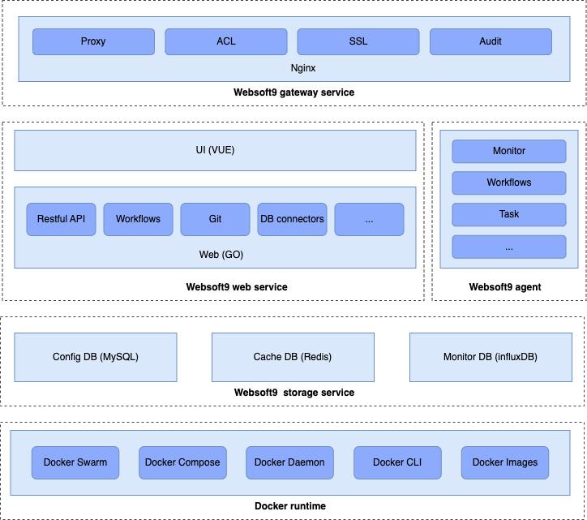
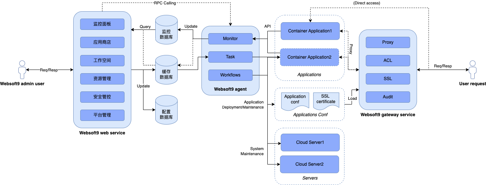

# Websoft9 功能详细设计说明书 V1.1

**目录**

- [Websoft9 功能详细设计说明书 V1.1](#websoft9-功能详细设计说明书-v11)
  - [1. 引言](#1-引言)
    - [1.1 名词定义](#11-名词定义)
    - [1.2 总体应用架构](#12-总体应用架构)
      - [1.2.1 应用架构图](#121-应用架构图)
      - [1.2.2 用户角色](#122-用户角色)
      - [1.2.3 应用服务](#123-应用服务)
      - [1.2.4 基础服务](#124-基础服务)
      - [1.2.3 技术架构图](#123-技术架构图)
      - [1.2.4 逻辑架构图](#124-逻辑架构图)
  - [2. 用户管理功能设计](#2-用户管理功能设计)
    - [用户查询](#用户查询)
    - [用户列表](#用户列表)
    - [用户新增](#用户新增)
    - [用户修改](#用户修改)
    - [用户删除](#用户删除)
    - [密码管理](#密码管理)
  - [3. 用户管理接口设计](#3-用户管理接口设计)
  - [4. 用户管理数据库设计](#4-用户管理数据库设计)
  - [5. 附录](#5-附录)

## 1. 引言

本文档为 **Websoft9架构升级** 的详细设计文档，本文档的编写目的在于明确 **Websoft9架构升级** 需求的开发途径以及应用方法，通过此文档，为此 **Websoft9架构升级** 需求的维护提供清晰、详细的设计，为下阶段开发工作的开展起到指导作用。

本文档的预期读者是 **Websoft9架构升级** 需求相关的业务人员、开发人员以及系统运维人员。

### 1.1 名词定义

| 名词                  | 说明                                                                                                                                           |
| --------------------- | ---------------------------------------------------------------------------------------------------------------------------------------------- |
| `平台`                | 本文档所述"平台"、"`Websoft9平台`"均指`Websoft9平台`。                                                                                         |
| `CI/CD`               | 持续集成（Continuous Integration, CI）与持续交付/部署（Continuous Delivery/Deployment, CD）。 通过自动化流程和工具简化并加快软件开发生命周期。 |
| `Websoft9 Mobile` | `Websoft9平台`提供的移动端 APP，提供监控分析、便捷操作和基本查询功能。                                                                       |
| `Websoft9 Agent`      | `Websoft9平台`提供的服务器客户端代理，提供服务端任务执行、监控采集等功能。                                                                         |
| `应用`                | `Websoft9平台`应用市场提供的应用，支持用户按需选择进行应用部署、发布、更新等操作。                                                             |
| `纳管`                | 已安装`Websoft9 Agent`的服务器和部署的应用，可以被`Websoft9平台`直接管理。                                                                     |
| `发布`                | 指将已经部署的应用发布为互联网可访问的服务，例如：个人网站。本文档所述`应用发布`为将应用通过`Websoft9平台`提供的应用网关服务进行发布。         |
| `应用部署模版`        | 指容器模版（Dockerfile/Compose config）和工作流模版（workflow），用于描述如何将应用部署的配置信息。                                            |
| `SaaS`                | 软件即服务，本文档所述指`Websoft9平台`以`云服务平台`方式为客户提供应用托管服务。                                                               |
| `PaaS`                | 平台即服务，本文档所述指`Websoft9平台`以`私有化平台`方式为客户提供应用托管服务。                                                               |
| `RBAC`                | 基于角色的访问控制，一种通用的访问控制模型，基于用户角色进行权限管理，用户角色与权限之间是多对多的关系。                                       |
| `服务端`              | 本文档所述指`Websoft9 web service`。                                                                                                           |
| `客户端（Agent）`     | 本文档所述指`Websoft9 agent`。                                                                                                                 |
| `工作流`              | 可视化的业务流程编排工具，支持拖拽式组件编排，用于实现复杂的自动化任务调度和执行。                                                             |
| `资源组`              | 对应用、服务器、数据库等资源的分组管理。                                                       |

### 1.2 总体应用架构

#### 1.2.1 应用架构图


#### 1.2.2 用户角色

| 用户角色   | 描述                                                                          |
| ---------- | ----------------------------------------------------------------------------- |
| `开发角色` | 开发者，涉及应用的开发与部署、资源监控、日常维护等应用运维工作。              |
| `运维角色` | IT运维，涉及服务器、网络等基础架构运维、监控分析、资源管理等IT运维工作。      |
| `管理角色` | CTO/CIO，涉及对企业自身IT架构、IT资产管理、IT建设规划与安全审计等IT管理工作。 |

#### 1.2.3 应用服务

用户可以通过浏览器直接访问`Websoft9平台`，也可以通过`Websoft9 Mobile App`访问`Websoft9平台`，`Websoft9 Mobile App`提供了有限的功能支持，仅提供监控分析图表的展示、便捷操作（如应用启停操作）、基本状态或日志的查询等功能。

#### 1.2.4 基础服务

`Websoft9平台`依赖的基础服务，以支撑平台各功能的实现。

#### 1.2.3 技术架构图



#### 1.2.4 逻辑架构图



## 2. 用户管理功能设计

支持对用户的管理，包括用户列表、用户添加、用户修改、用户删除。

### 用户查询

支持分页查询和多条件筛选，查询条件包括：

| 查询条件 | 示例   | 描述                                                 |
| -------- | ------ | ---------------------------------------------------- |
| 搜索     | 关键词 | 文本输入框，支持用户名的精确或模糊查询。             |
| 用户状态 | 启用   | 单选下拉选项，支持按用户状态筛选（启用/禁用/锁定）。 |
| 用户角色 | 管理员 | 多选下拉选项，支持按用户角色筛选。                   |
| 用户组   | 开发组 | 多选下拉选项，支持按用户组筛选。                     |
| 更新时间 | 近7天  | 日期范围选择器，支持按更新时间范围筛选。             |

### 用户列表

按照创建时间倒序排列，以列表方式展示用户信息，展示信息包括：

- 用户名、昵称、用户状态 用户角色、所属用户组、更新时间、最后登录时间。
- 操作按钮：编辑、重置密码、启用/禁用、删除。

### 用户新增

支持管理员创建新用户：

- 【基本信息】用户名、昵称、邮箱、手机号、性别。
- 【账号设置】初始密码、密码策略、账号状态。
- 【角色分配】选择用户角色（支持多选）。
- 【用户组分配】选择所属用户组（支持多选）。
- 【权限设置】设置用户的功能权限和资源访问权限。

### 用户修改

支持对用户信息的修改：

- 【基本信息修改】昵称、邮箱、手机号、性别、头像。
- 【角色调整】修改用户角色分配。
- 【用户组调整】修改用户组归属。
- 【状态管理】启用、禁用、锁定用户账号。
- 【权限调整】修改用户的功能权限和资源访问权限。

### 用户删除

支持用户的安全删除：

- 【删除检查】检查用户是否有关联的资源或正在执行的任务。
- 【数据处理】选择删除用户，用户下相关数据转移至备份目录保留30天。
- 【确认删除】需要管理员二次确认删除操作。
- 【删除审计】记录用户删除操作的审计日志。

### 密码管理

支持用户密码的管理：

- 【重置密码】管理员可以重置用户密码。
- 【密码策略】设置密码复杂度要求和过期策略。
- 【强制修改】强制用户下次登录时修改密码。

## 3. 用户管理接口设计

**获取用户列表**

```text
GET /api/v1/users
```

查询参数：

| 参数      | 类型    | 必填 | 默认值     | 描述                             |
| --------- | ------- | ---- | ---------- | -------------------------------- |
| page      | integer | 否   | 1          | 页码                             |
| page_size | integer | 否   | 20         | 每页数量（1-100）                |
| keyword   | string  | 否   | -          | 搜索关键词（用户名、邮箱、昵称） |
| status    | integer | 否   | -          | 用户状态（0-禁用，1-启用）       |
| role_id   | integer | 否   | -          | 角色ID筛选                       |
| sort      | string  | 否   | created_at | 排序字段                         |
| order     | string  | 否   | desc       | 排序方向（asc, desc）            |

响应示例：

```json
{
  "code": 200,
  "message": "success",
  "data": {
    "items": [
      {
        "id": 1,
        "group_id": 1,
        "username": "admin",
        "email": "admin@example.com",
        "nickname": "系统管理员",
        "avatar": "https://example.com/avatars/admin.jpg",
        "phone": "13800138000",
        "gender": 1,
        "signature": "系统管理员账户",
        "status": 1,
        "timezone": "Asia/Shanghai",
        "language": "zh-CN",
        "last_login_at": "2025-07-15T10:30:00Z",
        "last_login_ip": "192.168.1.100",
        "roles": [
          {
            "id": 1,
            "name": "系统管理员",
            "code": "admin"
          }
        ],
        "created_at": "2025-07-15T10:30:00Z",
        "updated_at": "2025-07-15T10:30:00Z"
      }
    ],
    "pagination": {
      "page": 1,
      "page_size": 20,
      "total": 1,
      "total_pages": 1,
      "has_next": false,
      "has_prev": false
    }
  }
}
```

**获取用户详情**

```text
GET /api/v1/users/{id}
```

**创建用户**

```text
POST /api/v1/users
```

请求体参数：

| 参数名    | 数据类型 | 是否可空 | 描述                                 |
| --------- | -------- | -------- | ------------------------------------ |
| group_id  | integer  | 否       | 用户组ID                             |
| username  | string   | 否       | 用户名，3-32字符，字母数字下划线     |
| email     | string   | 否       | 邮箱地址，必须唯一                   |
| password  | string   | 否       | 密码，8-32字符，包含大小写字母和数字 |
| nickname  | string   | 是       | 用户昵称                             |
| phone     | string   | 是       | 手机号码                             |
| gender    | integer  | 是       | 性别（1-男，2-女，0-未知）           |
| signature | string   | 是       | 个性签名                             |
| timezone  | string   | 是       | 时区，默认UTC                        |
| language  | string   | 是       | 语言，默认zh-CN                      |
| role_ids  | array    | 是       | 角色ID数组                           |
| status    | integer  | 是       | 状态：0-禁用，1-启用                 |

验证规则：

- `username`: 必填，5-32字符，字母数字下划线
- `email`: 必填，有效邮箱格式，唯一
- `password`: 必填，8-32字符，包含大小写字母和数字
- `phone`: 可选，有效手机号格式

**更新用户**

```text
PUT /api/v1/users/{id}
```

**删除用户**

```text
DELETE /api/v1/users/{id}
```

**修改用户密码**

```text
PUT /api/v1/users/{id}/password
```

请求体参数：

| 参数名           | 数据类型 | 是否可空 | 描述       |
| ---------------- | -------- | -------- | ---------- |
| old_password     | string   | 否       | 原密码     |
| new_password     | string   | 否       | 新密码     |
| confirm_password | string   | 否       | 确认新密码 |

## 4. 用户管理数据库设计

**用户表（users）**

| 字段名        | 类型            | 约束               | 默认值                                        | 注释                     |
| ------------- | --------------- | ------------------ | --------------------------------------------- | ------------------------ |
| id            | BIGINT UNSIGNED | PK, AUTO_INCREMENT | -                                             | 用户ID                   |
| username      | VARCHAR(64)     | NOT NULL, UNIQUE   | -                                             | 用户名                   |
| email         | VARCHAR(255)    | NOT NULL, UNIQUE   | -                                             | 邮箱                     |
| password_hash | VARCHAR(255)    | NOT NULL           | -                                             | 密码哈希                 |
| nickname      | VARCHAR(64)     | -                  | NULL                                          | 昵称                     |
| avatar        | VARCHAR(255)    | -                  | NULL                                          | 头像URL                  |
| phone         | VARCHAR(20)     | -                  | NULL                                          | 手机号                   |
| gender        | TINYINT(1)      | -                  | 0                                             | 性别：0-未知，1-男，2-女 |
| signature     | VARCHAR(255)    | -                  | NULL                                          | 个性签名                 |
| status        | TINYINT(1)      | -                  | 1                                             | 状态：0-禁用，1-启用     |
| last_login_at | DATETIME        | -                  | NULL                                          | 最后登录时间             |
| last_login_ip | VARCHAR(45)     | -                  | NULL                                          | 最后登录IP               |
| timezone      | VARCHAR(64)     | -                  | 'UTC'                                         | 时区                     |
| language      | VARCHAR(10)     | -                  | 'zh-CN'                                       | 语言                     |
| created_at    | DATETIME        | NOT NULL           | CURRENT_TIMESTAMP                             | 创建时间                 |
| updated_at    | DATETIME        | NOT NULL           | CURRENT_TIMESTAMP ON UPDATE CURRENT_TIMESTAMP | 更新时间                 |

**用户登录历史表（user_login_history）**

| 字段名      | 类型            | 约束               | 默认值            | 注释       |
| ----------- | --------------- | ------------------ | ----------------- | ---------- |
| id          | BIGINT UNSIGNED | PK, AUTO_INCREMENT | -                 | 记录ID     |
| user_id     | BIGINT UNSIGNED | NOT NULL, FK       | -                 | 用户ID     |
| ip_address  | VARCHAR(45)     | -                  | NULL              | IP地址     |
| user_agent  | VARCHAR(255)    | -                  | NULL              | 用户代理   |
| location    | VARCHAR(100)    | -                  | NULL              | 登录地点   |
| device      | VARCHAR(100)    | -                  | NULL              | 设备信息   |
| browser     | VARCHAR(100)    | -                  | NULL              | 浏览器信息 |
| login_time  | DATETIME        | NOT NULL           | CURRENT_TIMESTAMP | 登录时间   |
| logout_time | DATETIME        | -                  | NULL              | 登出时间   |
| status      | ENUM            | -                  | 'ACTIVE'          | 会话状态   |
| session_id  | VARCHAR(128)    | -                  | NULL              | 会话ID     |
| created_at  | DATETIME        | NOT NULL           | CURRENT_TIMESTAMP | 创建时间   |

## 5. 附录

<!-- 这里写功能的所包含的枚举值、字典等定义，或者相关的参考文档引用 -->