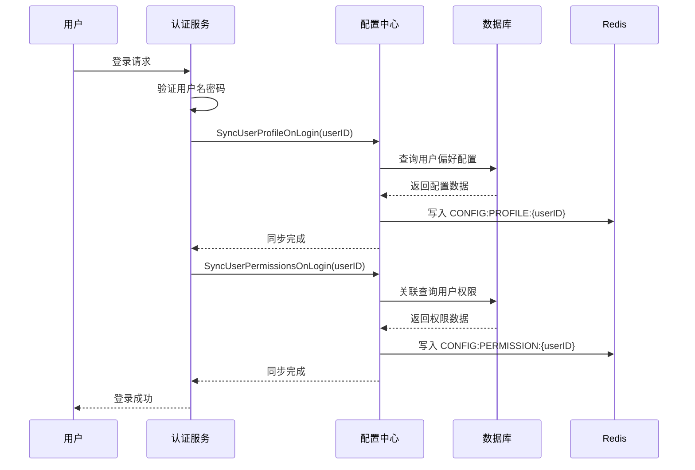
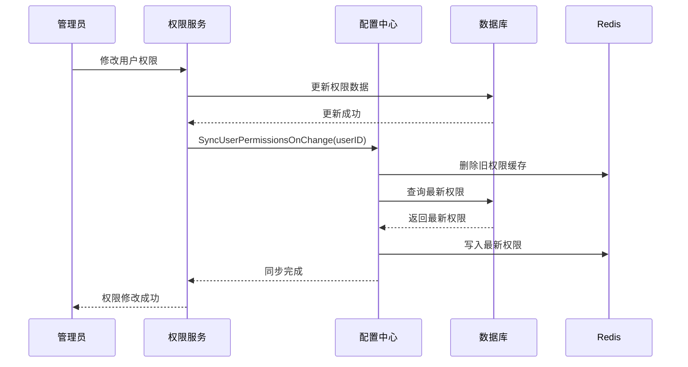
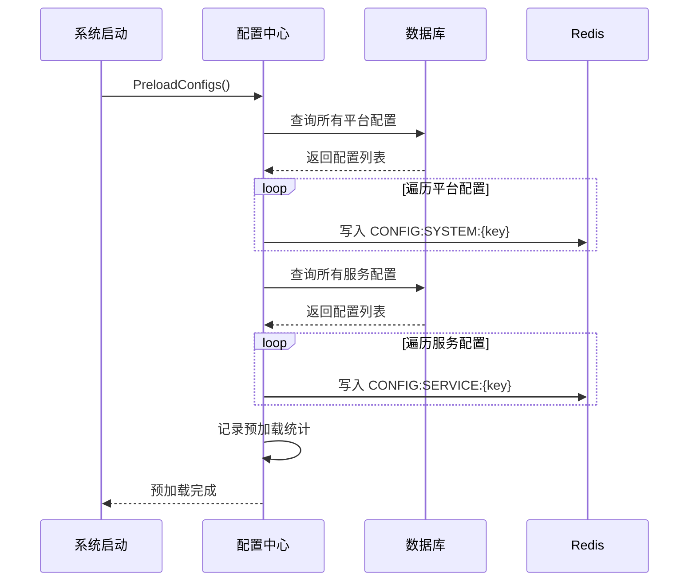

# 配置中心功能详细设计 V1.0

**说明**：配置中心功能详细设计文档（Detailed Design）。遵循 Websoft9 项目规范（**CONTRIBUTING.Zh_CN.md**），内容应清晰标注接口契约、数据模型、关键数据流与验收条件，便于开发、测试与运维落地。

## 文档元信息

- **负责人**：待定
- **审核**：待定
- **创建日期**：2025-11-01

**目录**

- [配置中心功能详细设计 V1.0](#配置中心功能详细设计-v10)
  - [文档元信息](#文档元信息)
  - [1. 需求](#1-需求)
    - [1.1 是什么？](#11-是什么)
    - [1.2 解决什么问题？](#12-解决什么问题)
      - [1.2.1 业务目标](#121-业务目标)
      - [1.2.2 用户故事](#122-用户故事)
    - [1.3 功能需求](#13-功能需求)
      - [1.3.1 平台配置管理](#131-平台配置管理)
      - [1.3.2 服务配置管理](#132-服务配置管理)
      - [1.3.3 用户偏好配置管理](#133-用户偏好配置管理)
      - [1.3.4 权限配置管理](#134-权限配置管理)
      - [1.3.5 配置加载优先级](#135-配置加载优先级)
      - [1.3.6 配置同步策略](#136-配置同步策略)
      - [1.3.7 预加载机制](#137-预加载机制)
    - [1.4 约束](#14-约束)
    - [1.5 非功能需求](#15-非功能需求)
  - [2. 依赖关系](#2-依赖关系)
    - [2.1 依赖内部 Feature 列表](#21-依赖内部-feature-列表)
    - [2.2 依赖的外部服务/基础设施列表](#22-依赖的外部服务基础设施列表)
    - [2.3 依赖的已存在的配置项](#23-依赖的已存在的配置项)
    - [2.4 依赖缺失时的模拟方案](#24-依赖缺失时的模拟方案)
  - [3. API 设计](#3-api-设计)
    - [3.1 子模块设计](#31-子模块设计)
    - [3.2 API 接口汇总](#32-api-接口汇总)
    - [3.3 API 详细说明](#33-api-详细说明)
  - [4. 服务接口说明](#4-服务接口说明)
    - [4.1 平台配置服务接口](#41-平台配置服务接口)
      - [4.1.1 GetSystemConfig - 获取平台配置](#411-getsystemconfig---获取平台配置)
      - [4.1.2 CreateSystemConfig - 创建平台配置](#412-createsystemconfig---创建平台配置)
      - [4.1.3 UpdateSystemConfig - 更新平台配置](#413-updatesystemconfig---更新平台配置)
      - [4.1.4 DeleteSystemConfig - 删除平台配置](#414-deletesystemconfig---删除平台配置)
    - [4.2 服务配置服务接口](#42-服务配置服务接口)
      - [4.2.1 GetServiceConfig - 获取服务配置](#421-getserviceconfig---获取服务配置)
      - [4.2.2 CreateServiceConfig - 创建服务配置](#422-createserviceconfig---创建服务配置)
      - [4.2.3 UpdateServiceConfig - 更新服务配置](#423-updateserviceconfig---更新服务配置)
      - [4.2.4 DeleteServiceConfig - 删除服务配置](#424-deleteserviceconfig---删除服务配置)
    - [4.3 用户偏好配置服务接口](#43-用户偏好配置服务接口)
      - [4.3.1 GetUserProfile - 获取用户偏好配置](#431-getuserprofile---获取用户偏好配置)
      - [4.3.2 UpdateUserProfile - 更新用户偏好配置](#432-updateuserprofile---更新用户偏好配置)
      - [4.3.3 SyncUserProfileOnLogin - 用户登录时同步偏好配置](#433-syncuserprofileonlogin---用户登录时同步偏好配置)
    - [4.4 权限配置服务接口](#44-权限配置服务接口)
      - [4.4.1 GetUserPermissions - 获取用户权限配置](#441-getuserpermissions---获取用户权限配置)
      - [4.4.2 SyncUserPermissionsOnLogin - 用户登录时同步权限配置](#442-syncuserpermissionsonlogin---用户登录时同步权限配置)
      - [4.4.3 SyncUserPermissionsOnChange - 权限变更时同步配置](#443-syncuserpermissionsonchange---权限变更时同步配置)
    - [4.5 配置预加载服务接口](#45-配置预加载服务接口)
      - [4.5.1 PreloadConfigs - 系统启动时预加载配置](#451-preloadconfigs---系统启动时预加载配置)
  - [5. 实现要点与关键数据流](#5-实现要点与关键数据流)
    - [5.1 配置加载优先级实现](#51-配置加载优先级实现)
    - [5.2 配置同步策略实现](#52-配置同步策略实现)
    - [5.3 用户登录时配置同步流程](#53-用户登录时配置同步流程)
    - [5.4 权限变更时配置同步流程](#54-权限变更时配置同步流程)
    - [5.5 系统启动预加载流程](#55-系统启动预加载流程)
  - [6. 数据字典设计](#6-数据字典设计)
    - [6.1 系统表](#61-系统表)
    - [6.2 独立表](#62-独立表)
      - [6.2.1 system\_configs - 平台配置表](#621-system_configs---平台配置表)
      - [6.2.2 service\_configs - 服务配置表](#622-service_configs---服务配置表)
      - [6.2.3 user\_profile - 用户偏好配置表](#623-user_profile---用户偏好配置表)
    - [6.3 配置文件（Config Files）](#63-配置文件config-files)
    - [6.4 常量（Constants）](#64-常量constants)
      - [6.4.1 配置类型常量](#641-配置类型常量)
      - [6.4.2 Redis 键前缀常量](#642-redis-键前缀常量)
      - [6.4.3 配置分类常量](#643-配置分类常量)
      - [6.4.4 错误码常量](#644-错误码常量)
  - [7. 数据模型与存储设计](#7-数据模型与存储设计)
    - [7.1 数据架构概述](#71-数据架构概述)
    - [7.2 关系表设计](#72-关系表设计)
    - [7.3 缓存设计](#73-缓存设计)
      - [缓存策略](#缓存策略)
      - [缓存键示例](#缓存键示例)
      - [Redis Hash 数据结构示例](#redis-hash-数据结构示例)
  - [8. 风险与应对](#8-风险与应对)
    - [8.1 风险应对策略](#81-风险应对策略)
      - [8.1.1 Redis 故障降级方案](#811-redis-故障降级方案)
      - [8.1.2 配置同步失败回滚机制](#812-配置同步失败回滚机制)
      - [8.1.3 预加载超时控制](#813-预加载超时控制)
  - [9. 附录](#9-附录)
    - [9.1 FAQ](#91-faq)
    - [9.2 术语表](#92-术语表)
    - [9.3 变更记录](#93-变更记录)

---

## 1. 需求

### 1.1 是什么？

配置中心是 Websoft9 平台的核心基础服务模块，负责统一管理和提供平台配置、服务配置、用户偏好配置和权限配置等全局性配置参数，支持多层级配置加载策略和高性能缓存机制。

### 1.2 解决什么问题？

配置中心要解决以下核心问题：

1. **配置分散管理问题**：各模块配置分散在代码、数据库、配置文件中，难以统一管理和维护
2. **配置访问性能问题**：频繁的数据库查询导致性能瓶颈，影响系统响应速度
3. **配置一致性问题**：多实例部署时配置更新不同步，导致数据不一致
4. **配置加载优先级问题**：缺乏统一的配置加载策略，无法灵活支持多层级配置覆盖

#### 1.2.1 业务目标

- 提供统一的配置管理接口，降低配置管理复杂度
- 通过 Redis 缓存机制，将配置读取性能提升至毫秒级（< 5ms）
- 实现配置的实时同步更新，确保多实例环境下的数据一致性
- 支持灵活的配置加载优先级策略，满足不同场景的配置需求

#### 1.2.2 用户故事

- **作为平台管理员**，我希望能够集中管理所有系统配置参数，以便统一维护和审计配置变更
- **作为开发工程师**，我希望能够通过统一的 Service API 获取配置，以便简化代码实现和提高开发效率
- **作为运维工程师**，我希望配置更新能够实时生效，以便快速响应业务需求变化
- **作为系统架构师**，我希望配置中心能够支持高并发访问，以便保障系统整体性能

### 1.3 功能需求

#### 1.3.1 平台配置管理

- 支持平台级系统配置的读取、更新、删除、新增操作
- 配置数据存储在 `system_configs` 表
- Redis 缓存键规则：`CONFIG:SYSTEM:{config_key}`
- 使用 Hash 数据类型存储，字段名称和值作为 Hash key-value

#### 1.3.2 服务配置管理

- 支持服务级配置的读取、更新、删除、新增操作
- 配置数据存储在 `service_configs` 表
- Redis 缓存键规则：`CONFIG:SERVICE:{config_key}`
- 使用 Hash 数据类型存储，字段名称和值作为 Hash key-value

#### 1.3.3 用户偏好配置管理

- 支持用户个性化偏好配置的读取、更新、删除操作
- 配置数据存储在 `user_profile` 表
- Redis 缓存键规则：`CONFIG:PROFILE:{user_id}`
- 用户登录成功后自动同步至 Redis，未查询到则创建空 Hash
- 使用 Hash 数据类型存储，字段名称和值作为 Hash key-value

#### 1.3.4 权限配置管理

- 支持用户权限配置的读取和同步操作
- 权限数据从 `permissions`、`roles`、`user_roles`、`role_permissions` 表关联查询
- Redis 缓存键规则：`CONFIG:PERMISSION:{user_id}`
- 用户登录成功后自动同步至 Redis，未查询到则创建空 Hash
- 权限变更时自动更新 Redis 缓存
- Hash key 为 `resource`，Hash value 为 `action`

#### 1.3.5 配置加载优先级

支持多层级配置加载策略，优先级从高到低：

1. **Redis 缓存**：优先从 Redis 读取，性能最优
2. **Database 数据库**：Redis 未命中时从数据库读取
3. **Config 配置文件**：数据库未配置时从配置文件读取（如有）
4. **Constants 常量**：配置文件未定义时使用代码常量（如有）

#### 1.3.6 配置同步策略

- 数据库配置更新时，同步更新 Redis 缓存
- 数据库配置删除时，同步删除 Redis 缓存
- 确保缓存与数据库的强一致性

#### 1.3.7 预加载机制

- 系统启动时自动预加载所有配置数据至 Redis
- 预加载顺序：平台配置 → 服务配置
- 预加载失败时记录错误日志，但不阻塞系统启动

### 1.4 约束

- 配置中心仅提供 Service API，不对外暴露 HTTP API
- 配置更新操作必须同时更新数据库和 Redis，保证数据一致性
- Redis 连接失败时应降级至数据库直接读取，不影响业务功能
- 配置键（config_key）必须全局唯一，避免配置冲突
- 敏感配置（如密钥、密码）必须加密存储（is_encrypted=1）
- 只读配置（is_readonly=1）不允许通过 API 修改

### 1.5 非功能需求

| 类别     | 需求描述               | 指标             |
| -------- | ---------------------- | ---------------- |
| 性能     | Redis 缓存读取响应时间 | < 5ms (99%)      |
| 性能     | 数据库查询响应时间     | < 50ms (95%)     |
| 性能     | 配置预加载时间         | < 3s             |
| 可用性   | Redis 故障时降级可用   | 100%             |
| 可靠性   | 配置同步成功率         | > 99.9%          |
| 安全     | 敏感配置加密存储       | 100%             |
| 可维护性 | 代码测试覆盖率         | ≥ 80%            |
| 可扩展性 | 支持新增配置类型       | 无需修改核心代码 |

## 2. 依赖关系

### 2.1 依赖内部 Feature 列表

| Feature 名称 | 依赖程度 | 依赖说明                                 |
| ------------ | -------- | ---------------------------------------- |
| 用户认证     | 强依赖   | 用户登录时需要同步用户偏好配置和权限配置 |
| 权限管理     | 强依赖   | 需要查询用户权限数据并同步至 Redis       |
| 日志系统     | 弱依赖   | 记录配置操作日志和异常信息               |

### 2.2 依赖的外部服务/基础设施列表

| 服务名称     | 接口/方法    | 用途                   | SLA 要求 |
| ------------ | ------------ | ---------------------- | -------- |
| MySQL/SQLite | GORM API     | 配置数据持久化存储     | < 50ms   |
| Redis        | go-redis API | 配置数据缓存和快速读取 | < 5ms    |

### 2.3 依赖的已存在的配置项

配置中心本身不依赖其他配置项，但需要以下基础设施配置：

- **数据库连接配置**：`configs/config.yaml` 中的 database 配置
- **Redis 连接配置**：`configs/config.yaml` 中的 redis 配置

### 2.4 依赖缺失时的模拟方案

- **Redis 不可用**：降级至数据库直接读取，记录警告日志
- **数据库不可用**：使用配置文件和常量默认值，记录错误日志
- **测试环境**：使用 Mock Redis 和内存数据库进行单元测试

## 3. API 设计

### 3.1 子模块设计

| 子模块名称       | 核心职责                       |
| ---------------- | ------------------------------ |
| 平台配置服务     | 管理系统级配置参数的 CRUD 操作 |
| 服务配置服务     | 管理服务级配置参数的 CRUD 操作 |
| 用户偏好配置服务 | 管理用户个性化配置的读取和更新 |
| 权限配置服务     | 管理用户权限配置的同步和查询   |
| 配置加载服务     | 实现多层级配置加载策略         |
| 配置同步服务     | 实现数据库与 Redis 的数据同步  |
| 预加载服务       | 系统启动时预加载配置数据       |

### 3.2 API 接口汇总

配置中心不提供对外的 HTTP API，仅提供 Service 层接口供其他模块调用。

### 3.3 API 详细说明

配置中心不提供 HTTP API，仅提供 Service 接口。详见第 4 节服务接口说明。

## 4. 服务接口说明

### 4.1 平台配置服务接口

#### 4.1.1 GetSystemConfig - 获取平台配置

```go
// GetSystemConfig retrieves a system configuration by key
// Priority: Redis -> Database -> Config File -> Constants
func (s *ConfigService) GetSystemConfig(ctx context.Context, configKey string) (*model.SystemConfig, error)
```

**参数说明**：

- `ctx`：上下文对象
- `configKey`：配置键（唯一标识）

**返回值**：

- `*model.SystemConfig`：配置对象
- `error`：错误信息

**业务逻辑**：

1. 从 Redis 查询配置（键：`CONFIG:SYSTEM:{configKey}`）
2. Redis 未命中则从数据库查询
3. 数据库未查询到则从配置文件读取（如有）
4. 配置文件未定义则返回常量默认值（如有）
5. 所有来源均未找到则返回 `CodeRecordNotFound` 错误

#### 4.1.2 CreateSystemConfig - 创建平台配置

```go
// CreateSystemConfig creates a new system configuration
func (s *ConfigService) CreateSystemConfig(ctx context.Context, config *model.SystemConfig) error
```

**参数说明**：

- `ctx`：上下文对象
- `config`：配置对象

**返回值**：

- `error`：错误信息

**业务逻辑**：

1. 验证配置键是否已存在
2. 如果 `is_encrypted=1`，加密 `config_value`
3. 插入数据库
4. 同步写入 Redis 缓存
5. 记录操作日志

#### 4.1.3 UpdateSystemConfig - 更新平台配置

```go
// UpdateSystemConfig updates an existing system configuration
func (s *ConfigService) UpdateSystemConfig(ctx context.Context, configKey string, config *model.SystemConfig) error
```

**参数说明**：

- `ctx`：上下文对象
- `configKey`：配置键
- `config`：更新的配置对象

**返回值**：

- `error`：错误信息

**业务逻辑**：

1. 检查配置是否存在
2. 检查是否为只读配置（`is_readonly=1`），只读配置不允许更新
3. 如果 `is_encrypted=1`，加密新的 `config_value`
4. 更新数据库记录
5. 同步更新 Redis 缓存
6. 记录操作日志

#### 4.1.4 DeleteSystemConfig - 删除平台配置

```go
// DeleteSystemConfig deletes a system configuration by key
func (s *ConfigService) DeleteSystemConfig(ctx context.Context, configKey string) error
```

**参数说明**：

- `ctx`：上下文对象
- `configKey`：配置键

**返回值**：

- `error`：错误信息

**业务逻辑**：

1. 检查配置是否存在
2. 检查是否为只读配置，只读配置不允许删除
3. 删除数据库记录
4. 同步删除 Redis 缓存
5. 记录操作日志

### 4.2 服务配置服务接口

#### 4.2.1 GetServiceConfig - 获取服务配置

```go
// GetServiceConfig retrieves a service configuration by key
// Priority: Redis -> Database -> Config File -> Constants
func (s *ConfigService) GetServiceConfig(ctx context.Context, configKey string) (*model.ServiceConfig, error)
```

**参数说明**：

- `ctx`：上下文对象
- `configKey`：配置键（唯一标识）

**返回值**：

- `*model.ServiceConfig`：配置对象
- `error`：错误信息

**业务逻辑**：与 `GetSystemConfig` 类似，Redis 键规则为 `CONFIG:SERVICE:{configKey}`

#### 4.2.2 CreateServiceConfig - 创建服务配置

```go
// CreateServiceConfig creates a new service configuration
func (s *ConfigService) CreateServiceConfig(ctx context.Context, config *model.ServiceConfig) error
```

**业务逻辑**：与 `CreateSystemConfig` 类似

#### 4.2.3 UpdateServiceConfig - 更新服务配置

```go
// UpdateServiceConfig updates an existing service configuration
func (s *ConfigService) UpdateServiceConfig(ctx context.Context, configKey string, config *model.ServiceConfig) error
```

**业务逻辑**：与 `UpdateSystemConfig` 类似

#### 4.2.4 DeleteServiceConfig - 删除服务配置

```go
// DeleteServiceConfig deletes a service configuration by key
func (s *ConfigService) DeleteServiceConfig(ctx context.Context, configKey string) error
```

**业务逻辑**：与 `DeleteSystemConfig` 类似

### 4.3 用户偏好配置服务接口

#### 4.3.1 GetUserProfile - 获取用户偏好配置

```go
// GetUserProfile retrieves user profile configuration
// Priority: Redis -> Database
func (s *ConfigService) GetUserProfile(ctx context.Context, userID uint) (map[string]interface{}, error)
```

**参数说明**：

- `ctx`：上下文对象
- `userID`：用户 ID

**返回值**：

- `map[string]interface{}`：用户偏好配置键值对
- `error`：错误信息

**业务逻辑**：

1. 从 Redis 查询配置（键：`CONFIG:PROFILE:{userID}`）
2. Redis 未命中则从数据库查询
3. 数据库查询结果写入 Redis
4. 返回配置数据

#### 4.3.2 UpdateUserProfile - 更新用户偏好配置

```go
// UpdateUserProfile updates user profile configuration
func (s *ConfigService) UpdateUserProfile(ctx context.Context, userID uint, configKey string, configValue interface{}) error
```

**参数说明**：

- `ctx`：上下文对象
- `userID`：用户 ID
- `configKey`：配置键
- `configValue`：配置值

**返回值**：

- `error`：错误信息

**业务逻辑**：

1. 更新数据库记录（`user_profile` 表）
2. 同步更新 Redis 缓存
3. 记录操作日志

#### 4.3.3 SyncUserProfileOnLogin - 用户登录时同步偏好配置

```go
// SyncUserProfileOnLogin synchronizes user profile to Redis when user logs in
func (s *ConfigService) SyncUserProfileOnLogin(ctx context.Context, userID uint) error
```

**参数说明**：

- `ctx`：上下文对象
- `userID`：用户 ID

**返回值**：

- `error`：错误信息

**业务逻辑**：

1. 从数据库查询用户偏好配置
2. 如果未查询到配置，创建空的 Redis Hash
3. 如果查询到配置，将所有配置项写入 Redis Hash
4. 设置合理的过期时间（如 24 小时）

### 4.4 权限配置服务接口

#### 4.4.1 GetUserPermissions - 获取用户权限配置

```go
// GetUserPermissions retrieves user permissions from Redis or database
// Priority: Redis -> Database
func (s *ConfigService) GetUserPermissions(ctx context.Context, userID uint) (map[string]string, error)
```

**参数说明**：

- `ctx`：上下文对象
- `userID`：用户 ID

**返回值**：

- `map[string]string`：权限配置，key 为 resource，value 为 action
- `error`：错误信息

**业务逻辑**：

1. 从 Redis 查询权限配置（键：`CONFIG:PERMISSION:{userID}`）
2. Redis 未命中则从数据库关联查询（参考 `permission.CheckUserPermission` 逻辑）
3. 数据库查询结果写入 Redis
4. 返回权限数据

#### 4.4.2 SyncUserPermissionsOnLogin - 用户登录时同步权限配置

```go
// SyncUserPermissionsOnLogin synchronizes user permissions to Redis when user logs in
func (s *ConfigService) SyncUserPermissionsOnLogin(ctx context.Context, userID uint) error
```

**参数说明**：

- `ctx`：上下文对象
- `userID`：用户 ID

**返回值**：

- `error`：错误信息

**业务逻辑**：

1. 从数据库关联查询用户权限（通过 `user_roles` → `role_permissions` → `permissions`）
2. 如果未查询到权限，创建空的 Redis Hash
3. 如果查询到权限，将所有权限项写入 Redis Hash（key=resource, value=action）
4. 设置合理的过期时间（如 24 小时）

#### 4.4.3 SyncUserPermissionsOnChange - 权限变更时同步配置

```go
// SyncUserPermissionsOnChange synchronizes user permissions to Redis when permissions change
func (s *ConfigService) SyncUserPermissionsOnChange(ctx context.Context, userID uint) error
```

**参数说明**：

- `ctx`：上下文对象
- `userID`：用户 ID

**返回值**：

- `error`：错误信息

**业务逻辑**：

1. 删除 Redis 中的旧权限配置
2. 重新从数据库查询最新权限
3. 将最新权限写入 Redis
4. 记录同步日志

### 4.5 配置预加载服务接口

#### 4.5.1 PreloadConfigs - 系统启动时预加载配置

```go
// PreloadConfigs preloads all configurations to Redis on system startup
func (s *ConfigService) PreloadConfigs(ctx context.Context) error
```

**参数说明**：

- `ctx`：上下文对象

**返回值**：

- `error`：错误信息

**业务逻辑**：

1. 预加载所有平台配置（`system_configs` 表）
2. 预加载所有服务配置（`service_configs` 表）
3. 记录预加载统计信息（成功数量、失败数量、耗时）
4. 预加载失败不阻塞系统启动，仅记录错误日志

## 5. 实现要点与关键数据流

### 5.1 配置加载优先级实现

配置加载采用多层级回退策略，确保在各种场景下都能获取到配置值：

**实现步骤**：

1. **第一优先级：Redis 缓存读取**
   - 根据配置键构建 Redis Key（如：`CONFIG:SYSTEM:{config_key}`）
   - 从 Redis Hash 中读取配置数据
   - 如果读取成功且数据有效，直接返回配置对象
   - 记录日志：配置从 Redis 加载成功

2. **第二优先级：数据库查询**
   - 如果 Redis 未命中，调用 Repository 层从数据库查询配置
   - 如果查询成功，将配置数据写入 Redis 缓存（Cache-Aside 模式）
   - 返回配置对象
   - 记录日志：配置从数据库加载成功

3. **第三优先级：配置文件读取（可选）**
   - 如果数据库未查询到配置，尝试从 `configs/config.yaml` 读取
   - 使用 Viper 库解析配置文件
   - 如果找到对应配置项，返回配置对象
   - 记录日志：配置从配置文件加载成功

4. **第四优先级：常量默认值（可选）**
   - 如果配置文件未定义，查找代码中的常量定义
   - 返回预定义的默认值
   - 记录日志：配置使用常量默认值

5. **所有来源均未找到**
   - 返回 `CodeRecordNotFound` 错误
   - 记录错误日志：配置不存在

### 5.2 配置同步策略实现

配置更新采用数据库事务 + Redis 同步的强一致性策略，确保缓存与数据库数据完全一致：

**实现步骤**：

1. **前置检查**
   - 调用 Repository 层查询配置是否存在
   - 如果配置不存在，返回 `CodeRecordNotFound` 错误
   - 检查配置的 `is_readonly` 字段
   - 如果为只读配置（`is_readonly=1`），返回 `CodeConfigReadonly` 错误

2. **敏感数据加密**
   - 检查配置的 `is_encrypted` 字段
   - 如果需要加密（`is_encrypted=1`），使用 AES-256 算法加密 `config_value`
   - 加密失败则返回错误，不继续执行

3. **开启数据库事务**
   - 使用 GORM 的 `Begin()` 方法开启事务
   - 设置 defer 函数，捕获 panic 并回滚事务

4. **更新数据库记录**
   - 在事务中调用 Repository 层的 `UpdateSystemConfigWithTx` 方法
   - 更新配置记录的 `config_value`、`updated_at` 等字段
   - 如果更新失败，回滚事务并返回错误

5. **同步更新 Redis 缓存**
   - 构建 Redis Key（如：`CONFIG:SYSTEM:{config_key}`）
   - 将更新后的配置数据写入 Redis Hash
   - 如果 Redis 写入失败，回滚数据库事务并返回 `CodeConfigSyncFailed` 错误
   - 记录错误日志：Redis 同步失败

6. **提交事务**
   - 调用事务的 `Commit()` 方法提交数据库变更
   - 如果提交失败，返回错误
   - 记录成功日志：配置更新并同步成功

7. **删除操作的同步策略**
   - 删除配置时，先删除数据库记录（在事务中）
   - 然后删除 Redis 缓存（使用 `DEL` 命令）
   - 同样遵循事务回滚机制，确保一致性

### 5.3 用户登录时配置同步流程



### 5.4 权限变更时配置同步流程



### 5.5 系统启动预加载流程



## 6. 数据字典设计

### 6.1 系统表

配置中心不需要在 `system_config` 表中存储额外的配置项，所有配置均存储在专用表中。

### 6.2 独立表

#### 6.2.1 system_configs - 平台配置表

| 字段名           | 类型        | 约束            | 默认值            | 说明                                        |
| ---------------- | ----------- | --------------- | ----------------- | ------------------------------------------- |
| id               | INTEGER     | PRIMARY KEY     | AUTO_INCREMENT    | 主键 ID                                     |
| config_key       | VARCHAR(64) | NOT NULL UNIQUE | -                 | 配置键（唯一标识）                          |
| config_value     | TEXT        | NULL            | -                 | 配置值                                      |
| config_type      | VARCHAR(20) | NOT NULL        | 'STRING'          | 配置类型：STRING/INTEGER/BOOLEAN/JSON/FLOAT |
| category         | VARCHAR(32) | NOT NULL        | -                 | 配置分类                                    |
| description      | TEXT        | NULL            | -                 | 配置描述                                    |
| is_readonly      | INTEGER     | NOT NULL        | 0                 | 是否只读：0-否，1-是                        |
| is_encrypted     | INTEGER     | NOT NULL        | 0                 | 是否加密：0-否，1-是                        |
| default_value    | TEXT        | NULL            | -                 | 默认值                                      |
| validation_rules | TEXT        | NULL            | -                 | 验证规则（JSON 格式）                       |
| sort_order       | INTEGER     | NOT NULL        | 0                 | 排序顺序                                    |
| created_at       | DATETIME    | NOT NULL        | CURRENT_TIMESTAMP | 创建时间                                    |
| updated_at       | DATETIME    | NOT NULL        | CURRENT_TIMESTAMP | 更新时间                                    |

**索引设计**：

- PRIMARY KEY: `id`
- UNIQUE INDEX: `config_key`
- INDEX: `category`
- INDEX: `config_type`

#### 6.2.2 service_configs - 服务配置表

| 字段名        | 类型        | 约束            | 默认值            | 说明                 |
| ------------- | ----------- | --------------- | ----------------- | -------------------- |
| id            | INTEGER     | PRIMARY KEY     | AUTO_INCREMENT    | 主键 ID              |
| code          | VARCHAR(64) | NOT NULL UNIQUE | -                 | 配置代码（唯一标识） |
| config_key    | VARCHAR(64) | NOT NULL        | -                 | 配置键               |
| config_value  | TEXT        | NULL            | -                 | 配置值               |
| config_type   | VARCHAR(20) | NOT NULL        | 'STRING'          | 配置类型             |
| category      | VARCHAR(32) | NOT NULL        | -                 | 配置分类             |
| description   | TEXT        | NULL            | -                 | 配置描述             |
| is_readonly   | INTEGER     | NOT NULL        | 0                 | 是否只读             |
| is_encrypted  | INTEGER     | NOT NULL        | 0                 | 是否加密             |
| default_value | TEXT        | NULL            | -                 | 默认值               |
| sort_order    | INTEGER     | NOT NULL        | 0                 | 排序顺序             |
| owner_id      | INTEGER     | NOT NULL        | -                 | 所有者 ID            |
| created_at    | DATETIME    | NOT NULL        | CURRENT_TIMESTAMP | 创建时间             |
| updated_at    | DATETIME    | NOT NULL        | CURRENT_TIMESTAMP | 更新时间             |

**索引设计**：

- PRIMARY KEY: `id`
- UNIQUE INDEX: `code`
- INDEX: `category`
- INDEX: `owner_id`

#### 6.2.3 user_profile - 用户偏好配置表

| 字段名        | 类型        | 约束        | 默认值            | 说明     |
| ------------- | ----------- | ----------- | ----------------- | -------- |
| id            | INTEGER     | PRIMARY KEY | AUTO_INCREMENT    | 主键 ID  |
| user_id       | INTEGER     | NOT NULL    | -                 | 用户 ID  |
| category      | VARCHAR(64) | NOT NULL    | 'general'         | 配置分类 |
| config_key    | VARCHAR(64) | NOT NULL    | -                 | 配置键   |
| config_value  | TEXT        | NULL        | -                 | 配置值   |
| description   | TEXT        | NULL        | -                 | 配置描述 |
| is_readonly   | INTEGER     | NOT NULL    | 0                 | 是否只读 |
| is_encrypted  | INTEGER     | NOT NULL    | 0                 | 是否加密 |
| default_value | TEXT        | NULL        | -                 | 默认值   |
| sort_order    | INTEGER     | NOT NULL    | 0                 | 排序顺序 |
| created_at    | DATETIME    | NOT NULL    | CURRENT_TIMESTAMP | 创建时间 |
| updated_at    | DATETIME    | NOT NULL    | CURRENT_TIMESTAMP | 更新时间 |

**索引设计**：

- PRIMARY KEY: `id`
- UNIQUE INDEX: `(user_id, config_key)`
- INDEX: `user_id`
- FOREIGN KEY: `user_id` REFERENCES `users(id)`

### 6.3 配置文件（Config Files）

配置中心支持从 `configs/config.yaml` 读取配置项作为降级方案，但不强制要求。

### 6.4 常量（Constants）

#### 6.4.1 配置类型常量

```go
// 文件路径: internal/constants/config.go
package constants

const (
    ConfigTypeString  = "STRING"
    ConfigTypeInteger = "INTEGER"
    ConfigTypeBoolean = "BOOLEAN"
    ConfigTypeJSON    = "JSON"
    ConfigTypeFloat   = "FLOAT"
)
```

#### 6.4.2 Redis 键前缀常量

```go
// 文件路径: internal/constants/redis.go
package constants

const (
    RedisKeyPrefixSystemConfig     = "CONFIG:SYSTEM:"
    RedisKeyPrefixServiceConfig    = "CONFIG:SERVICE:"
    RedisKeyPrefixUserProfile      = "CONFIG:PROFILE:"
    RedisKeyPrefixUserPermission   = "CONFIG:PERMISSION:"
)
```

#### 6.4.3 配置分类常量

```go
// 文件路径: internal/constants/config.go
package constants

const (
    ConfigCategoryGeneral      = "general"
    ConfigCategorySecurity     = "security"
    ConfigCategoryNotification = "notification"
    ConfigCategoryStorage      = "storage"
    ConfigCategoryMonitoring   = "monitoring"
)
```

#### 6.4.4 错误码常量

```go
// 文件路径: pkg/errors/codes/codes.go
package codes

const (
    // 配置中心相关错误码 (7000-7099)
    CodeConfigNotFound      ErrorCode = 7001 // 配置不存在
    CodeConfigReadonly      ErrorCode = 7002 // 配置为只读
    CodeConfigInvalidType   ErrorCode = 7003 // 配置类型无效
    CodeConfigSyncFailed    ErrorCode = 7004 // 配置同步失败
    CodeConfigPreloadFailed ErrorCode = 7005 // 配置预加载失败
)
```

## 7. 数据模型与存储设计

### 7.1 数据架构概述

| 存储系统     | 用途               | 数据类型                         |
| ------------ | ------------------ | -------------------------------- |
| MySQL/SQLite | 配置数据持久化存储 | 平台配置、服务配置、用户偏好配置 |
| Redis        | 配置数据高速缓存   | Hash 类型，键值对存储            |

### 7.2 关系表设计

详见第 6.2 节独立表设计。

### 7.3 缓存设计

#### 缓存策略

- **Write-Through**：配置更新时同时写入数据库和 Redis
- **Cache-Aside**：配置读取时先查 Redis，未命中则查数据库并回写 Redis
- **失效策略**：配置更新/删除时，主动删除或更新 Redis 缓存
- **缓存一致性**：通过事务保证数据库和 Redis 的强一致性

#### 缓存键示例

| 缓存键模式                    | 数据类型 | TTL  | 说明             |
| ----------------------------- | -------- | ---- | ---------------- |
| `CONFIG:SYSTEM:{config_key}`  | Hash     | 永久 | 平台配置缓存     |
| `CONFIG:SERVICE:{config_key}` | Hash     | 永久 | 服务配置缓存     |
| `CONFIG:PROFILE:{user_id}`    | Hash     | 24h  | 用户偏好配置缓存 |
| `CONFIG:PERMISSION:{user_id}` | Hash     | 24h  | 用户权限配置缓存 |

#### Redis Hash 数据结构示例

**平台配置示例**：

```text
Key: CONFIG:SYSTEM:smtp.host
Hash:
  id: "1"
  config_key: "smtp.host"
  config_value: "smtp.example.com"
  config_type: "STRING"
  category: "notification"
  description: "SMTP server host"
  is_readonly: "0"
  is_encrypted: "0"
```

**用户权限配置示例**：

```text
Key: CONFIG:PERMISSION:123
Hash:
  "/api-uri": "create"
  "/api-uri/xxx": "query"
```

## 8. 风险与应对

| 风险项               | 风险等级 | 影响范围           | 发生概率 | 应对策略                                 |
| -------------------- | -------- | ------------------ | -------- | ---------------------------------------- |
| Redis 连接失败       | 高       | 配置读取性能下降   | 中       | 降级至数据库直接读取，记录告警           |
| 数据库连接失败       | 高       | 配置无法读取和更新 | 低       | 使用配置文件和常量默认值，记录严重错误   |
| 配置同步失败         | 中       | 缓存与数据库不一致 | 低       | 事务回滚，记录错误日志，触发告警         |
| 预加载超时           | 中       | 系统启动延迟       | 低       | 设置预加载超时时间（3s），超时不阻塞启动 |
| 敏感配置泄露         | 高       | 安全风险           | 低       | 强制加密存储，访问日志审计               |
| 配置键冲突           | 中       | 配置覆盖错误       | 低       | 数据库唯一约束，创建前检查               |
| 大量配置导致内存溢出 | 中       | Redis 内存不足     | 低       | 设置 Redis 内存限制，配置淘汰策略        |
| 并发更新配置冲突     | 低       | 配置更新失败       | 低       | 使用数据库事务和乐观锁                   |

### 8.1 风险应对策略

#### 8.1.1 Redis 故障降级方案

**降级策略**：

1. **故障检测**
   - 尝试从 Redis 读取配置时捕获连接异常
   - 识别常见错误：连接超时、连接拒绝、网络不可达等
   - 记录警告日志，包含错误详情和配置键信息

2. **告警触发**
   - 调用告警服务发送 Redis 连接失败通知
   - 通知运维团队进行故障排查
   - 记录告警时间和故障次数

3. **降级至数据库**
   - 如果 Redis 读取失败，直接调用 Repository 层从数据库查询
   - 数据库查询成功后，不尝试写回 Redis（避免重复失败）
   - 返回配置数据，保证业务功能正常运行

4. **性能监控**
   - 记录降级期间的响应时间（预期从 < 5ms 降至 < 50ms）
   - 统计降级请求数量，用于评估 Redis 故障影响范围

5. **自动恢复**
   - 定期（如每 30 秒）尝试重新连接 Redis
   - 连接恢复后，记录恢复日志并发送恢复通知
   - 恢复后自动切换回 Redis 读取模式

#### 8.1.2 配置同步失败回滚机制

**回滚策略**：

1. **事务开启**
   - 使用 GORM 的 `Begin()` 方法开启数据库事务
   - 设置 defer 函数捕获 panic 异常
   - 如果发生 panic，自动回滚事务并记录错误日志

2. **数据库更新**
   - 在事务中执行配置更新操作
   - 如果数据库更新失败，立即回滚事务
   - 返回数据库操作错误信息

3. **Redis 同步**
   - 数据库更新成功后，尝试同步更新 Redis 缓存
   - 如果 Redis 同步失败，回滚数据库事务
   - 记录错误日志：Redis 同步失败，事务已回滚
   - 返回 `CodeConfigSyncFailed` 错误

4. **事务提交**
   - 数据库和 Redis 都更新成功后，提交数据库事务
   - 如果提交失败，返回事务提交错误
   - 记录成功日志：配置更新并同步成功

5. **一致性保证**
   - 通过事务回滚机制，确保数据库和 Redis 的强一致性
   - 避免出现数据库已更新但 Redis 未更新的不一致状态
   - 失败时保持原有配置不变

#### 8.1.3 预加载超时控制

**超时控制策略**：

1. **设置超时时间**
   - 使用 Context 的 `WithTimeout` 方法设置预加载超时时间为 3 秒
   - 超时时间应根据配置数量和网络环境合理设置
   - 设置 defer 函数确保 Context 正确取消

2. **并发预加载**
   - 使用 goroutine 并发预加载平台配置和服务配置
   - 创建错误通道（error channel）收集预加载结果
   - 并发执行可以显著减少总预加载时间

3. **结果收集**
   - 使用 select 语句监听错误通道和超时信号
   - 如果预加载成功，记录成功日志
   - 如果预加载失败，记录错误日志但继续等待其他任务

4. **超时处理**
   - 如果超过 3 秒仍未完成，触发超时机制
   - 记录警告日志：预加载超时，继续系统启动
   - 返回 nil 错误，不阻塞系统启动流程

5. **统计信息**
   - 记录预加载统计信息：成功数量、失败数量、耗时
   - 统计信息用于监控和性能优化
   - 预加载失败的配置将在首次访问时从数据库加载

## 9. 附录

### 9.1 FAQ

**Q1: 配置中心是否支持配置版本管理？**

A1: V1.0 版本暂不支持配置版本管理，后续版本可考虑增加配置历史记录和版本回滚功能。

**Q2: Redis 缓存的过期时间如何设置？**

A2:

- 平台配置和服务配置：永久缓存（不设置 TTL），通过主动更新和删除保证一致性
- 用户偏好配置和权限配置：24 小时过期，用户登录时刷新

**Q3: 如何处理敏感配置的加密？**

A3: 使用 AES-256 加密算法，加密密钥存储在环境变量或密钥管理服务中，不存储在代码或配置文件中。

**Q4: 配置中心是否支持配置变更通知？**

A4: V1.0 版本暂不支持，后续版本可考虑通过 Redis Pub/Sub 或 WebSocket 实现配置变更实时通知。

**Q5: 如何保证配置的高可用性？**

A5:

- Redis 采用主从复制或集群模式
- 数据库采用主从复制或高可用集群
- 实现降级策略，Redis 故障时降级至数据库

### 9.2 术语表

| 术语         | 英文                     | 说明                             |
| ------------ | ------------------------ | -------------------------------- |
| 配置中心     | Configuration Center     | 统一管理和提供配置参数的服务模块 |
| 平台配置     | System Configuration     | 系统级全局配置参数               |
| 服务配置     | Service Configuration    | 服务级配置参数                   |
| 用户偏好配置 | User Profile             | 用户个性化配置参数               |
| 权限配置     | Permission Configuration | 用户权限数据缓存                 |
| 预加载       | Preload                  | 系统启动时提前加载配置至缓存     |
| 降级策略     | Degradation Strategy     | 依赖服务故障时的备用方案         |
| 强一致性     | Strong Consistency       | 缓存与数据库数据完全一致         |

### 9.3 变更记录

| 版本 | 日期       | 变更人       | 变更内容                           |
| ---- | ---------- | ------------ | ---------------------------------- |
| V1.0 | 2025-11-01 | AI Assistant | 初始版本，完成配置中心功能详细设计 |
